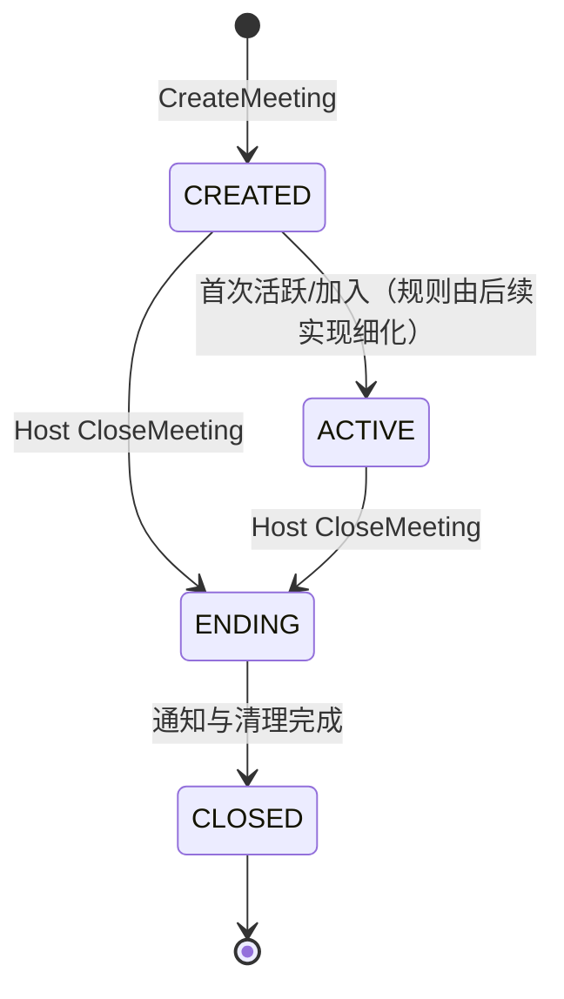

# Step 1.1：Meeting MVP 需求规格

## 1. 文档目的

本文定义 Real-Time Communication & Conference Control Platform V2 的 Meeting MVP 边界和业务规则，作为后续 Step 1.2～1.6 的需求基线。本文只描述计划中的领域行为，不表示相关 C++、协议、存储或部署能力已经实现。

## 2. 当前系统背景

仓库当前由 Qt 客户端和多个服务端工程组成。现有主链路为：

```text
Qt Client --HTTP 注册/登录--> GateServer
GateServer --gRPC 节点申请--> StatusServer
StatusServer --查询节点负载/Token 状态--> Redis
GateServer --返回 ChatServer 地址和 Token--> Qt Client
Qt Client --TCP 长连接--> ChatServer
```

StatusServer 负责节点选择相关流程，不是 TCP 长连接入口；Qt Client 在获得 ChatServer 地址和 Token 后直接连接 ChatServer。

根据当前源码：

- ChatServer 入口 `Server/ChatServer/ChatServer/ChatServer.cpp` 启动 Asio 网络、gRPC 服务、Redis 登录计数，并运行 `CServer`。
- `CServer` 接受 TCP 连接并维护 Session 映射；`CSession` 负责异步读写、认证后绑定用户 ID，以及断线时通知 `CServer::ClearSession`。
- `CSession` 收到完整消息后创建 `LogicNode` 投递到 `LogicSystem` 的逻辑队列；`LogicSystem` 以消息 ID 查找回调并处理登录、好友和文本聊天消息。
- `UserMgr` 维护当前 ChatServer 上的用户 ID 到 Session 映射；现有 ChatServer 间好友/聊天通知使用 gRPC，用户在线位置使用 Redis。
- 当前未发现 Meeting 领域对象、Meeting 消息 ID、会议 Redis 路由或会议数据库表。

因此，Meeting MVP 需要以增量设计方式描述，不应把尚未存在的实现、协议或容量指标写成现状。

## 3. Meeting 内置于 ChatServer 的原因

Phase 1 先将 Meeting 作为 ChatServer 内的领域模块，原因是：

1. 复用已经存在的认证 Session、TCP 消息接收和 `LogicSystem` 分发链路。
2. 复用本机用户 Session 查找能力，先验证会议生命周期和成员关系规则。
3. 控制改动范围，暂不引入新的 MeetingServer 进程、服务发现或部署拓扑。
4. 为后续将会议状态抽离、增加 Redis 路由和跨节点转发保留清晰的 owner ChatServer 边界。

这只是 Phase 1 的部署选择，不预示永久采用 ChatServer 承载会议。

## 4. MVP 功能范围

MVP 规划包含以下会议操作：

| 操作 | 目的 |
| --- | --- |
| `CreateMeeting` | 创建会议并返回会议快照/标识 |
| `JoinMeeting` | 加入处于可加入状态的会议 |
| `LeaveMeeting` | Participant 主动离开会议 |
| `CloseMeeting` | Host 关闭会议 |
| `QueryMeeting` | 查询单个会议的摘要和状态 |
| `ListParticipants` | 查询会议成员列表 |

角色仅有 `Host` 和 `Participant`。当前 MVP 仅规划 Host 关闭会议这一项会控能力；成员进入和退出属于会议成员关系操作，不扩展为其他会控功能。

## 5. 明确不包含的功能

以下能力不属于本次 MVP：

- `Mute`、`Unmute`、`Kick`、`TransferHost`；
- Room Lock、Co-host 及复杂管理员权限体系；
- 预约会议、周期会议、邀请名单、会议密码；
- 未经讨论的固定人数上限或性能/容量承诺；
- 独立 MeetingServer 进程；
- Redis `meeting_id → server_id` 路由、跨 ChatServer 会议 gRPC、MQ/Kafka/RabbitMQ；
- Meeting MySQL 表、数据库迁移、进程重启恢复；
- 新增 HTTP/WebSocket 接口、现有 TCP 协议实现和 Qt UI 改造。

## 6. 核心领域术语

| 术语 | 定义 |
| --- | --- |
| Meeting | 由 Host 创建的会议聚合；创建成功后至少包含 Host 这一名逻辑 Participant，Phase 1 的运行态由 owner ChatServer 在内存中维护 |
| `meeting_id` | 每次有效创建生成的新会议标识；在生命周期内唯一 |
| Host | Meeting 创建者和会议控制角色；可关闭会议，不能对开放会议执行普通离开 |
| Participant | 会议逻辑成员；可加入和主动离开 |
| 活动成员集合 | 当前未被移除的逻辑 Participant 集合；Host 也占其中一个成员名额 |
| owner ChatServer | 保存并负责该 Meeting 运行态的 ChatServer；不用于指代 Host |
| `owner_chat_server_id` | Meeting 创建时绑定的 owner ChatServer 标识 |
| Session | 现有 TCP 连接对象；不等同于 Participant，单个用户可有多个 Session |
| 终态快照 | Meeting 进入 CLOSED 后为受权限查询而暂时保留的最小内存记录；不包含活动 Session |
| 本地领域事件 | Phase 1 在 owner ChatServer 内用于通知/观测的语义，不代表已接入 MQ |

## 7. 角色与权限

所有 Meeting 命令都要求当前 Session 已完成现有认证流程；本步骤不重新设计登录、Token 或鉴权系统。

| 操作 | Host | 当前 Participant | 未加入用户 | 未认证 Session |
| --- | --- | --- | --- | --- |
| CreateMeeting | 可创建（创建者成为 Host） | 以当前认证身份创建 | 可创建（需已认证） | 拒绝 |
| JoinMeeting | 幂等加入 | 可加入 | 可加入 | 拒绝 |
| LeaveMeeting | 开放状态拒绝；关闭后仅做幂等清理 | 可主动离开 | 返回未加入语义 | 拒绝 |
| CloseMeeting | 允许（仅从 CREATED/ACTIVE） | 拒绝 | 拒绝 | 拒绝 |
| QueryMeeting | 允许 | 允许 | 拒绝枚举成员 | 拒绝 |
| ListParticipants | 允许 | 允许 | 拒绝 | 拒绝 |

创建者自动成为 Host，并同时成为第一个 Participant。

## 8. Meeting 状态

状态定义如下：

| 状态 | 含义 | 允许的关系操作 |
| --- | --- | --- |
| `CREATED` | 已创建，尚未进入活跃阶段 | 允许 Join；Host 可 Close |
| `ACTIVE` | 至少完成一次正常运行/加入流程的开放会议 | 允许 Join/Participant Leave；Host 可 Close |
| `ENDING` | Host 已发起关闭，正在通知和清理 | 拒绝 Join 及成员关系变更 |
| `CLOSED` | 关闭完成的终态 | 不可 Join、不可重新激活；允许受限查询和幂等清理 |

计划中的关闭状态流转为 `CREATED/ACTIVE → ENDING → CLOSED`。除该路径外，不定义状态回退或自动转移 Host。



图中的“首次活跃/加入”仅表达允许的设计方向；具体触发时机留给后续实现，不应视为当前代码行为。

## 9. CreateMeeting 规则

1. 请求必须来自已完成现有认证流程的 Session。
2. 每次有效请求生成新的 `meeting_id`；Phase 1 不设计客户端幂等键。
3. 新会议初始状态为 `CREATED`。
4. 调用者自动成为 Host 和首个 Participant，创建成功成员数为 1。
5. Meeting 必须记录 `owner_chat_server_id`，其值为处理创建请求的 ChatServer 标识。
6. Phase 1 会议运行态只保存在 owner ChatServer 的内存领域模型中，不发布到 Redis，也不持久化到 MySQL。
7. 创建响应应包含足以进行后续操作的 `meeting_id`、状态、owner ChatServer 标识和当前成员数/快照（具体传输格式由 Step 1.4 定义）。

## 10. JoinMeeting 规则

1. 仅 `CREATED` 和 `ACTIVE` 允许加入；`ENDING`、`CLOSED` 拒绝加入。
2. 逻辑唯一键为 `meeting_id + user_id`；同一用户只能对应一个逻辑 Participant。
3. 同一用户重复 Join 视为幂等成功，不得重复增加成员数。
4. 重复 Join 应返回当前 Participant 或会议快照，使客户端可收敛到服务端状态。
5. 同一用户的多设备或多 Session 不得在逻辑成员列表中产生重复 Participant；设备/Session 绑定细节留给 Step 1.2。
6. 本步骤不规定硬编码人数上限。若后续需要容量限制，必须作为待定策略单独评审并记录，不能隐含在 MVP 规则中。
7. 首次实际加入产生 `ParticipantJoined` 本地领域事件；幂等重复 Join 不重复产生加入事件。

## 11. LeaveMeeting 规则

1. Participant 主动 Leave 后，从活动成员集合移除，并产生一次 `ParticipantLeft` 事件语义。
2. 重复 Leave 必须幂等，不得崩溃、负计数或重复通知；响应应区分“本次实际移除”和“已经不在会议中”。
3. Host 对仍开放的 `CREATED`/`ACTIVE` 会议调用 Leave，返回明确错误（例如 `HOST_MUST_CLOSE_MEETING`），不得改变会议状态。
4. Host 如需结束会议，应调用 CloseMeeting，而不是普通 LeaveMeeting。
5. `ENDING` 状态拒绝新的成员关系变更；关闭流程负责统一清理。
6. `CLOSED` 状态下收到 Leave 或清理回调时，操作必须安全且幂等；不重新打开会议。

## 12. CloseMeeting 规则

1. 只有 Host 可以关闭会议；Participant、未加入用户或其他用户不能获得关闭权限。
2. Host 可从 `CREATED` 或 `ACTIVE` 发起关闭。
3. 关闭请求先使会议进入 `ENDING` 保护状态，拒绝新的 Join 和成员关系变更。
4. 完成必要的成员通知和清理后进入 `CLOSED`；`CLOSED` 是终态，不能重新激活。
5. 重复关闭已 `CLOSED` 的会议返回幂等成功/已关闭语义，不重复执行清理或广播。
6. 对已处于 `ENDING` 的重复关闭，应返回“关闭处理中”或等价幂等结果，不能并发启动第二个关闭流程。
7. 非 Host 即使会议已经关闭，也必须按权限规则拒绝 CloseMeeting。

## 13. QueryMeeting 和 ListParticipants 规则

1. 请求必须来自已认证 Session，且调用者是 Host 或当前 Participant。
2. 未加入会议的用户不能通过 QueryMeeting 枚举会议成员；对其请求返回无权限/未加入语义。
3. QueryMeeting 计划返回会议摘要，包括 `meeting_id`、状态、owner ChatServer 标识、Host 标识及当前成员数；是否包含完整成员详情由 API 草案在 Step 1.4 细化。
4. ListParticipants 仅对开放会议的 Host 或当前 Participant 开放，返回逻辑 Participant 列表，不返回按设备/Session 展开的重复条目；对 `CLOSED` 会议则依据终态快照中的 Host/历史 Participant 身份执行同等权限控制。
5. Meeting 进入 `CLOSED` 后仍允许受权限控制的 QueryMeeting 和 ListParticipants 查询。Host 或终态快照中记录的历史 Participant 可以查询；未加入过会议的用户仍不得访问成员信息。
6. 为支持 `CLOSED` 查询和鉴权，owner ChatServer 需要暂时保留终态快照。快照至少包含 `meeting_id`、`host_user_id`、`owner_chat_server_id`、终态、关闭时间，以及判断历史 Participant 权限所需的必要身份信息。
7. 终态快照不等同于继续保留活动 Session，也不得使会议重新激活。
8. CLOSED 数据保留时间和淘汰策略本步骤不决定；终态记录被淘汰后，查询返回 `MEETING_NOT_FOUND`。
9. 终态快照仍只保存在 owner ChatServer 内存中，本步骤不新增 MySQL 或 Redis 持久化。
10. 非 owner ChatServer 不得从本地不存在的副本返回看似有效的会议快照，须遵循第 18 节规则。

## 14. 重复请求和幂等语义

Phase 1 不引入客户端幂等键，以下服务端判定作为最低要求：

| 重复请求 | 预期语义 |
| --- | --- |
| `CreateMeeting` | 每次有效请求都是新会议，不因内容相同而合并 |
| `JoinMeeting`（同 meeting/user） | 幂等成功；成员数和加入事件不重复 |
| `LeaveMeeting` | 首次实际移除；后续返回已不在，不重复事件 |
| `CloseMeeting`（`ENDING`/`CLOSED`） | 返回处理中或已关闭的幂等结果，不重复清理/通知 |
| Query/List | 只读重复调用返回当前可见快照 |

后续实现必须让主动 Leave、最后一个有效会议 Session 断开所触发的逻辑离会和 Close 清理共享可重复调用的移除语义，并在并发下保持成员数与集合一致。Leave、断线和 Close 的并发裁决由 Step 1.3 状态机设计。

## 15. Host 主动离开与异常断线

### 主动离开

- Host 对开放会议调用 LeaveMeeting 必须返回 `HOST_MUST_CLOSE_MEETING`（或同等明确错误），不移除 Host、不改变状态。
- Host 应调用 CloseMeeting 结束会议；关闭期间 Host 仍保留 Host 身份，直至会议进入 `CLOSED`。

### 异常断线

- Host 异常断线不自动关闭会议、不自动转移 Host、不销毁 Meeting；Host 身份仍然保留。
- Host 的任一底层 Session 断开只解除该 Session 的绑定，不能直接解释为 Host 逻辑身份消失，也不能改写 Host 角色。
- Presence 阶段再规划更完整的在线/离线标记。当前仅定义会议关系不因 Host TCP Session 消失而自动改写。
- 关闭时若 Host Session 已销毁，通知应允许跳过不可达 Session，但不能阻止状态最终收敛到 `CLOSED`。

## 16. Participant 异常断线

1. 单个底层 Session 断开时，首先只解除该 Session 与逻辑 Participant 的绑定，不必然移除整个 Participant。
2. 只有满足逻辑离会条件时，才从活动成员集合移除 Participant。对多 Session 用户，该条件至少需要检查是否仍存在其他有效的会议 Session。
3. “有效会议 Session”的准确字段、绑定关系和判定方式由 Step 1.2 核心数据模型定义，本步骤不预设字段或超时值。
4. 主动 Leave、最后一个有效会议 Session 断开和 Close 清理必须共享幂等移除语义；与其他清理路径竞态时，最多产生一次逻辑移除和一次 `ParticipantLeft` 语义。
5. Leave、断线和 Close 的并发裁决由 Step 1.3 状态机设计。
6. 不能因为底层 Session 已销毁就假定 Meeting 成员对象已安全清理；逻辑移除应以 `meeting_id + user_id` 的成员关系为准。
7. 若通知目标 Session 不存在或发送失败，逻辑离会条件已经成立时仍应完成本地成员集合的幂等更新，并记录可观测结果（具体日志/指标留给后续步骤）。

## 17. 多设备和重连的暂定规则

- 同一用户多设备、多 Session 在逻辑成员列表中合并为一个 Participant。
- 单个 Session 断开仅解除 Session 绑定；是否触发逻辑离会，至少取决于该 Participant 是否还存在其他有效的会议 Session。
- Participant 与 Device/Session 的具体关系，以及“有效会议 Session”和“最后一个有效 Session 断开”的判定，留给 Step 1.2 核心数据模型；不得在本步骤擅自固定协议字段或超时值。
- 同一用户重新 Join 已存在的会议时，复用原逻辑 Participant，不创建重复条目。
- Phase 1 不承诺 ChatServer 进程重启后的会议恢复；崩溃/重启导致内存态丢失属于明确限制。

## 18. owner ChatServer 规则

1. Meeting 创建时绑定 `owner_chat_server_id`。
2. Phase 1 仅保证 owner ChatServer 处理该 Meeting 的状态变更和成员关系变更。
3. Phase 1 不实现 Redis `meeting_id → server_id` 路由，不实现跨 ChatServer 会议 gRPC 转发。
4. 由于当前没有 Meeting 路由，本地查不到 `meeting_id` 时，当前节点不能天然判断会议不存在，还是位于其他 ChatServer。
5. 只有请求携带可信的 `owner_chat_server_id`，或后续 MeetingLocator 能识别 owner ChatServer 时，非 owner 节点才能返回清晰、可观测的 `MEETING_NOT_LOCAL`。
6. 如果没有任何 owner ChatServer 定位信息，本地查无记录只能返回 `MEETING_NOT_FOUND`。
7. 无论是否具有定位信息，非 owner 节点都不得静默创建同 `meeting_id` 的本地副本；Query/List 等只读请求也不得伪造本地快照。
8. Step 1.2 需要定义 owner ChatServer 信息在 Meeting 模型中的表达、所有权关系和生命周期；其随操作传递的方式由 Step 1.4 API 草案设计。
9. 本步骤只定义错误和所有权语义，不实现 Redis 路由或跨节点转发。该边界为后续演进预留扩展点。

## 19. 领域事件语义

Phase 1 可定义以下本地领域事件/通知语义：

- `MeetingCreated`
- `ParticipantJoined`
- `ParticipantLeft`
- `MeetingClosed`

这些事件只表示 owner ChatServer 内的领域语义，可用于本地通知、日志或后续适配；当前不代表已经接入 MQ、Kafka、RabbitMQ 或其他可靠事件总线。事件计划携带 `meeting_id`、相关 `user_id`、发生时状态和必要的去重上下文，具体字段由 Step 1.4 API 草案细化。

## 20. 初步错误语义

错误码/传输格式不在本步骤落地，先统一可观测的语义名称：

| 语义 | 使用场景 |
| --- | --- |
| `AUTH_REQUIRED` | Session 未完成现有认证流程 |
| `MEETING_NOT_FOUND` | owner ChatServer 本地不存在该 `meeting_id`，或当前节点本地查无记录且没有任何可信 owner 定位信息 |
| `MEETING_NOT_LOCAL` | 请求到达非 owner ChatServer，且请求携带可信 `owner_chat_server_id` 或 MeetingLocator 能识别 owner ChatServer |
| `MEETING_STATE_REJECTED` | 当前状态不允许该操作（如 ENDING/CLOSED Join） |
| `NOT_PARTICIPANT` | 调用者不是当前会议成员 |
| `PERMISSION_DENIED` | 非 Host 尝试 Close 或其他越权操作 |
| `HOST_MUST_CLOSE_MEETING` | Host 对开放会议调用 LeaveMeeting |
| `ALREADY_JOINED`（幂等成功） | 重复 Join；建议作为结果标志而非失败 |
| `ALREADY_LEFT`（幂等结果） | 重复 Leave，成员已不存在 |
| `CLOSE_IN_PROGRESS`（幂等结果） | 重复关闭处于 ENDING 的会议 |
| `ALREADY_CLOSED`（幂等成功） | 重复关闭 CLOSED 会议 |

具体数值、事件字段、传输格式、未来 TCP 映射和客户端展示由 Step 1.4 API 草案设计，不能在本步骤虚构为已存在协议。Step 1.2 不定义正式 TCP 消息 ID、JSON wire format 或完整 API。

## 21. 后续 Step 1.2～1.6 待设计问题

- **Step 1.2：核心数据模型**：定义 User、Device、Session、Meeting、Participant、ServerNode、Event 的字段、标识、关系、唯一性、所有权和生命周期。该步骤不得提前定义正式 TCP 消息 ID、JSON wire format 或完整 API。
- **Step 1.3：状态机**：定义 Session、Meeting、Participant 状态，合法/非法转换，以及 Leave、断线、Close 的竞态裁决。
- **Step 1.4：API 草案**：定义 Create、Join、Leave、Close、Query、ListParticipants 的命令、响应、错误码、事件字段及未来 TCP 映射。
- **Step 1.5：核心时序图**：覆盖创建、加入、重复加入、主动离开、异常断线、关闭和非 owner 请求。
- **Step 1.6：首轮编码切分与测试策略**：确定代码目录落点、最小编码任务、编译方式、单元测试和集成验证方式。
- 会议容量上限、Join 是否自动令会议从 CREATED 进入 ACTIVE、通知失败重试及 CLOSED 数据保留时间与淘汰策略均为后续待定项。

## 22. 本 Step 验收标准

完成本步骤应满足：

1. 仓库新增本文件，章节覆盖本任务要求的 23 个主题。
2. 文档明确 Meeting 仅作为 ChatServer 内置模块的 Phase 1 设计，未声称代码已实现。
3. 文档固化 Host/Participant 角色、四种状态、六项操作、权限、幂等、断线、关闭和 owner 规则。
4. 文档明确不新增 MeetingServer、Redis 会议路由、跨节点 gRPC、数据库迁移、MQ、HTTP/WebSocket、Qt UI 或工程改动。
5. 文档包含并发/生命周期注意事项：网络回调并发访问、状态修改串行化或加锁、清理幂等、Session 与 Participant 解耦、不能仅凭 `shared_ptr` 解决生命周期、关闭时处理待发送通知和已销毁 Session。
6. Markdown 标题层级、表格和 Mermaid 代码块通过静态结构检查。

## 23. 明确的 Phase 1 限制

- 会议运行态和为 CLOSED 查询暂留的终态快照仅在 owner ChatServer 内存中存在，不发布 Redis、不写 MySQL；进程崩溃、重启或终态快照淘汰后，相应会议数据不可恢复。
- 不支持跨 ChatServer 会议操作；只有存在可信 owner ChatServer 定位信息时，非 owner 请求才返回 `MEETING_NOT_LOCAL`，否则本地查无记录返回 `MEETING_NOT_FOUND`。任何情况下均不创建本地副本。
- 不承诺固定人数上限、吞吐、延迟、可用性或恢复能力。
- 不重新设计现有认证、Token、TCP 帧格式和消息分发机制；Meeting 接入协议仍需后续步骤定义。
- 当前 MVP 仅规划“Host 关闭会议”这一项会控能力；静音、踢人、转移 Host、锁房、协主持及邀请/密码等均延期。
- Presence、设备级在线状态、可靠事件总线、通知重试和完整审计均不在本步骤范围。

后续实现必须特别注意：Meeting 状态和 Participant 集合会被多个网络回调访问，应明确串行化或加锁策略；Participant 清理可能由主动 Leave、最后一个有效会议 Session 断开和关闭流程同时触发，清理逻辑必须幂等，其并发裁决由 Step 1.3 状态机定义；不能把 `CSession` 生命周期直接等同于 Participant 生命周期，也不能仅因为使用 `shared_ptr` 就认为生命周期问题已经解决；关闭 Meeting 时须处理待发送通知以及目标 Session 已经销毁的情况。
