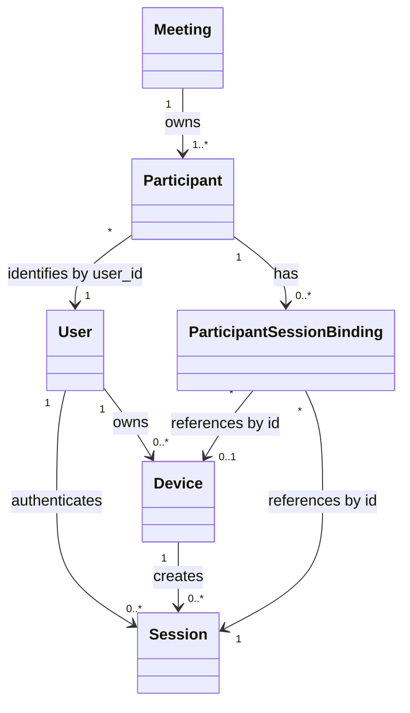
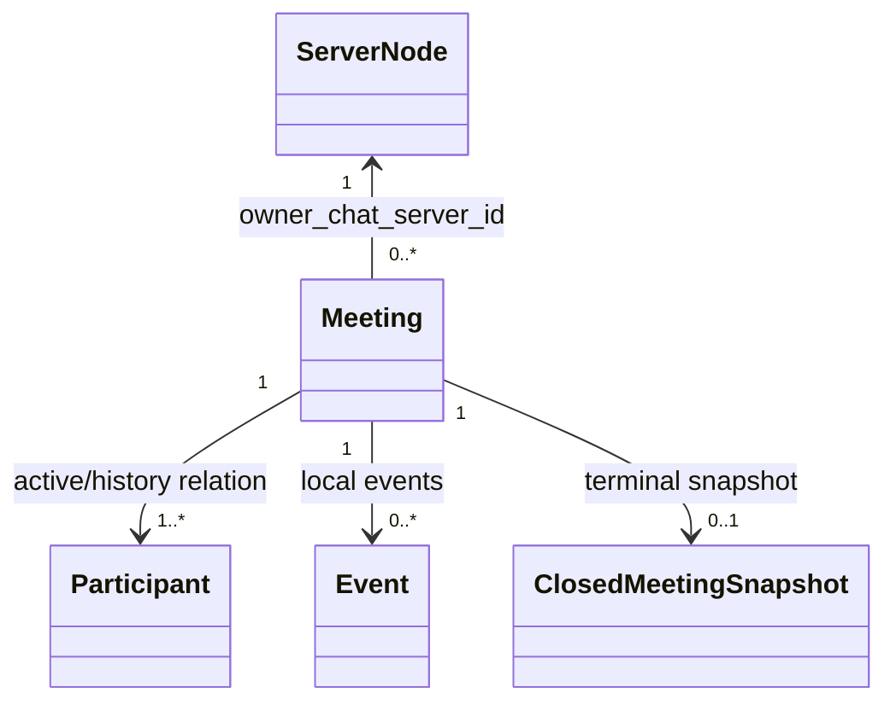

# Phase 1 - Step 1.2：Meeting 核心领域数据模型

## 1. 文档目的

本文为 Meeting MVP 定义最小、可解释的核心领域数据模型，供 Step 1.3 状态机、Step 1.4 API 草案和后续编码使用。本文是设计文档，不表示这些对象或关系已经在 C++ 中实现。

本文只定义对象、字段、标识、关系、所有权和生命周期边界；不定义完整状态机、TCP 消息 ID、JSON/二进制 wire format 或完整 Create/Join/Leave/Close/Query API。

## 2. Phase 0 现有实现边界

依据当前仓库源码，现有 ChatServer 具备以下事实：

- `Server/ChatServer/ChatServer/ChatServer.cpp` 从 `ConfigMgr` 读取 `[SelfServer] Name/Host/Port/RPCPort`，启动 Asio TCP 服务和 gRPC 服务，并维护 Redis 登录计数。
- `CServer` 接受 TCP 连接，将 `CSession` 按 `session_id` 放入 `_sessions`，并在连接异常时调用 `ClearSession`。
- `CSession` 构造时通过 Boost UUID 生成字符串 `_session_id`；认证成功后通过 `SetUserId(int)` 保存整数 `uid`。
- `CSession` 收到消息后以 `LogicNode` 投递到 `LogicSystem` 的逻辑队列；当前回调注册覆盖登录、好友和文本聊天消息，没有 Meeting 回调。
- `UserMgr` 使用 `unordered_map<int, shared_ptr<CSession>>` 维护当前节点的 `user_id → 单个 Session` 映射。重复登录会覆盖旧映射，当前实现不是一对多 Session 模型。
- `CServer::ClearSession` 会按 `uid` 调用 `UserMgr::RmvUserSession`，没有校验待删除 Session 是否仍是该用户当前映射；因此 CSession 生命周期与 UserMgr 映射并不严格一致。
- `LogicSystem::LoginHandler` 将 `ConfigMgr` 的 `SelfServer.Name` 写入 `uip_<uid>` Redis 用户路由键。该路由服务于现有用户在线位置，不是 Meeting 路由。
- 当前未发现 Device、Participant、Meeting、会议快照或会议事件数据类，也未发现 Meeting Redis 路由或会议 MySQL 表。

以上是现状，不应与本文件的目标模型混写。

## 3. Step 1.1 需求约束

本模型继承 Step 1.1 的约束：

1. Meeting 第一版内置于 owner ChatServer，运行态只保存在该节点内存。
2. 角色只有 Host 和 Participant；创建成功后 Host 至少占有一个逻辑 Participant。
3. Meeting 状态字段使用 `CREATED`、`ACTIVE`、`ENDING`、`CLOSED` 四个值；合法转换由 Step 1.3 定义。
4. 同一 Meeting 中，一个 `user_id` 只能对应一个逻辑 Participant，即唯一键为 `meeting_id + user_id`。
5. 同一 User 的多 Device、多 Session 可以绑定到同一个 Participant，但不能产生重复逻辑成员。
6. 单个 Session 断开首先解除绑定；仅在满足最后一个有效会议 Session 等逻辑离会条件时才移除 Participant。
7. Host 任一 Session 断开不消失 Host 身份，不自动关闭 Meeting，也不自动转移 Host。
8. CLOSED 需要暂时保留终态快照；不新增 MySQL 或 Redis 持久化。
9. 本步骤只建立数据模型，不新增独立 MeetingServer、Redis 会议路由、跨节点会议 gRPC、MQ 或新的外部接口。

## 4. 领域对象总览

| 对象 | 目标职责 | 主要拥有者/边界 |
| --- | --- | --- |
| User | 复用现有认证产生的用户身份 | 现有账号系统；本模型只引用 `user_id` |
| Device | 表示 User 的逻辑设备维度 | User 身份域；不保存硬件指纹 |
| Session | 表示一次 TCP 连接及其认证上下文 | 所属 ChatServer；对应现有 `CSession` |
| Meeting | 会议聚合根，持有状态和 Participant 集合 | `owner_chat_server_id` 对应的 ChatServer 内存 |
| Participant | Meeting 内按 User 唯一的逻辑成员 | Meeting；不是 User 或 Session 所拥有 |
| ParticipantSessionBinding | 连接 Participant 与 Device/Session 的轻量关系 | Meeting/Participant 关系域；保存 ID 和绑定元数据 |
| ServerNode | 描述 ChatServer 节点及 owner 归属 | 配置/节点标识适配层；Phase 1 不做 Meeting 路由 |
| Event | 描述本地 Meeting 领域事件 | owner ChatServer 的本地事件上下文 |
| ClosedMeetingSnapshot | CLOSED 后用于查询和授权的终态值对象 | owner ChatServer；独立于活动 Meeting 聚合 |

## 5. User 模型

### 5.1 目标字段

| 字段 | 含义 | Phase 1 约束 |
| --- | --- | --- |
| `user_id` | 用户稳定身份标识 | 复用现有认证流程中的整数 `uid`；是 Participant 唯一键的一部分 |
| `identity_source` | 身份由哪个现有账号/认证体系确认 | 只记录来源语义，不新建认证体系 |
| `display_identity_ref` | 可选的展示资料引用 | 不在 Meeting 模型内复制密码、Token 或完整用户资料 |

### 5.2 关系和权限边界

- User 的身份来源是现有 GateServer/ChatServer 登录和 Token 校验结果；本步骤不重新设计注册、登录、Token 或鉴权。
- 一个 User 可以拥有多个 Device 和多个 Session（这是目标模型能力，不是当前 `UserMgr` 已支持的能力）。
- User 不直接拥有 Meeting Participant 对象。Participant 由 Meeting 拥有，并通过 `user_id` 引用 User。
- 一个 User 可以在不同 Meeting 中分别成为 Participant；同一 Meeting 内不得出现两个相同 `user_id` 的 Participant。
- User 对 Meeting 的访问权限仍由 Host/Participant 关系和 Step 1.1 规则决定，不在 User 对象内增加管理员权限字段。

## 6. Device 模型

### 6.1 目标字段

| 字段 | 含义 | 是否为 MVP 必需 |
| --- | --- | --- |
| `device_id` | User 范围内的逻辑设备标识 | 作为多 Session 绑定模型的目标标识；具体生成方式待后续实现 |
| `user_id` | Device 所属 User | 必需，必须与认证 User 一致 |
| `device_label` | 可选的人类可读标签 | 可选，不承载硬件信息 |
| `created_at` | Device 逻辑记录创建时间 | 可选；不是会议权限依据 |

### 6.2 边界

- 一个 User 可以拥有多个 Device；一个 Device 可以产生多个 Session。
- Device 不是 Meeting 的逻辑成员。Meeting 只记录一个 User 对应的 Participant，Device 通过 ParticipantSessionBinding 间接关联。
- 不引入设备指纹、硬件指纹、IP 历史、操作系统明细或其他与 MVP 无关的隐私字段。
- Presence 阶段再决定设备在线状态、最后心跳、设备能力、网络质量和活跃设备等字段；这些不属于本步骤的会议模型。
- 当前仓库没有 Device 标识或设备管理代码；`device_id` 是目标模型字段，不应被描述为现有能力。

## 7. Session 模型

### 7.1 目标字段

| 字段 | 含义 |
| --- | --- |
| `session_id` | 一次连接的稳定标识；目标上沿用现有 CSession 的 UUID 字符串语义 |
| `user_id` | 认证后绑定的 User；未认证时为空/无效 |
| `device_id` | 产生该 Session 的逻辑 Device；当前代码没有此字段 |
| `chat_server_id` | 承载该 Session 的 ChatServer 节点标识 |
| `authenticated` | 是否已经通过现有认证流程；不是新的鉴权机制 |
| `connection_state` | 连接生命周期状态占位；具体状态和值由 Step 1.3 定义 |
| `connected_at` / `disconnected_at` | 连接时间边界；用于关系审计和有效性判断 |

### 7.2 与 CSession 的关系

- `CSession` 是当前网络层连接对象；目标 `Session` 是可被领域模型引用的连接生命周期记录。两者可以通过 `session_id` 和适配层关联，但不是同一个类型。
- 当前 `CSession` 直接保存 `int _user_uid` 和 UUID `_session_id`，且异步回调以 `shared_ptr<CSession>` 延长网络对象生命周期。
- Session 不拥有 Participant，不直接持有 `shared_ptr<Participant>`。它只通过 `ParticipantSessionBinding` 的 ID 关系参与会议。
- Session 断开后，领域层首先将相应绑定标记为解除/无效；是否移除 Participant 由逻辑离会条件决定，不能由 CSession 析构直接决定。
- 目标模型中的 Session 记录可在 CSession 销毁后短暂保留必要元数据，以完成解绑、审计或幂等判断；具体保留时间留给后续步骤。

### 7.3 生命周期和循环引用

网络层回调可以暂时持有 `shared_ptr<CSession>`，但领域对象之间只保存稳定 ID、值对象或非拥有句柄。禁止形成以下循环：

```text
CSession --shared_ptr--> Participant --shared_ptr--> CSession
```

后续实现可由 SessionRegistry/适配层按 `session_id` 查找活动 CSession，并在发送前检查其有效性；该注册表的具体实现不在本步骤决定。不能仅凭 `shared_ptr` 证明 Session、Participant 或 Meeting 生命周期安全。

## 8. Meeting 模型

### 8.1 目标字段

| 字段 | 含义 | 说明 |
| --- | --- | --- |
| `meeting_id` | Meeting 稳定标识 | 每次有效创建生成新值；作用域见第 16 节 |
| `host_user_id` | 创建者/Host 的 User 标识 | Host 是控制角色，不与 owner ChatServer 混称 |
| `owner_chat_server_id` | 保存并负责运行态的 ChatServer 标识 | 创建时绑定；不表示 Host |
| `meeting_state` | Meeting 状态字段 | 表达 `CREATED/ACTIVE/ENDING/CLOSED`；转换由 Step 1.3 定义 |
| `created_at` | 创建时间 | 由 owner ChatServer 记录 |
| `closed_at` | 关闭完成时间 | 未关闭时为空；具体写入时机由 Step 1.3 定义 |
| `participants_by_user_id` | 当前活动 Participant 集合 | 以 `user_id` 为键，禁止重复逻辑成员 |
| `closed_snapshot_ref` | CLOSED 终态快照引用/存在标记 | 快照内容见第 13 节 |

### 8.2 聚合和访问边界

- Meeting 是领域聚合根；owner ChatServer 内的 MeetingRegistry（名称仅为目标概念）持有活动 Meeting 对象。
- Meeting 对象拥有当前活动 Participant 集合；Participant 不反向拥有 Meeting 的 `shared_ptr`，只保存 `meeting_id`。
- Meeting 通过 ParticipantSessionBinding 间接关联 Session，不直接保存大量 `shared_ptr<CSession>`。
- Phase 1 只在 owner ChatServer 内处理运行态变更，不允许依赖跨 ChatServer 本地副本；是否转发留给后续演进。
- Meeting 进入 CLOSED 后，活动聚合可以释放或转入不可变终态；查询和授权依赖独立的 ClosedMeetingSnapshot。
- ChatServer 崩溃或重启导致内存态丢失，Phase 1 不承诺恢复。

### 8.3 `meeting_id` 生成原则

- 每次有效 CreateMeeting 生成新 `meeting_id`，不使用客户端幂等键合并请求。
- 目标上要求在系统设计声明的 Meeting 标识作用域内唯一；生成器不得因为节点重启或节点并行创建而产生可接受范围内的碰撞。
- 是否包含节点前缀不是本步骤的强制协议决定。若不包含节点前缀，唯一性由生成器保证，owner 位置由 `owner_chat_server_id` 记录并在受信定位信息存在时使用。
- 不在本步骤规定字符串格式、二进制布局、TCP 传输字段或客户端展示形式；这些属于 Step 1.4 API 草案。

## 9. Participant 模型

### 9.1 目标字段

| 字段 | 含义 |
| --- | --- |
| `meeting_id` | 所属 Meeting |
| `user_id` | 所属 User；与 `meeting_id` 组成逻辑唯一键 |
| `participant_id` | 可选的内部标识；MVP 不要求独立全局 ID，推荐以 `meeting_id + user_id` 作为稳定逻辑身份 |
| `role` | `HOST` 或 `PARTICIPANT`；Host 是创建者/控制角色 |
| `joined_at` | 首次成为该 Meeting 逻辑成员的时间 |
| `left_at` | 逻辑离会时间；仍活动时为空 |
| `is_active` | 当前是否属于活动成员集合的投影字段 |
| `session_binding_ids` | 关联的 ParticipantSessionBinding 标识集合 |

### 9.2 语义

- 同一 Meeting 中，一个 `user_id` 只能对应一个逻辑 Participant；重复 Join 复用该对象/身份，不创建第二条。
- Host 同时是 Participant，创建成功时至少有一个 `HOST` Participant；Host 与普通 Participant 的差异是控制权限和断线后的身份保留规则。
- Participant 由 Meeting 拥有。User 不拥有 Participant，CSession 也不拥有 Participant。
- `is_active` 描述成员集合事实，不定义 Leave、断线或 Close 的状态转换；这些转换由 Step 1.3 决定。
- Participant 可以同时关联多个 Device/Session binding；成员列表只呈现逻辑 Participant，不按设备或 Session 展开重复成员。
- Participant 与 CSession 生命周期独立：CSession 销毁只影响相应 binding，不能自动销毁 Participant。

## 10. 多设备、多 Session 绑定模型

### 10.1 关系结构

```text
User
 ├── Device A
 │    ├── Session A1
 │    └── Session A2
 └── Device B
      └── Session B1

Meeting
 └── Participant(user_id)
      ├── Binding(Session A1, Device A)
      ├── Binding(Session A2, Device A)
      └── Binding(Session B1, Device B)
```

对应目标关系是：一个 User 可有多个 Device，一个 Device 可有多个 Session；同一 User 在同一 Meeting 中只有一个 Participant，Participant 可以绑定多个有效 Session。

### 10.2 ParticipantSessionBinding 最小模型

本步骤引入轻量关系对象 `ParticipantSessionBinding`，不引入 ORM 或 Repository 层：

| 字段 | 含义 |
| --- | --- |
| `binding_id` | 绑定记录标识；可由 `meeting_id + user_id + session_id` 稳定识别 |
| `meeting_id` / `participant_user_id` | 关系所属 Meeting 和逻辑 Participant |
| `session_id` | 被绑定的 Session |
| `device_id` | Session 所属 Device；未知时不伪造值 |
| `chat_server_id` | 承载该 Session 的节点 |
| `binding_status` | `BOUND` 或 `UNBOUND` 的关系事实；不是完整状态机 |
| `bound_at` / `unbound_at` | 绑定和解除时间 |
| `last_validated_at` | 最近一次确认 Session 仍满足有效性条件的时间，可选 |

### 10.3 有效会议 Session 定义

“有效会议 Session”是用于逻辑离会判断的模型谓词，而非仅看 CSession 指针是否存在。至少同时满足：

1. Binding 的 `meeting_id`、Participant User 和 `session_id` 关系一致。
2. `binding_status = BOUND`，且未被 Leave、显式解绑或关闭清理标记为 `UNBOUND`。
3. Session 已完成现有认证并绑定相同 `user_id`，且其 `chat_server_id` 与实际承载节点一致。
4. Session 的连接生命周期尚未进入由 Step 1.3 定义的终止/不可用状态；仅有元数据记录或已销毁 CSession 不算有效。
5. 对同一 Participant，至少还有一条满足上述条件的其他 binding 时，单个 Session 断开不得触发整体逻辑离会。

准确的 Session 状态值、校验时机、超时和并发判定留给 Step 1.3；本节只规定最小数据条件。

### 10.4 断开与重连边界

- 单个 Session 断开：先将该 Session binding 解除；Participant 是否继续活动取决于是否还有有效会议 Session。
- 最后一个有效会议 Session 断开：触发逻辑离会判断，但不在本步骤决定竞态裁决或具体状态转换。
- Host 的任一 Session 断开：只解除该 binding，Host Participant 和 `host_user_id` 仍保留，即使暂时没有有效 Session。
- 主动 Leave、最后 Session 断开和 Close 清理应定位到同一个 `meeting_id + user_id` 逻辑成员关系，以便共享幂等移除语义。
- 重连后重新 Join 复用原 Participant；新的 Session 只新增/恢复 binding，不新增逻辑 Participant。

## 11. ServerNode 模型

### 11.1 目标字段

| 字段 | 含义 |
| --- | --- |
| `server_id` / `node_id` | 节点稳定标识；Phase 1 对 ChatServer 取现有 `[SelfServer] Name` 语义 |
| `node_type` | 节点类型，例如 `CHAT_SERVER`；不扩展为新的进程 |
| `host` / `port` / `rpc_port` | 可选的节点配置引用；来源于现有 `ConfigMgr`，不是 Meeting 协议字段 |
| `is_meeting_owner` | 针对某一 Meeting 的关系判断，不是节点全局永久属性 |
| `observed_at` | 节点信息观测时间，可选；不定义服务发现状态机 |

### 11.2 owner 关系

- `owner_chat_server_id` 是 Meeting 指向 ServerNode 的所有权引用，含义是“保存并负责该 Meeting 运行态的 ChatServer”。
- Host 是 User 级别的会议控制角色；owner ChatServer 是节点级别的运行态所有者，二者不能使用同一个 `owner` 概念混称。
- Phase 1 的 ServerNode 只在模型中表达节点标识和关联，不实现 Meeting `meeting_id → server_id` Redis 路由、服务发现或跨节点转发。
- 现有 Redis 用户路由和节点登录计数可以继续服务旧 IM 链路，但不能据此声称已有 Meeting 路由。

## 12. Event 模型

### 12.1 最小字段

| 字段 | 含义 |
| --- | --- |
| `event_id` | 本地事件标识；用于观测、关联和最低限度去重 |
| `event_type` | `MeetingCreated`、`ParticipantJoined`、`ParticipantLeft` 或 `MeetingClosed` |
| `meeting_id` | 事件所属 Meeting |
| `actor_user_id` | 发起动作的 User；系统清理可为空或使用约定系统主体 |
| `participant_user_id` | 受影响 Participant 的 User；适用时填写 |
| `owner_chat_server_id` | 产生本地事件的 owner ChatServer |
| `occurred_at` | 领域事件发生时间 |
| `dedupe_context` | 最小去重上下文，例如逻辑动作类型、`meeting_id + user_id`、聚合修订号或来源事件引用 |

### 12.2 语义边界

- 这些是 owner ChatServer 内的本地领域事件模型，不代表已接入 Kafka、RabbitMQ、其他 MQ、可靠投递、ACK、重试或死信队列。
- `event_id` 只保证在文档约定的本地事件作用域内可识别；是否采用 UUID、节点前缀或序列号留给后续实现。
- `dedupe_context` 只提供后续实现所需的最小上下文，不在本步骤规定事件顺序、并发去重算法或投递保证。
- 事件字段和未来传输映射由 Step 1.4 API 草案细化；事件并发顺序和去重裁决由 Step 1.3 结合状态机设计。

## 13. CLOSED 终态快照模型

### 13.1 为什么需要独立快照

活动 Meeting 聚合中的 Participant 集合可能在关闭清理或对象释放后不再存在；但 Step 1.1 仍要求 CLOSED Meeting 可受权限控制地查询。因此不能只依赖活动 Meeting 对象，也不能用活动 Session 是否存在来判断历史访问权。

`ClosedMeetingSnapshot` 是关闭后的不可变/受限修改值对象，独立于活动 Meeting 聚合，用于摘要查询和历史 Participant 授权。

### 13.2 最小字段

| 字段 | 含义 |
| --- | --- |
| `meeting_id` | 已关闭 Meeting 标识 |
| `host_user_id` | Host 身份，保留关闭后的控制角色归属记录 |
| `owner_chat_server_id` | 产生并保存该快照的 owner ChatServer |
| `meeting_state` | 固定为 `CLOSED` 的终态记录 |
| `created_at` | 原 Meeting 创建时间 |
| `closed_at` | Meeting 完成关闭的时间 |
| `participant_identities` | 历史 Participant 身份最小集合，至少包含 `user_id`、角色及必要的成员时间边界 |
| `final_participant_count` | 关闭时逻辑成员数量快照，可选但建议保留 |
| `snapshot_version` | 快照版本/生成序号，可选，用于并发保护和观测 |

### 13.3 授权和生命周期

- QueryMeeting 和 ListParticipants 在 CLOSED 状态下读取快照，并按 `host_user_id` 或 `participant_identities` 中的历史 User 身份执行权限判断；未加入过会议的用户不能借此枚举成员。
- 快照不保留活动 `CSession` 指针、不保留有效会议 Session，也不使 Meeting 重新激活。
- 快照暂时保存在 owner ChatServer 内存中。保留时间和淘汰策略由后续步骤决定；淘汰后查询返回 `MEETING_NOT_FOUND`。
- 快照不会写入 MySQL 或 Redis：本阶段没有会议持久化需求，也禁止借此引入数据库表或 Meeting Redis 路由。
- ChatServer 崩溃或重启会同时丢失活动 Meeting 和内存快照；Phase 1 不承诺 CLOSED 数据恢复。

## 14. 对象关系图

### 14.1 User、Device、Session、Participant



### 14.2 Meeting 与 owner ChatServer



图示只表达目标数据关系，不表示已经存在的跨节点调用或服务发现流程。

目标基数汇总为：`User 1 --- N Device`、`User 1 --- N Session`、`User 1 --- N Meeting Participant`、`Meeting 1 --- N Participant`、`Participant 1 --- N Session Binding`、`Meeting 1 --- N Local Event`、`Meeting 1 --- 1 owner ChatServer`。其中每个 Meeting 恰好引用一个 `owner_chat_server_id`，一个 owner ChatServer 可以负责多个 Meeting。

## 15. 所有权与生命周期

### 15.1 领域对象所有权

- owner ChatServer 的 MeetingRegistry（目标概念）拥有活动 Meeting 聚合。
- Meeting 拥有活动 Participant 集合；Participant 拥有或索引其 ParticipantSessionBinding 集合。
- Binding 只引用 Session、Device 和 User 的稳定 ID；不拥有网络连接对象。
- ServerNode 是被 Meeting 引用的节点标识值/配置视图，不反向拥有 Meeting。
- Event 由 owner ChatServer 的本地事件上下文创建；Event 不反向拥有 Meeting。
- ClosedMeetingSnapshot 独立于活动 Meeting，可在活动聚合释放后继续存在到快照淘汰。

### 15.2 CSession 销毁和 Meeting 销毁

| 生命周期动作 | 必须继续存在 | 可以释放/解绑 |
| --- | --- | --- |
| CSession 销毁 | Meeting、Participant、必要的 Session/Binding 元数据（若仍需判断其他 Session） | 该网络对象、该 Session 的活动 binding |
| 单个 Session 断开 | 同 User 的 Participant（若还有其他有效 Session） | 对应 binding；不自动释放 Participant |
| Participant 逻辑离会 | Meeting、历史快照所需身份（若会议随后关闭） | 活动 Participant 和其活动 bindings |
| Meeting 进入 CLOSED | ClosedMeetingSnapshot、必要事件/观测上下文 | 活动 Session 绑定和可释放的活动聚合成员 |
| CLOSED 快照淘汰 | 无需继续保留会议查询数据 | 快照；后续查询返回 `MEETING_NOT_FOUND` |

具体内存回收时机、通知队列和线程安全策略留给 Step 1.3 及后续实现。

### 15.3 shared_ptr 约束

领域对象之间不得通过互相持有 `shared_ptr` 建立关系。推荐：

- CSession/网络回调暂时持有 `shared_ptr<CSession>`；
- Meeting、Participant、Binding 只保存 ID、值对象或受控的弱/非拥有句柄；
- 发送前通过适配层检查 Session 是否仍有效；
- 关闭和清理流程不因某个 `shared_ptr` 仍存在就认为 Participant 或 Meeting 仍然有效。

## 16. 唯一性约束

| 约束 | 模型表达 |
| --- | --- |
| User 身份 | `user_id` 来自现有认证身份；同一逻辑用户不因 Device/Session 增加而复制 |
| Device | `device_id` 在 User 作用域内唯一；具体生成和重建规则待后续设计 |
| Session | `session_id` 对一次连接唯一，目标上沿用现有 CSession UUID |
| Participant | `(meeting_id, user_id)` 唯一；这是逻辑成员的强约束 |
| Binding | 至少以 `(meeting_id, user_id, session_id)` 唯一，禁止同一 Session 对同一 Participant 产生重复有效绑定 |
| Meeting | `meeting_id` 在系统声明的 Meeting 标识作用域内唯一；生成器负责避免碰撞 |
| Event | `event_id` 在本地事件作用域可识别；更高范围的全局唯一性不在本步骤承诺 |

`meeting_id` 是否带节点前缀不改变 Participant 唯一性；不带前缀时必须依赖生成器唯一性和 Meeting 上记录的 `owner_chat_server_id`。

## 17. `meeting_id + user_id` 约束

该组合键是逻辑成员身份，而不是某个 TCP Session、Device 或 Participant 指针的地址：


1. CreateMeeting 先创建 Host User 对应的 Participant。
2. JoinMeeting 以 `(meeting_id, user_id)` 查找 Participant；命中时复用并按需要增加新的 Session binding。
3. 多设备、多 Session 只能增加 Binding，不能增加第二个 Participant。
4. Leave、最后一个有效 Session 断开和 Close 清理都以该组合键定位同一逻辑关系，保证幂等操作落在同一对象上。
5. Participant 的独立 `participant_id` 如后续需要，只能作为内部引用，不能替代该组合键的唯一性约束。

上述是数据模型约束，不定义这些操作的完整请求响应或状态转换。

## 18. “最后一个有效会议 Session”定义

对某个 `(meeting_id, user_id)`，先收集其 ParticipantSessionBinding，再过滤出同时满足第 10.3 节条件的 Binding。若过滤结果为空，则该 User 没有有效会议 Session；若从至少一条变为空，称为“最后一个有效会议 Session 断开”。

该定义刻意区分三件事：

- 底层 CSession 对象是否仍被网络回调暂时持有；
- Session 是否仍通过 Binding 参与该 Meeting；
- Participant 是否应从活动成员集合逻辑移除。

前两者由数据模型记录，第三者的状态转换和 Leave/断线/Close 竞态裁决由 Step 1.3 定义。Host 即使有效会议 Session 数为零，也保留 Host 身份。

## 19. 当前实现与目标模型的差异

| 方面 | 当前代码事实 | Step 1.2 目标设计 |
| --- | --- | --- |
| User 标识 | `CSession::_user_uid` 为 `int`，登录后设置 | 复用 `user_id`/`uid`，不重做认证 |
| Session 标识 | CSession 使用 Boost UUID 字符串 `_session_id` | 以 `session_id` 作为领域连接标识 |
| User→Session | UserMgr 是单节点 `user_id → 单个 shared_ptr<CSession>` | User 可多 Device/Session；通过 Binding 管理会议关系 |
| Device | 当前无 Device 模型或字段 | 引入轻量 `device_id` 目标字段，不引入指纹 |
| Participant | 当前不存在 | Meeting 拥有，按 `(meeting_id,user_id)` 唯一 |
| Meeting | 当前不存在 | owner ChatServer 内存聚合，含状态、成员和快照引用 |
| 节点标识 | `[SelfServer] Name`，如 `chatserver1` | 作为 `server_id/node_id` 和 `owner_chat_server_id` 来源 |
| 用户路由 | Redis `uip_<uid>` 保存用户所在节点 | 仅复用现有事实，不扩展为 Meeting 路由 |
| 断线清理 | ClearSession 移除 UserMgr 的 uid 映射，未处理会议关系 | 先解除单 Session Binding，再按逻辑离会条件处理 Participant |
| 生命周期 | CSession、UserMgr 映射和网络回调存在强耦合 | 领域对象通过 ID/绑定与 CSession 解耦，避免 shared_ptr 环 |
| 持久化 | 当前没有 Meeting 存储 | 活动态和 CLOSED 快照均为 owner 内存态，不写 MySQL/Redis |

## 20. 留给 Step 1.3 的状态机问题

本步骤不定义完整状态机，以下问题必须在 Step 1.3 解决：

- Session 的连接状态值、认证后可用条件和终止状态；
- Meeting 四种固定状态的合法/非法转换及 `CREATED → ACTIVE` 的触发时机；
- Participant 活动/离会状态的正式枚举和 `is_active` 更新规则；
- `BOUND/UNBOUND` 与 Session 终止的先后关系；
- 主动 Leave、单 Session 断开、最后有效 Session 断开和 Close 清理的竞态裁决；
- CLOSED 快照生成、通知、清理的原子性和重复调用行为；
- 并发回调访问 Meeting/Participant 集合时的串行化或加锁策略。

## 21. 留给 Step 1.4 的 API/错误码问题

Step 1.4 才定义：

- Create、Join、Leave、Close、Query、ListParticipants 的命令和响应语义；
- `meeting_id`、`owner_chat_server_id`、用户身份和快照字段如何在操作中传递；
- `MEETING_NOT_FOUND`、`MEETING_NOT_LOCAL`、权限、状态拒绝和幂等结果的错误码/结果结构；
- Event 字段的外部表达、关联 ID 和未来 TCP 映射；
- 是否需要请求关联标识、快照版本或客户端重试上下文。

本步骤不定义正式 TCP 消息 ID、JSON wire format、二进制布局或完整 API。

## 22. 明确不在本步骤实现的内容

- 不修改 `.cpp`、`.h`、Visual Studio/CMake 工程、配置或 README。
- 不新增 C++ 数据类、TCP 消息 ID、JSON/二进制协议实现或 Qt UI。
- 不实现 Session 断线清理、MeetingRegistry、SessionRegistry 或事件发布器；这里只定义它们需要遵守的模型边界。
- 不新增 MeetingServer、Redis `meeting_id → server_id` 路由、跨 ChatServer 会议 gRPC、MySQL 表、MQ、HTTP 或 WebSocket。
- 不设计完整状态机、状态转换条件、容量指标或性能结论。
- 不把当前 UserMgr 的单 Session 映射描述为已支持多设备、多 Session；多 Session 是目标模型，具体编码留给后续步骤。

## 23. 本步骤验收标准

完成本步骤应满足：

1. 新增本文件，覆盖 User、Device、Session、Meeting、Participant、ServerNode、Event 和轻量 Session Binding。
2. 明确 `meeting_id + user_id` 是同一 Meeting 内逻辑 Participant 的唯一键。
3. 明确 User、Device、Session、Participant 的多层关系，以及单 Session 断开只解除绑定的模型语义。
4. 给出“有效会议 Session”和最后一个有效 Session 断开的最小可实现定义，但不提前裁决并发竞态。
5. 明确 Meeting 与 owner ChatServer 的所有权关系、内存运行态边界和重启丢失限制。
6. 单独定义 CLOSED 终态快照的字段、授权用途、生命周期、淘汰后的 `MEETING_NOT_FOUND` 语义，以及不使用 MySQL/Redis 的原因。
7. 明确当前代码与目标模型的差异，尤其是 UserMgr 一对一映射、CSession UUID、节点 Name 来源和生命周期不一致问题。
8. 明确 Step 1.3 和 Step 1.4 的输入问题，且没有提前定义正式 TCP 消息 ID、JSON wire format 或完整 API。
9. Markdown 标题层级、表格和 Mermaid 代码块通过静态检查，文件使用 UTF-8 编码。
