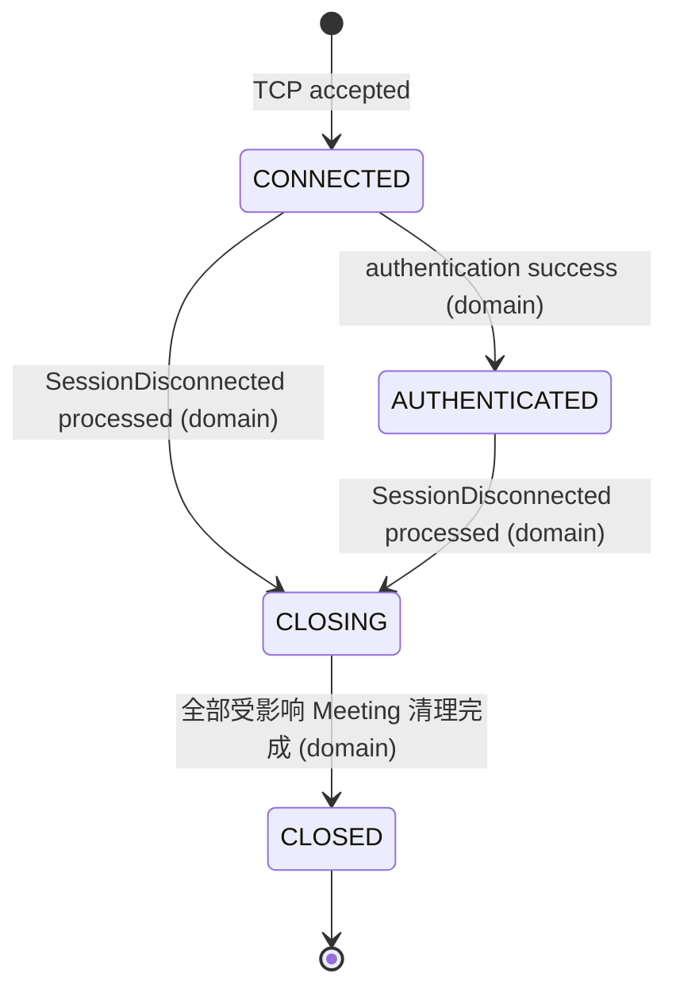
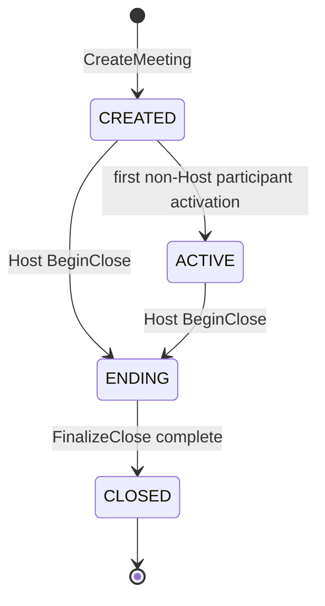
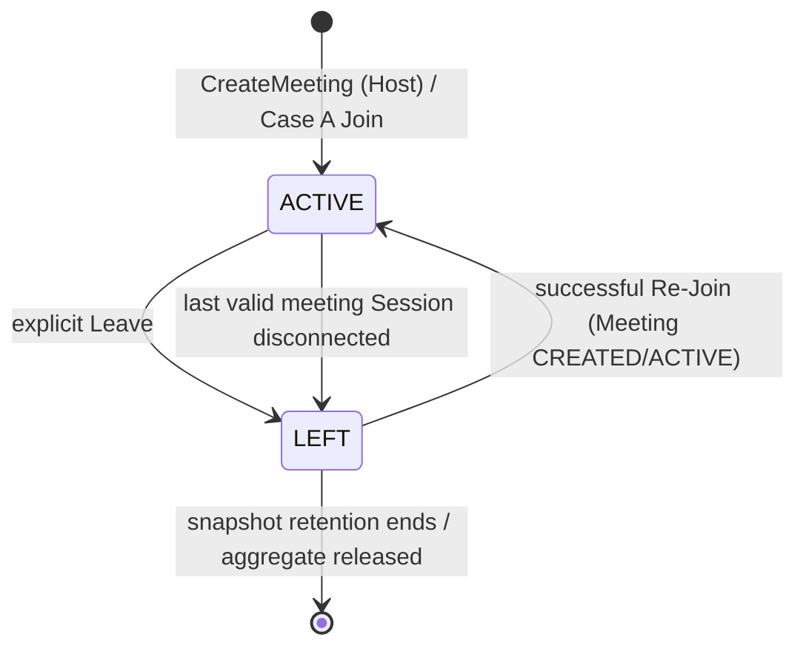
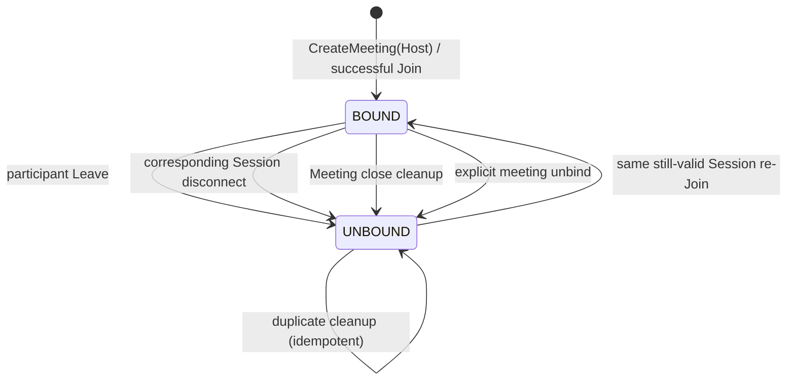
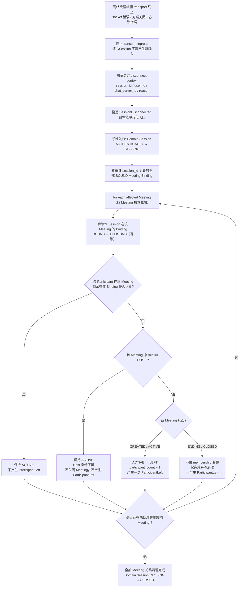
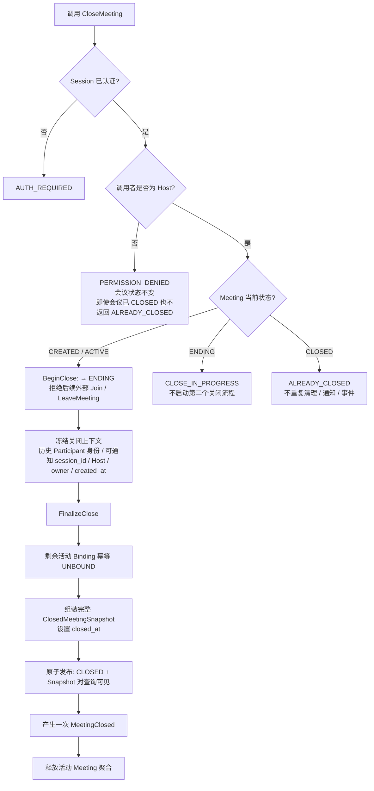
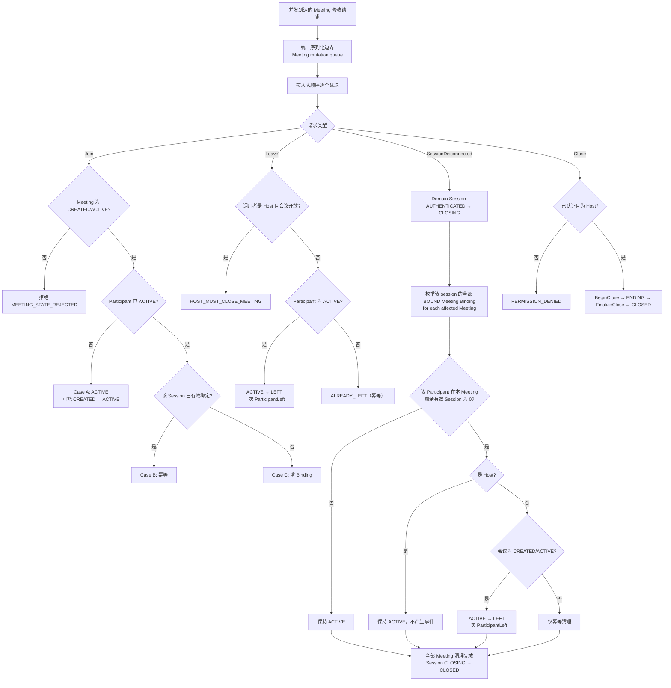

# Phase 1 - Step 1.3：Session / Meeting / Participant 状态机设计

## 1. 文档目的

本文为 Meeting MVP 定义正式状态机、合法/非法状态转换、并发修改策略、断线与关闭的竞态裁决、CLOSED 终态快照的原子性以及领域事件去重规则。

本文是设计文档，不表示任何状态、状态机、串行化入口或事件发布器已经在 C++ 中实现。当前仓库中不存在 Meeting、Participant、Binding 或 ClosedMeetingSnapshot 的代码实体，也不存在 Meeting 消息 ID 或 Meeting 协议。

本文的输出目标是：状态与转换规则精确到可以直接翻译为后续单元测试用例，且不允许用若干 `bool` 字段互相组合来替代显式状态。

本文不定义：正式 API 请求/响应结构、`request_id`、数值错误码、TCP message ID、JSON 或 protobuf 字段、Event 对外传输格式、`owner_chat_server_id` 的请求传递方式，也不定义 `MeetingRegistry` 的 C++ 类型与容器选型。

## 2. 输入约束

本文继承并不得推翻 Step 1.1 与 Step 1.2 已冻结的规则：

1. Meeting 第一版内置于 owner ChatServer，不新增独立 MeetingServer 进程。
2. `(meeting_id, user_id)` 是同一 Meeting 内 Participant 的唯一逻辑身份。
3. 一个 User 可以拥有多个 Device 和多个 Session。
4. 一个 Meeting 中同一 User 只有一个逻辑 Participant。
5. Session 与 Participant 生命周期解耦；单个 Session 断开首先只影响其 Binding。
6. 普通 Participant 只有在最后一个有效会议 Session 消失后才满足逻辑离会条件。
7. Host Session 全部断开不自动关闭 Meeting，也不自动 TransferHost。
8. Host 对开放会议执行 Leave 必须被拒绝（`HOST_MUST_CLOSE_MEETING`）。
9. CLOSED Meeting 不能重新激活。
10. CLOSED 查询依赖 ClosedMeetingSnapshot。
11. Phase 1 不增加 Redis Meeting 路由、Meeting 跨节点 gRPC、MQ 或 MySQL Meeting 表。
12. Phase 1 不定义正式 TCP wire format。

本文对上述约束不做任何修改；如某处需要细化，只在本文内以 `Design Refinement / Compatibility Note` 的形式说明，不回头修改 Step 1.1 或 Step 1.2 文档。

## 3. 与当前代码线程模型的关系

本节只陈述**当前源码事实**，用于说明目标设计的落点边界。

### 3.1 当前可确认的事实

- `Server/ChatServer/ChatServer/ChatServer.cpp` 建立 `AsioIOServicePool`、gRPC 服务线程、Redis 登录计数，并在主 `io_context` 上运行 `CServer`。
- `CServer` 通过 `_acceptor.async_accept` 接收连接，`CSession` 以 `session_id` 为键存入 `std::map<std::string, std::shared_ptr<CSession>> _sessions`，插入时持有 `_mutex`。
- `CSession` 构造时用 Boost UUID 生成字符串 `_session_id`；认证成功后由 `LogicSystem::LoginHandler` 调用 `SetUserId(int)` 写入整数 `_user_uid`。
- `CSession` 内部只有 `bool _b_close` 表示关闭标记，**不存在连接状态枚举**；`Close()` 在 `_session_mtx` 保护下关闭 socket 并置位 `_b_close`。
- `CSession` 的读写异步回调由 `AsioIOServicePool` 的 `io_context` 线程执行；`AsyncReadHead`／`AsyncReadBody` 在错误或长度非法时调用 `_server->ClearSession(_session_id)`。
- `CSession::AsyncReadBody` 将 `LogicNode`（持有 `shared_ptr<CSession>`）投递到 `LogicSystem::PostMsgToQue`。
- `LogicSystem` 使用 `std::queue<std::shared_ptr<LogicNode>> _msg_que`、`std::mutex _mutex`、`std::condition_variable _consume` 和**单个** `_worker_thread` 执行 `DealMsg()`；回调由 `std::map<short, FunCallBack> _fun_callbacks` 按消息 ID 分发。
- `LogicSystem::LoginHandler` 在逻辑线程中设置 Session 的 uid、写入 Redis `uip_<uid>` 用户路由，并调用 `UserMgr::SetUserSession(uid, session)`。
- `UserMgr` 是 `std::unordered_map<int, std::shared_ptr<CSession>> _uid_to_session`，即**当前为 `user_id → 单个 Session`**。
- `CServer::ClearSession(session_id)` 由网络回调直接调用，其行为是：查表得到 uid → 无条件调用 `UserMgr::RmvUserSession(uid)` → 在 `_mutex` 下 `_sessions.erase(session_id)`。

### 3.2 由此得到的落点边界

| 事项 | 当前事实 | Step 1.3 目标设计 |
| --- | --- | --- |
| 会议状态修改位置 | 不存在 | 必须进入统一串行化入口，不由任何网络回调直接修改 |
| 断线处理路径 | 网络回调直接调用 `ClearSession` 并直接改 `UserMgr` | 网络回调只停止 transport ingress 并投递 `SessionDisconnected` |
| 线程模型 | 多个 Asio io_context 线程 + 1 个逻辑 worker 线程 | Meeting 变更与正式 `connection_state` 变更只发生在串行化边界内 |
| Transport 状态 | `bool _b_close` 与 socket 状态（网络线程视角） | 作为独立的 transport 事实，不与 Domain `connection_state` 混用 |
| Domain Session 状态表达 | 不存在 | 正式 `connection_state` 枚举，仅由领域串行化入口修改，见第 5 节 |
| `UserMgr` 映射 | `user_id → 单个 Session` | 会议关系由 Binding 表达，不依赖该映射的多 Session 能力 |

本文只描述目标边界，不修改 `ClearSession`，也不要求现在为 Meeting 新建线程池。

### 3.3 Transport liveness 与 Domain connection_state 的关系

这是后续多处规则共同依赖的前提，必须在最前面固定：

> **transport liveness（网络连接是否仍可收发）与 domain `connection_state` 是相关但不等价的两个事实。**

| 对比项 | Transport liveness | Domain `connection_state` |
| --- | --- | --- |
| 事实含义 | 该连接是否还能接收新的网络输入 | 该连接的正式领域生命周期状态 |
| 修改者 | Asio 网络线程（`CSession` 的 socket 状态、关闭标志或未来 transport flag） | 领域串行化入口 |
| 判断依据 | socket 错误、对端关闭、协议失败 | 认证结果与领域终止流程的处理进度 |
| 变化时机 | 网络事件发生时立即变化 | 由领域操作（含 `SessionDisconnected`）处理时变化 |

由此得到两条本文反复使用的规则：

1. 网络 callback 只修改 transport 事实，**不修改** Domain `connection_state`，也不修改任何 Meeting 聚合、Participant 或 Binding。
2. 当 transport 已经终止、但 `SessionDisconnected` 尚未被领域线程处理时，**Domain Session record 仍保持其上一个正式状态**（对已认证连接即 `AUTHENTICATED`），其 Binding 也仍按该正式状态参与判定。此时网络层已经阻止该 `CSession` 产生新的输入，因此不存在"网络已断却仍能继续下达会议命令"的窗口。

该规则消除了早期表达中的一处歧义：如果由网络线程直接把 Domain Session 置为 `CLOSING`，就会在领域线程处理 `SessionDisconnected` 之前产生"Participant 为 `ACTIVE` 而 `effective_binding_count` 为 0"的跨线程窗口。现在该窗口不存在（详见第 13.3 与 23.2 节）。

## 4. 状态建模原则

1. **显式枚举优先。** 状态必须由明确的枚举值表达，禁止用若干 `bool` 组合隐式表示状态。
2. **连接生命周期与会议成员关系分离。** 这两件事变化节奏不同、来源不同，必须分别建模。
3. **存储事实与派生谓词分离。** 例如 Binding 是否"有效"是派生谓词，不是可独立写入的状态位。
4. **终态不可逆。** `CLOSED`（Session 与 Meeting）是终态，不定义任何离开终态的转换。
5. **每条转换必须有唯一裁决者。** 每条转换只能由一个串行化入口内的用例产生，不存在两处代码各自修改同一状态。
6. **过渡瞬间与稳定状态必须区分。** 可观测的外部状态遵循稳定不变量；处理过程中的临时中间态不得对外暴露。
7. **事件跟随状态。** 领域事件在对应状态修改**成功之后**产生，且同一逻辑变化最多产生一次。
8. **认证与权限优先于幂等。** 任何请求都必须先完成认证与权限判断，才允许用幂等结果作为响应（见 4.1 节）。
9. **网络事实与领域事实分离。** transport 状态不由网络线程写入领域状态（见 3.3 节）。

### 4.1 请求求值顺序

对任何会议命令，求值顺序固定为：

```text
Authentication（Session 是否已完成认证）
        ↓
Authorization / caller identity（调用者身份与角色）
        ↓
Resource / state lookup（会议是否存在、是否在本节点、当前状态）
        ↓
Idempotent result evaluation（是否为重复请求、应返回何种幂等结果）
        ↓
Mutation（执行状态变更，或最终拒绝）
```

必须冻结的规则：

> **幂等语义不能绕过认证与权限检查。**

其含义是：一次请求即使最终会得到一个幂等结果（例如"会议已关闭"），也必须先完成认证与权限判断；只有当调用者确实具有执行该操作的权限时，才允许把幂等结果作为响应返回。

不允许的形状：

```text
if (meeting.state == CLOSED) return ALREADY_CLOSED;   // 错误：跳过了认证与权限检查
```

要求的形状：

```text
1. 认证检查        → 未认证：AUTH_REQUIRED
2. 身份/权限检查   → 非 Host 调用 CloseMeeting：PERMISSION_DENIED
3. 资源与状态查询  → 会议不存在或不在本节点：MEETING_NOT_FOUND / MEETING_NOT_LOCAL
4. 幂等结果求值    → Host 且会议已 CLOSED：ALREADY_CLOSED
5. 变更或最终拒绝
```

具体函数切分、错误码数值与对外字段由 Step 1.4 细化；本 Step 冻结的是**顺序与优先级**。

## 5. Session State

### 5.1 正式状态值

Session 的正式连接生命周期为四个值：

| 状态 | 含义 |
| --- | --- |
| `CONNECTED` | TCP 已建立，尚未完成现有认证流程 |
| `AUTHENTICATED` | 已通过现有 Token 认证，`user_id` 已绑定 |
| `CLOSING` | 终止流程已启动，不再接受新的业务命令 |
| `CLOSED` | 领域清理与注册表清理完成，终态 |

### 5.2 合法转换



图中除 `[*] --> CONNECTED` 之外的转换均由领域串行化入口产生；网络线程不直接产生 `CLOSING`（见 3.3 与 5.5 节）。

明确禁止的逆向或跳跃转换：

- `AUTHENTICATED → CONNECTED`
- `CLOSING → AUTHENTICATED`
- `CLOSING → CONNECTED`
- `CLOSED → *`
- `CONNECTED → CLOSED`（必须经过 `CLOSING`）

### 5.3 Session 状态转换表

| Current State | Trigger / Command | Preconditions | Next State | Side Effect | Event | Invalid / Idempotent Result |
| --- | --- | --- | --- | --- | --- | --- |
| `CONNECTED` | Auth success（现有登录流程） | Token 校验通过 | `AUTHENTICATED` | 绑定 `user_id`；建立 Session 领域记录 | 无会议事件 | 重复认证视为无效，不改状态 |
| `CONNECTED` | 未认证连接终止（transport 已断，领域处理 `SessionDisconnected`） | 无 | `CLOSING` | 停止读取；捕获断线上下文 | 无 | 已 `CLOSING`/`CLOSED` 时重复触发为幂等 |
| `AUTHENTICATED` | Join / Create 等会议命令 | 见第 15、16 节 | `AUTHENTICATED`（不变） | 仅新增／恢复 Binding | 视用例产生 | 会议关系不改变 `connection_state` |
| `AUTHENTICATED` | 断开终止（transport 已断，领域处理 `SessionDisconnected`） | 无 | `CLOSING` | 捕获 `session_id`、`user_id`、`chat_server_id`、原因；随后 fan-out 清理全部受影响 Meeting 的 Binding | 视各 Meeting 裁决产生 | 重复触发幂等 |
| `CLOSING` | 任意会议业务命令 | 无 | `CLOSING`（不变） | 无 | 无 | 必须拒绝，不得修改 Meeting |
| `CLOSING` | 全部受影响 Meeting 的 Binding 清理与 Participant 裁决完成 | 该 `session_id` 在**所有** Meeting 中的 Binding 均已 `UNBOUND` | `CLOSED` | 释放 Session 领域记录 | 无 | 重复完成为幂等 |
| `CLOSED` | 任意命令或断线 | 无 | `CLOSED`（不变） | 无 | 无 | 全部拒绝或幂等 |

该表中的断线相关行体现 3.3 节原则：网络线程先停止 transport ingress，`CLOSING` 与 `CLOSED` 均由领域入口在同一个 `SessionDisconnected` mutation 内完成，不在网络线程写入。

### 5.4 与"是否在会议中"的关系

`connection_state` **不表达** Session 是否参加某个 Meeting。该信息由 `ParticipantSessionBinding` 与有效会议 Session 谓词派生（见第 11、12 节）。一个 `AUTHENTICATED` Session 可以同时是 0 个、1 个或多个 Meeting 的有效会议 Session。

### 5.5 connection_state 的唯一修改者

正式 `connection_state` **只能由领域串行化入口修改**，网络线程不得写入。各转换的归属如下：

| 转换 | 触发来源 | 修改者 | 说明 |
| --- | --- | --- | --- |
| `CONNECTED → AUTHENTICATED` | 认证流程 | 领域串行化入口 | 认证结果在逻辑线程处理（与现有 `LoginHandler` 位于同一线程语义下） |
| `AUTHENTICATED → CLOSING` | transport 终止、协议错误、服务器关闭 | 领域串行化入口 | 网络 callback 只投递 `SessionDisconnected`，由领域入口在本步置位（见第 13 节） |
| `CONNECTED → CLOSING` | 未认证连接终止 | 领域串行化入口 | 同上 |
| `CLOSING → CLOSED` | 该 Session 全部 Meeting 关系清理完成 | 领域串行化入口 | 见第 13.2 节 |

因此对已认证连接而言，`AUTHENTICATED → CLOSING` 发生在 `SessionDisconnected` 这一 serialized mutation 的**内部**：进入该 mutation 时置位 `CLOSING`，退出前完成全部 Binding 清理与 Participant 裁决并收敛到 `CLOSED`。这意味着 `CLOSING` 对普通断线路径而言不是跨领域操作的可观测状态（详见 13.3 与 23.2 节）。

## 6. Design Refinement / Compatibility Note：为什么正式 Session State 不使用 JOINED

Phase 1 总纲中的早期目标语义为：

```text
CONNECTED → AUTHENTICATED → JOINED → CLOSING → CLOSED
```

本 Step 依据 Step 1.2 已确立的多会议 Binding 模型，将其**细化为派生关系**，`JOINED` 不再作为 `connection_state` 的正式枚举值。

理由：

1. **单值枚举无法表达多会议。** 一个 Session 可能同时参与多个 Meeting，单一 `JOINED` 无法承载"加入了哪些会议"。
2. **回退语义无法定义。** 若 Session 离开会议 A、仍在会议 B 中，`JOINED` 应回退到哪个状态无从回答；回退到 `AUTHENTICATED` 会丢失"仍在会议 B"的事实，留在 `JOINED` 又表示错误信息。
3. **变化来源不同。** 会议成员关系可因其他 User/其他节点的行为改变（例如 Meeting 被 Close），而连接生命周期只能由该连接自身或服务端终止行为改变。把两者混在一个字段会产生非局部修改。
4. **Step 1.2 已定义归属。** Step 1.2 明确"Session 不拥有 Participant，只通过 Binding 的 ID 关系参与会议"，因此"是否在会议中"是关系数据，不是连接状态。

因此本文的正式结论是：

- `connection_state` 只有 `CONNECTED`、`AUTHENTICATED`、`CLOSING`、`CLOSED` 四个值。
- "Session 是否参加至少一个 Meeting" 由有效 Binding 派生，可以表达为 `effective_binding_count > 0`。
- 该细化不改变 Step 1.1 的任何业务规则，只是把早期总纲中的过渡语义换成可实现的表达。

## 7. Meeting State

### 7.1 正式状态值

| 状态 | 含义 | 允许的关系操作 |
| --- | --- | --- |
| `CREATED` | 已创建，已有 Host，尚无第一名非 Host 激活成员 | 允许非 Host 首次 Join；Host 可 Close |
| `ACTIVE` | 已有非 Host 成员成功激活的开放会议 | 允许 Join；允许 Participant Leave；Host 可 Close |
| `ENDING` | Host 已发起关闭，正在冻结上下文并清理 | 拒绝 Join、Leave 及一切成员关系变更 |
| `CLOSED` | 终态，由 ClosedMeetingSnapshot 承接查询 | 不可 Join、不可 Leave、不可重新激活 |

### 7.2 合法转换



合法转换仅有四条：

```text
CREATED → ACTIVE
CREATED → ENDING
ACTIVE  → ENDING
ENDING  → CLOSED
```

明确禁止：

```text
ACTIVE  → CREATED
ENDING  → ACTIVE
CLOSED  → ACTIVE
CLOSED  → CREATED
CLOSED  → ENDING
ENDING  → CREATED
```

### 7.3 Meeting 状态转换表

| Current State | Trigger / Command | Preconditions | Next State | Side Effect | Event | Invalid / Idempotent Result |
| --- | --- | --- | --- | --- | --- | --- |
| `CREATED` | CreateMeeting | 调用者 Session 已认证 | `CREATED`（终点同上） | 建 Meeting、建 Host Participant、建 Host Binding、成员数 = 1 | `MeetingCreated` | 无 |
| `CREATED` | 非 Host 首次 Join（Case A） | 调用者已认证；见第 15 节 | `ACTIVE` | 与该 Participant 激活在同一串行化修改内完成 | `ParticipantJoined` | 无 |
| `CREATED` | Host 重复 Join / 重新绑定 Session | 调用者已认证；见第 15 节 Case B/C | `CREATED`（不变） | 仅 Binding 增量 | 无 | **不得**触发 `CREATED → ACTIVE` |
| `CREATED` | Host BeginClose | 调用者已认证且为 Host | `ENDING` | 冻结关闭上下文 | 无 | 未认证返回 `AUTH_REQUIRED`；非 Host 返回 `PERMISSION_DENIED` |
| `ACTIVE` | 非 Host Join（Case A） | 调用者已认证；见第 15 节 | `ACTIVE`（不变） | 成员数 +1 | `ParticipantJoined` | 无 |
| `ACTIVE` | LeaveMeeting（外部命令） | 调用者已认证且为该会议 Participant；见第 16 节 | `ACTIVE`（不变） | 成员数 −1；该 Participant 全部 Binding `UNBOUND` | `ParticipantLeft` | 重复 Leave 返回 `ALREADY_LEFT`；Host 调用返回 `HOST_MUST_CLOSE_MEETING` |
| `ACTIVE` | Session Disconnect（内部清理） | 见第 13 节 | `ACTIVE`（不变） | 解除该 Session Binding；如为该 Participant 最后一个有效 Session 则成员数 −1 | 仅在真实 `ACTIVE → LEFT` 时产生一次 `ParticipantLeft` | 重复断线不重复事件；Host 不迁移、不产生事件 |
| `ACTIVE` | Host BeginClose | 调用者已认证且为 Host | `ENDING` | 冻结关闭上下文 | 无 | 未认证返回 `AUTH_REQUIRED`；非 Host 返回 `PERMISSION_DENIED` |
| `ACTIVE` | 所有非 Host Participant 离开 | 无 | `ACTIVE`（不变） | 成员数减少 | 视用例 | **不得**回退到 `CREATED` |
| `CREATED` / `ACTIVE` | Join | 调用者已认证；会议为 `ENDING`/`CLOSED` | 不变 | 无 | 无 | `MEETING_STATE_REJECTED` |
| `CREATED` / `ACTIVE` | LeaveMeeting（外部命令） | 调用者已认证；会议为 `ENDING`/`CLOSED` | 不变 | 无 | 无 | `MEETING_STATE_REJECTED`；不接受外部成员关系变更 |
| `ENDING` | Join | 调用者已认证 | `ENDING`（不变） | 无 | 无 | `MEETING_STATE_REJECTED` |
| `ENDING` | LeaveMeeting（外部命令） | 调用者已认证 | `ENDING`（不变） | 无 | 无 | `MEETING_STATE_REJECTED`；成员关系已冻结 |
| `ENDING` | 内部幂等清理（Disconnect / Close cleanup） | 无（内部路径） | `ENDING`（不变） | 仅 Binding 幂等 `UNBOUND` | 无 | 幂等；不改变 membership，不产生 `ParticipantLeft` |
| `ENDING` | BeginClose（重复） | 调用者已认证且为 Host | `ENDING`（不变） | 无 | 无 | `CLOSE_IN_PROGRESS`，不得启动第二个关闭流程 |
| `ENDING` | FinalizeClose | 快照已完整组装 | `CLOSED` | 安装快照、设置 `closed_at`、释放活动聚合 | `MeetingClosed` | 重复调用幂等，不重复事件 |
| `CLOSED` | CloseMeeting | 调用者已认证且为 Host（顺序见 4.1 节） | `CLOSED`（不变） | 无 | 无 | `ALREADY_CLOSED`（幂等成功） |
| `CLOSED` | CloseMeeting | 调用者已认证但**不是 Host** | `CLOSED`（不变） | 无 | 无 | **`PERMISSION_DENIED`**；不得因会议已关闭而返回 `ALREADY_CLOSED` |
| `CLOSED` | 外部成员关系命令（Join / LeaveMeeting） | 调用者已认证 | `CLOSED`（不变） | 无 | 无 | 按 4.1 节顺序先判权限后判状态；拒绝且不得重新激活 |
| `CLOSED` | 内部幂等清理 | 无（内部路径） | `CLOSED`（不变） | 仅 Binding 幂等 `UNBOUND` | 无 | 幂等；不改变 membership |

### 7.4 `CLOSED` 状态下 CloseMeeting 的结果取决于权限

`CLOSED` + `CloseMeeting` 的结果**不是**对任何调用者都返回 `ALREADY_CLOSED`。按 4.1 节的求值顺序：

| 调用者 | 会议状态 | 结果 |
| --- | --- | --- |
| Host | `CLOSED` | `ALREADY_CLOSED`（幂等成功，不重复清理、通知与事件） |
| Host | `ENDING` | `CLOSE_IN_PROGRESS`（幂等，不启动第二个关闭流程） |
| 非 Host（已认证） | `CLOSED` | `PERMISSION_DENIED`，**不得**返回 `ALREADY_CLOSED` |
| 非 Host（已认证） | `ENDING` | `PERMISSION_DENIED`，**不得**返回 `CLOSE_IN_PROGRESS` |
| 非 Host（已认证） | `CREATED` / `ACTIVE` | `PERMISSION_DENIED` |
| 未认证 Session | 任意 | `AUTH_REQUIRED` |

该规则继承 Step 1.1 的表述"非 Host 即使会议已经关闭，也必须按权限规则拒绝 CloseMeeting"。

## 8. CREATED → ACTIVE 精确触发规则

### 8.1 规则

`CREATED → ACTIVE` 的触发条件是：

> **第一个非 Host 用户在 Meeting 中成功完成一次逻辑 Participant 激活，即该 `user_id` 的 Participant 从"不存在或 `LEFT`"变为 `ACTIVE`。**

激活必须与该 Participant 的加入落在同一个 Meeting 聚合串行化修改内，即在一次串行化处理中同时完成：

```text
Participant absent/LEFT → ACTIVE
（若这是第一个非 Host 激活）Meeting CREATED → ACTIVE
```

不允许出现"Participant 已 ACTIVE 但 Meeting 仍 CREATED"对外可见的稳定状态。

### 8.2 CreateMeeting 完成后的状态

`CreateMeeting` 完成以下三件事后，Meeting 仍为 `CREATED`：

```text
创建 Meeting
+ 创建 Host Participant（membership_state = ACTIVE, role = HOST）
+ 建立 Host Session Binding（BOUND）
```

Host 的存在不构成"Meeting 已活跃"。`CREATED` 与 `ACTIVE` 的差别是"是否已有非 Host 成员成功激活"，用于区分空会议室与已开始的会议。

### 8.3 不触发转换的情形

以下行为**不得**触发 `CREATED → ACTIVE`：

| 行为 | 结果 |
| --- | --- |
| Host 自己重复 Join（Case B） | Meeting 保持 `CREATED` |
| Host 用另一个 Session Join（Case C） | Meeting 保持 `CREATED` |
| Host 断线后重新 Join／重新绑定 | Meeting 保持 `CREATED` |
| Host 的任一 Session 断开 | Meeting 保持 `CREATED` |
| 非 Host 用户 Join 被拒绝（`ENDING`/`CLOSED`） | Meeting 保持原状态 |
| 非 Host 用户 Join 幂等命中（理论上不存在，见下） | 不构成新的激活 |

### 8.4 非 Host 的"幂等命中"为何不触发

对非 Host 用户而言，Case B／Case C（幂等 Join 与多 Session Join）成立的前提是该用户已经是 `ACTIVE` Participant，而该状态只能由 Case A 产生。因此对非 Host 用户来说，Case B/C 必然发生在 Case A 之后，此时 Meeting 已是 `ACTIVE`，不存在"再次触发 `CREATED → ACTIVE`"的路径。

### 8.5 不可回退

Meeting 一旦进入 `ACTIVE`，即使所有非 Host Participant 后续全部离开、有效 Binding 全部消失，也**不得回退到 `CREATED`**。`CREATED` 只表示"尚未有人加入过"，不表示"当前没有非 Host 成员"。

## 9. Participant State

### 9.1 正式状态值

Participant 的正式成员关系状态为两个值：

| 状态 | 含义 |
| --- | --- |
| `ACTIVE` | 该 User 当前是 Meeting 的逻辑活动成员 |
| `LEFT` | 该 User 当前不属于活动成员集合 |

`LEFT` 是"非活动成员"的状态，不表示记录被删除。为支持幂等判断、后续重新 Join、CLOSED Snapshot 历史成员鉴权以及 `joined_at`／`left_at` 历史，`LEFT` 的 Participant 记录必须保留最小身份信息。

### 9.2 `is_active` 的定位

`is_active` 必须定义为：

```text
is_active  :=  (participant_state == ACTIVE)
```

`is_active` 是派生投影，不是可与 `participant_state` 冲突的第二套权威状态。禁止出现 `is_active == true` 而 `participant_state == LEFT` 的状态组合。

### 9.3 为什么不用底层 TCP 在线状态作为 Participant 状态

不使用"在线／离线"作为 Participant 状态，原因：

1. 一个 User 可有多条 Session，底层在线是 Session 级事实，不是成员关系事实。
2. 一个 User 可同时是多个 Meeting 的成员，且"是否在线"与"是否是成员"由不同条件决定。
3. Host 允许在有效 Session 数为 0 时保持 `ACTIVE`，此时"离线"不能等于"非成员"。
4. Presence 阶段的在线标记属于后续能力，不应提前混入成员状态。

### 9.4 Participant 合法转换



普通 Participant：

| 当前 | 触发 | 结果 |
| --- | --- | --- |
| 不存在 / `LEFT` | successful Join（Case A） | `ACTIVE` |
| `ACTIVE` | explicit Leave | `LEFT` |
| `ACTIVE` | 最后一个有效会议 Session 断开 | `LEFT` |
| `LEFT` | 在 `CREATED`/`ACTIVE` 会议中成功 Re-Join | `ACTIVE` |

Meeting 进入 `ENDING`/`CLOSED` 后禁止 `LEFT → ACTIVE`。

Host：

| 当前 | 触发 | 结果 |
| --- | --- | --- |
| 不存在 | `CreateMeeting` | `ACTIVE`（`role = HOST`） |
| `ACTIVE` | 全部 Session 断开（`effective_binding_count == 0`） | **保持 `ACTIVE`** |
| `ACTIVE` | 对 `CREATED`/`ACTIVE` 会议 Leave | 返回 `HOST_MUST_CLOSE_MEETING`，**保持 `ACTIVE`** |
| `ACTIVE` | Meeting 被 Close 并进入终态 | 随聚合进入终态快照与清理过程 |

明确禁止：

- Host 因 Disconnect 自动变为 `LEFT`。
- Host 因 `effective_binding_count == 0` 自动 Close Meeting。
- Host 因 Disconnect 自动 TransferHost。

### 9.5 Participant 状态转换表

| Current State | Trigger / Command | Preconditions | Next State | Side Effect | Event | Invalid / Idempotent Result |
| --- | --- | --- | --- | --- | --- | --- |
| 不存在 | CreateMeeting | Session 已认证 | `ACTIVE`（HOST） | Binding BOUND；成员数 = 1 | `MeetingCreated` | 无 |
| 不存在 / `LEFT` | Join（Case A） | Meeting 为 `CREATED`/`ACTIVE` | `ACTIVE` | Binding BOUND；成员数 +1；可能同时 `CREATED → ACTIVE` | `ParticipantJoined` | 无 |
| `ACTIVE`（PARTICIPANT） | Join 同一 Session（Case B） | 该 Session 已有有效 BOUND Binding | `ACTIVE`（不变） | 无 | 无 | 幂等成功，成员数与事件均不变 |
| `ACTIVE`（PARTICIPANT） | Join 其他 Session（Case C） | 该 Session 属于同一 `user_id` | `ACTIVE`（不变） | 为该 Session 建立／恢复 Binding | 无 | 不产生第二个 Participant，不产生事件 |
| `ACTIVE`（HOST） | Join 任意自己的 Session | 同上 | `ACTIVE`（不变） | Binding 增量 | 无 | 不触发 `CREATED → ACTIVE` |
| `ACTIVE`（PARTICIPANT） | LeaveMeeting | Meeting 为 `CREATED`/`ACTIVE` | `LEFT` | 全部 Binding UNBOUND；成员数 −1；写 `left_at` | `ParticipantLeft` | 无 |
| `ACTIVE`（HOST） | LeaveMeeting | Meeting 为 `CREATED`/`ACTIVE` | `ACTIVE`（不变） | 不解绑 Host Binding，不改成员数 | 无 | `HOST_MUST_CLOSE_MEETING` |
| `ACTIVE`（PARTICIPANT） | 最后一个有效 Session 断开 | 本 Meeting 中有效 Binding 数由 ≥1 变为 0 | `LEFT` | 全部 Binding UNBOUND；成员数 −1 | 本 Meeting 一次 `ParticipantLeft` | 重复断线不重复事件；同一 Session 跨多 Meeting 时各 Meeting 独立计数 |
| `ACTIVE`（HOST） | 最后一个有效 Session 断开 | 有效 Binding 数变为 0 | `ACTIVE`（不变） | 仅解绑该 Session | 无 | 不得产生 `ParticipantLeft` |
| `LEFT` | LeaveMeeting | 无 | `LEFT`（不变） | 无 | 无 | `ALREADY_LEFT`（幂等） |
| `LEFT` | Join | Meeting 为 `CREATED`/`ACTIVE` | `ACTIVE` | Binding BOUND；成员数 +1 | `ParticipantJoined` | 视为新的 membership activation |
| `LEFT` | Join | Meeting 为 `ENDING`/`CLOSED` | `LEFT`（不变） | 无 | 无 | `MEETING_STATE_REJECTED` |
| `ACTIVE` / `LEFT` | Close 清理 | 会议已 `ENDING` | 冻结进快照 | Binding 幂等 UNBOUND | 无（由 `MeetingClosed` 表达） | 不产生逐成员 `ParticipantLeft` |
| `ACTIVE` / `LEFT` | 重复 Disconnect 清理 | 无 | 不变 | 仅幂等 UNBOUND | 无 | 幂等 |

### 9.6 Design Refinement / Compatibility Note：Close 不表示为逐成员 LEFT

Step 1.2 定义 Participant 的 `left_at` 与 `is_active`，但未规定 Meeting Close 是否把活动 Participant 逐个转为 `LEFT`。

本 Step 明确：**Meeting Close 不产生逐成员的 `ACTIVE → LEFT` 转换，也不产生逐成员 `ParticipantLeft` 事件。** 理由是：

1. 会议结束是聚合级事实，由唯一一次 `MeetingClosed` 表达；逐成员事件会与聚合事件语义重复。
2. 若把被 Close 清理的 Host 也置为 `LEFT`，会产生"已 CLOSED 会议中有一个 `LEFT` 的 Host"这种自相矛盾的表达。
3. Step 1.1 要求 CLOSED 查询依赖快照中的历史身份，快照已经承载"谁曾参与"，无需依赖成员状态。

该细化不改变 Step 1.1 的权限规则与 Step 1.2 的字段定义，仅澄清 Close 路径不产生成员状态转换。

## 10. Participant Re-Join

### 10.1 基本规则

Participant 处于 `LEFT` 后重新 Join 同一 Meeting，复用原逻辑身份：

- 定位仍使用 `(meeting_id, user_id)`。
- 若 Meeting 为 `CREATED`/`ACTIVE`，可行；若为 `ENDING`/`CLOSED`，拒绝。
- 成功后 `membership_state` 回到 `ACTIVE`，更新成员数，建立新 Binding。
- 这是一次**新的 membership activation**，可以再次产生 `ParticipantJoined`。

### 10.2 为什么可以再次产生 ParticipantJoined

`ParticipantJoined` 表达的是"本次活动成员集合新增了一名成员"，而不是"这个 User 历史上第一次加入"。同一 User 的 Leave→Re-Join 在成员集合事实上是两次加入，因此第二次产生 `ParticipantJoined` 是正确语义，不属于重复事件。

为避免与"重复 Join 幂等"混淆，本文明确区分：

| 场景 | 是否产生 `ParticipantJoined` |
| --- | --- |
| 不存在 / `LEFT` → `ACTIVE`（Case A） | 产生一次 |
| `ACTIVE` + 同 Session 重复 Join（Case B） | 不产生 |
| `ACTIVE` + 新 Session Join（Case C） | 不产生 |
| `LEFT` → `ACTIVE`（Re-Join） | 产生一次（新的 activation） |
| `ACTIVE` 状态下任何 Binding 变更 | 不产生 |

后续 Step 1.4 可通过事件上下文（例如 membership 修订号或 activation 序号）让消费方区分同一 User 的多次 activation，本 Step 只规定产生规则。

### 10.3 不创建重复逻辑成员

Re-Join 不得产生第二条 Participant 记录。多设备 Re-Join 同样遵守：`(meeting_id, user_id)` 只有一个 Participant，各设备 Session 只体现为不同 Binding。

## 11. Binding State

### 11.1 正式状态值

`ParticipantSessionBinding` 的关系状态为两个值：

| 状态 | 含义 |
| --- | --- |
| `BOUND` | 该 Session 与该 Participant 存在绑定关系 |
| `UNBOUND` | 该绑定关系已被解除 |

### 11.2 合法转换



`UNBOUND` 不是该关系键的最终状态：同一 `(meeting_id, user_id, session_id)` 在 Session 仍然有效、认证仍在、且 Meeting 仍为 `CREATED`/`ACTIVE` 时，可以再次成为 `BOUND`。

但若 Session 已进入 `CLOSING` 或 `CLOSED`，则**永远不能**再转为 `BOUND`（Session 是终态，见第 5 节）。

### 11.3 `BOUND → UNBOUND` 的触发来源

| 触发来源 | 说明 |
| --- | --- |
| Participant 主动 Leave | 该 `(meeting_id, user_id)` 下**全部**活动 Binding 均变为 `UNBOUND` |
| 对应 Session Disconnect | 只解除该 `session_id` 在**各受影响 Meeting** 中的 Binding（一个 Session 可同时影响多个 Meeting，见 13.1 节） |
| Meeting Close 清理 | `FinalizeClose` 阶段对该 Meeting 所有剩余活动 Binding 执行幂等 UNBOUND |
| 显式会议解绑 | 预留的统一解绑路径，语义与上述一致且幂等 |

重复 `UNBOUND` 必须幂等：不得出错、不得改变其他 Binding、不得影响成员数。

### 11.4 Binding 有效性不能只看 `binding_status`

`binding_status == BOUND` 只是必要条件，不是充分条件。Binding 是否"有效"必须结合 Step 1.2 的有效会议 Session 谓词（见第 12 节）。特别地：

> 如果 Domain Session 的 `connection_state` 已进入 `CLOSING`，即使该 Binding 的 `binding_status` 仍为 `BOUND`，该 Binding 也**不得**被计算为有效会议 Session。

也就是说，Binding 有效性是**求值时刻的派生谓词**，而不是可缓存的状态位。

需要与第 13 节配合理解：对于断线路径，`AUTHENTICATED → CLOSING`、Binding `BOUND → UNBOUND` 与 Participant 裁决位于**同一个** serialized mutation 内（见 13.2、13.3 节），因此该排除规则不会在两次领域操作之间产生可观测冲突。

### 11.5 Binding 状态转换表

| Current State | Trigger / Command | Preconditions | Next State | Side Effect | Event | Invalid / Idempotent Result |
| --- | --- | --- | --- | --- | --- | --- |
| 不存在 | CreateMeeting / Join | Session 已认证且 Meeting 为 `CREATED`/`ACTIVE` | `BOUND` | 写 `bound_at` | 视用例 | 同一 `(meeting,user,session)` 已有有效 Binding 时为幂等，不重复创建 |
| `BOUND` | Participant Leave | Meeting 为 `CREATED`/`ACTIVE` | `UNBOUND` | 写 `unbound_at`；同 Participant 其余 Binding 一并 `UNBOUND` | 由 membership 变化决定 | 重复调用幂等 |
| `BOUND` | Session Disconnect | 无 | `UNBOUND` | 写 `unbound_at`；只影响该 Session | 视剩余有效 Session 决定 | 重复调用幂等 |
| `BOUND` | Close 清理 | Meeting 为 `ENDING` | `UNBOUND` | 写 `unbound_at` | 无 | 重复调用幂等，不产生成员事件 |
| `BOUND` | 显式解绑 | 无 | `UNBOUND` | 写 `unbound_at` | 无 | 重复调用幂等 |
| `UNBOUND` | Join（同一仍有效 Session） | Session 为 `AUTHENTICATED`；Meeting 为 `CREATED`/`ACTIVE`；Participant 为 `ACTIVE` | `BOUND` | 更新 `bound_at` | Case C 时无事件 | Meeting 为 `ENDING`/`CLOSED` 时拒绝 |
| `UNBOUND` | Join（同一 Session 但 Session 已 `CLOSING`/`CLOSED`） | 无 | `UNBOUND`（不变） | 无 | 无 | 必须拒绝，不得建立有效 Binding |
| `UNBOUND` | 任意清理动作 | 无 | `UNBOUND`（不变） | 无 | 无 | 幂等 |

## 12. 有效会议 Session

### 12.1 定义

对某个 `(meeting_id, user_id)`，"有效会议 Session"是满足下列**全部**条件的 Binding：

1. Binding 的 `meeting_id`、Participant User 与 `session_id` 关系一致。
2. `binding_status == BOUND`，且未被 Leave、显式解绑或关闭清理标记为 `UNBOUND`。
3. Session 的身份、User 身份与 Binding 记录一致。
4. Session 已完成认证（`connection_state == AUTHENTICATED`）。
5. Session 的 `chat_server_id` 与实际承载节点一致。
6. Session 未进入 `CLOSING` 或 `CLOSED`。
7. Session 未被 Leave、显式解绑或关闭清理标记为无效。

### 12.2 求值语义

- 该谓词在**求值时刻**计算，不得缓存为独立状态位。
- `effective_binding_count(meeting_id, user_id)` 定义为：满足上述全部条件的 Binding 的数量。
- "最后一个有效会议 Session 断开"定义为：该计数由 ≥1 变为 0。
- 仅持有 Binding 元数据、或 `shared_ptr<CSession>` 仍被回调暂时持有，均**不**构成有效会议 Session。

### 12.3 为什么必须排除 `CLOSING`

Domain Session 进入 `CLOSING` 表示该连接的终止流程已由领域开始处理，不会再接受新的业务命令。此时：

- 该 Binding 在逻辑上已经失效，不应参与成员数或成员状态判断；
- 但 `binding_status` 可能仍是 `BOUND`，因为 Binding 清理与状态变更位于同一 serialized mutation 内。

若允许 `CLOSING` 的 Session 计入有效 Session，会出现"参与者已被判定离会后，同一 Session 的命令又把状态改回去"的不一致。因此有效谓词必须包含"未进入 `CLOSING`/`CLOSED`"。

与早期表达的差别：本 Step 明确正式 `AUTHENTICATED → CLOSING` 由领域入口在处理 `SessionDisconnected` 时执行，并与 Binding 清理、Participant 裁决位于**同一个** serialized mutation 内。因此：

- 该排除规则只在该 mutation 内部生效；
- 不会出现"网络线程已把 Session 置为 `CLOSING`、而领域尚未清理 Binding"的跨线程可观测窗口；
- 普通 Participant 的 `ACTIVE` 且 `effective_binding_count == 0` 不会作为正常可观测状态长期存在（见 23.2 节）。

### 12.4 Host 的特殊情形

Host 的 `host_user_id` 是聚合根的固有属性，与有效 Session 数无关。因此 Host 允许

```text
effective_binding_count == 0 且 membership_state == ACTIVE
```

这是稳定状态，不是过渡瞬间。Host 的该状态可长期存在且可观测，与普通 Participant 不同；二者差别源于 Host 身份不依赖有效连接（见 I4）。

## 13. Session Disconnect

### 13.1 Transport 终止与 Domain Session 终止的职责划分

Session 终止涉及两个层次的事实，必须分开表达，不得混写：

| 层次 | 事实 | 修改者 | 语义 |
| --- | --- | --- | --- |
| Transport | socket 错误／对端关闭／协议失败；连接不再接受新的网络输入 | Asio 网络线程 | 网络事实 |
| Domain | `Session.connection_state` | 领域串行化入口 | 正式领域状态 |
| Domain | Binding 与 Participant membership | 领域串行化入口 | 关系事实 |

网络 callback **只允许**完成以下三件事：

```text
socket error / peer closed / protocol failure
        ↓
停止 transport ingress（不再接受该连接的新网络输入）
        ↓
捕获稳定 disconnect context
（session_id / user_id / chat_server_id / reason）
        ↓
投递 SessionDisconnected 到领域串行化入口
```

网络 callback **不允许**：

- 修改 Meeting 聚合、Participant 集合或 Binding；
- 修改正式的 `Session.connection_state`；
- 把"transport 已断"直接解释为"领域 Session 已经 `CLOSING`"。

正式的 `AUTHENTICATED → CLOSING` 由领域串行化入口在处理 `SessionDisconnected` 时执行（见 13.2 节），因此 transport 终止与 domain 终止是两个先后发生、由不同执行者完成的事件。

### 13.2 一个 SessionDisconnected 必须 fan-out 到全部受影响 Meeting

由于一个 Session 可以通过多条 Binding 同时参与多个 Meeting，`SessionDisconnected(session_id)` **不能只处理其中一个 Binding 或其中一个 Participant，必须覆盖该 Session 当前关联的全部 Meeting。** 正式处理顺序为：

```text
SessionDisconnected(session_id) 开始（一次 serialized mutation）
        ↓
Domain Session: AUTHENTICATED → CLOSING
        ↓
枚举该 session_id 当前关联的全部 BOUND Meeting Binding
        ↓
for each affected Meeting（各 Meeting 独立裁决）:
        解除本 Session 在该 Meeting 中的 Binding（幂等 UNBOUND）
        ↓
        定位该 Meeting 中对应的 (meeting_id, user_id) Participant
        ↓
        重新计算该 Participant 在本 Meeting 的剩余有效 Binding
        ↓
        普通 Participant:
            剩余 > 0  → 保持 ACTIVE
            第一次变为 0 → ACTIVE → LEFT
                          participant_count − 1
                          ParticipantLeft（该 Meeting 一次）
        Host（任意 Meeting）:
            即使变为 0 → 保持 ACTIVE，不产生事件，不关闭 Meeting
        ↓
全部受影响 Meeting 的关系清理完成
        ↓
Domain Session: CLOSING → CLOSED
```

对应的联动流程图为：



一个 Session 断开可能影响 0 个 Meeting（未加入任何会议）或同时影响多个 Meeting，图中循环部分即表达该 fan-out；`ParticipantLeft` 的产生粒度为 `(meeting_id, user_id)`。

必须遵守的规则：

1. **一个 SessionDisconnect 可以影响 0 个、1 个或多个 Meeting。** 影响 0 个（例如已认证但未加入任何会议）也是合法路径，此时只完成 Session 的领域终止。
2. **每个 Meeting 独立执行 Participant 裁决。** 某个 Meeting 中的清理结果不得影响另一个 Meeting 的 membership。
3. **`ParticipantLeft` 的产生粒度是 `(meeting_id, user_id)`。** 每个真实发生 `ACTIVE → LEFT` 的组合最多产生一次；同一 Session 断开跨越 M1、M2 时，若两者都真实发生离会，则各自产生一次，且各自只产生一次。
4. **Session 只有在全部相关 Meeting Binding 清理完成后才能进入 `CLOSED`。** 不允许"部分 Meeting 已清理但 Session 已 `CLOSED`"。
5. **重复 `SessionDisconnected` 必须整体幂等。** 重复投递时，已 `CLOSED` 的 Session 与已 `UNBOUND` 的 Binding 均不产生任何二次变更与事件。

为支持"枚举该 `session_id` 的全部 Binding"，实现上需要一个 Session → Binding 的反向索引能力。**其具体 C++ 容器、索引结构与维护方式留给 Step 1.6**，本 Step 只规定该能力必须具备及其语义。

### 13.3 为什么不会出现 Participant ACTIVE 且有效 Session 为 0 的可观测窗口

早期表达为：

```text
network disconnect → Session connection_state = CLOSING → enqueue SessionDisconnected → Meeting cleanup
```

这会在"网络线程已置 `CLOSING`、而 Logic worker 尚未处理 `SessionDisconnected`"期间形成：

```text
Participant == ACTIVE
effective_binding_count == 0
```

与普通 Participant 的稳定不变量 I3 冲突。

按 13.1 与 13.2 修正后，该窗口消失，原因有三：

1. **网络线程不写 Domain 状态。** transport 断开时，Domain Session record 保持 `AUTHENTICATED`，Binding 仍为 `BOUND`，因此按第 12 节的谓词求值时 `effective_binding_count` 仍 ≥ 1。
2. **Domain 置位与 Binding 清理位于同一 mutation。** `AUTHENTICATED → CLOSING`、Binding `BOUND → UNBOUND`、Participant 裁决、`CLOSING → CLOSED` 在同一个 serialized mutation 内完成，中间组合对外不可观测。
3. **网络输入已被阻止。** 该 Session 无法在此窗口内产生新的会议命令，因此不存在"已被网络判定断开却仍能改变状态"的路径。

因此"`AUTHENTICATED → CLOSING` 发生在串行化处理中"不是实现细节，而是维持 I3 的必要条件。

### 13.4 关键约束

1. 网络 io_context 回调**不得**直接修改 Meeting 聚合、Participant、Binding 或 Domain `connection_state`。
2. 网络回调只负责停止 ingress、生成稳定上下文并投递事件；投递后不再持有对该 Session 领域状态的修改权。
3. 断线清理必须幂等：重复投递 `SessionDisconnected` 最多产生一次逻辑移除与一次 `ParticipantLeft`（按 `(meeting_id, user_id)` 计）。
4. 只有当该 Session 在**全部**相关 Meeting 的 Binding 均已 `UNBOUND` 且领域清理完成后，Session 才可进入 `CLOSED`。
5. `ENDING`/`CLOSED` 会议中的 Disconnect 只做必要的幂等 `UNBOUND`，不改变 membership，不产生 `ParticipantLeft`。

### 13.5 CSession 存活与有效会议 Session 是两回事

必须强调：

> `CSession` 网络对象是否仍被 `shared_ptr` 临时持有（例如仍被队列中的 `LogicNode` 持有），与"该 Session 是否仍是有效会议 Session"是两个不同问题。

`LogicNode` 持有 `shared_ptr<CSession>` 会延长网络对象的生命周期，使"对象已销毁"无法作为"已退出会议"的判据。同理，transport liveness 也无法作为 Domain `connection_state` 的判据。因此逻辑离会判断必须基于 Domain Session 状态与 Binding 事实，而不是基于对象是否存在或 socket 是否可用。

## 14. Host Disconnect

### 14.1 规则

| 情形 | 结果 |
| --- | --- |
| Host 的某个 Session 断开 | 只解除该 Session 在全部受影响 Meeting 中的 Binding；各 Meeting 的 Host Participant 与 `host_user_id` 均保留 |
| Host 的全部 Session 断开（各 Meeting 中 `effective_binding_count == 0`） | 各 Meeting 的 Host 仍为 `ACTIVE`；所有 Meeting 状态不变；不产生 `ParticipantLeft` |
| Host 断开时 Meeting 为 `CREATED` | 保持 `CREATED`，不回退也不推进 |
| Host 断开时 Meeting 为 `ACTIVE` | 保持 `ACTIVE` |
| Host 断开后重新 Join（Case C 或 Re-Join） | 复用原 Participant，新增／恢复 Binding；不触发 `CREATED → ACTIVE` |
| Host 断开期间其他 Participant 离开 | 正常按第 13 节处理，与 Host 是否在线无关 |
| Host 的同一 Session 同时属于多个 Meeting | 按 13.2 节 fan-out 到全部受影响 Meeting；每个 Meeting 中 Host 均保持 `ACTIVE`，且不自动关闭任何 Meeting |

### 14.2 明确禁止

- Host Disconnect 自动 Close Meeting。
- Host Disconnect 自动 TransferHost。
- Host Disconnect 使 `membership_state` 变为 `LEFT`。
- Host Disconnect 产生 `ParticipantLeft`。
- Host Disconnect 销毁 Meeting 或释放聚合。

### 14.3 关闭时 Host 不可达

若 Host 在 `ENDING` 阶段已无有效 Session，关闭流程仍必须继续并收敛到 `CLOSED`：

- 通知阶段跳过不可达 Session。
- 不得因通知失败而回滚 `ENDING → CLOSED`。
- 不得让 Meeting 永久停留在 `ENDING`。

## 15. Join 幂等与多 Session Join

Join 必须在三种情形下给出确定的、可测试的结果。

### 15.1 Case A：首次逻辑 Join

前置：Participant 不存在或 `membership_state == LEFT`；Meeting 为 `CREATED`/`ACTIVE`。

结果：

```text
Participant → ACTIVE
当前 Session → Binding = BOUND
participant_count + 1
产生一次 ParticipantJoined
若这是本 Meeting 第一名非 Host 激活成员：Meeting CREATED → ACTIVE（同一串行化修改内完成）
```

### 15.2 Case B：同一 Participant + 同一 Session 重复 Join

前置：Participant 为 `ACTIVE`，且当前 Session 已有有效 `BOUND` Binding。

结果：

```text
不修改 Participant
不修改成员数
不重复创建 Binding
不产生 ParticipantJoined
返回当前 Participant / Meeting 快照（客户端可收敛到服务端状态）
```

属于幂等 Join，结果标记为 `ALREADY_JOINED`（在 Step 1.1 中被定义为幂等成功而非失败）。

### 15.3 Case C：Participant 已 ACTIVE，但另一个 Session Join

前置：同一 `user_id` 的另一条 Session（可能来自同一 Device 或不同 Device）发起 Join。

结果：

```text
Participant 保持 ACTIVE
成员数不变
为该 Session 创建或恢复 Binding（BOUND）
不产生第二个 Participant
不产生 ParticipantJoined
```

这是"逻辑 Join 幂等 + Session Binding 增量更新"。多设备、多 Session 均走该路径。

### 15.4 三情形对照表

| 情形 | Participant 状态前提 | 成员数 | Binding 变化 | Meeting 状态变化 | 事件 |
| --- | --- | --- | --- | --- | --- |
| Case A 首次逻辑 Join | 不存在 / `LEFT` | +1 | 新建 `BOUND` | 非 Host 首次激活时 `CREATED → ACTIVE` | `ParticipantJoined` |
| Case B 同 Session 重复 Join | `ACTIVE` | 不变 | 无 | 无 | 无 |
| Case C 新 Session Join | `ACTIVE` | 不变 | 新建／恢复 `BOUND` | 无 | 无 |

### 15.5 拒绝条件

以下情况 Join 必须被拒绝，不产生任何状态变化：

- 会议不存在或不在本节点（`MEETING_NOT_FOUND` / `MEETING_NOT_LOCAL`）。
- Meeting 为 `ENDING` 或 `CLOSED`（`MEETING_STATE_REJECTED`）。
- Session 未认证（`AUTH_REQUIRED`）。
- Session 处于 `CLOSING`/`CLOSED`。

## 16. Leave 语义

### 16.1 定义

Participant 主动 Leave 是**逻辑 User 级会议离开**，不是只解绑发起请求的那条 Session。

### 16.2 成功 Leave 的完整效果

成功 Leave 时必须在同一次串行化修改内完成：

1. `membership_state`：`ACTIVE → LEFT`。
2. 该 `(meeting_id, user_id)` 下**所有**活动 Binding 变为 `UNBOUND`。
3. 写入 `left_at`。
4. 成员数只减少一次。
5. 产生一次 `ParticipantLeft`。
6. 后续重复 Leave 不再修改状态、不重复产生事件，返回 `ALREADY_LEFT`。

### 16.3 Host 的 Leave

| 调用者 | 目标会议状态 | 结果 |
| --- | --- | --- |
| Host | `CREATED` / `ACTIVE` | `HOST_MUST_CLOSE_MEETING`；不解绑 Host Binding、不改成员数、不改状态 |
| Host | `ENDING` / `CLOSED` | `MEETING_STATE_REJECTED`；外部 Leave 不得改变成员关系 |
| Participant | `CREATED` / `ACTIVE` | 正常执行第 16.2 节 |
| Participant | `ENDING` / `CLOSED` | `MEETING_STATE_REJECTED`；成员关系已冻结，不接受外部变更 |
| 未加入者 | 任意开放状态 | `NOT_PARTICIPANT` |
| 未认证 Session | 任意 | `AUTH_REQUIRED` |

### 16.4 外部 LeaveMeeting 与内部幂等清理的区别

这两个概念必须分开表达，不得互相代替：

| 对比项 | External LeaveMeeting command | Internal idempotent cleanup |
| --- | --- | --- |
| 主体 | 已认证 Session 发起的业务命令 | 领域内部路径（`SessionDisconnected`、Close cleanup、重复清理回调） |
| 目标 | 逻辑 User 级会议离开 | 幂等解除 Binding / 完成已发生的离会收尾 |
| `ENDING` 后是否允许 | **不允许**改变 membership | **允许**必要的幂等 `UNBOUND` |
| 是否产生 `ParticipantLeft` | 仅在真实 `ACTIVE → LEFT` 时产生一次 | 不产生（关闭流程由一次 `MeetingClosed` 表达；重复清理不产生） |
| 是否改成员数 | 真实离会时减一次 | 不改（仅当真实 `ACTIVE → LEFT` 由该路径首次达成时才减） |
| 对外结果 | 受权限与状态规则约束的错误或幂等结果 | 不对外返回结果 |

因此文档中不再使用没有主体的"拒绝或幂等清理"来描述一个外部 Leave API 的直接结果：**外部 `LeaveMeeting` 在 `ENDING`/`CLOSED` 上就是拒绝**；幂等清理只属于内部路径。

### 16.5 共享幂等移除语义

主动 Leave、最后一个有效会议 Session 断开（见 13.2 节）、Close 清理必须共用同一条**幂等移除语义**，以便：

- 三者定位到同一个 `(meeting_id, user_id)` 逻辑关系。
- 无论由谁先到达，成员集合最多被减一次。
- `ParticipantLeft` 最多按该组合键被产生一次。

## 17. Close / ENDING

CloseMeeting 设计为两个逻辑阶段。

### 17.1 BeginClose

Host 的合法 Close：

```text
CREATED / ACTIVE → ENDING
```

进入 `ENDING` 后立即：

- 拒绝新的外部 Join。
- 拒绝外部 `LeaveMeeting` 及其他外部成员关系修改。
- 内部幂等清理（`SessionDisconnected`、Close cleanup）仍可执行必要的 Binding `UNBOUND`，但不改变 membership，也不产生 `ParticipantLeft`（见 16.4 节）。
- 冻结／捕获关闭所需上下文：历史 Participant 身份、当前成员关系、可通知的 `session_id` 列表、Host、owner ChatServer、`created_at`、其他 ClosedMeetingSnapshot 必需数据。

冻结上下文时只复制稳定标识（如 `session_id` 字符串），**不得**让 Meeting 长期持有 `shared_ptr<CSession>`，也不得依赖 Session 指针在关闭全过程中一直存在。

### 17.2 FinalizeClose

关闭最终阶段负责：

1. 将剩余活动 Binding 幂等 `UNBOUND`。
2. 组装完整 `ClosedMeetingSnapshot`。
3. 设置 `closed_at`。
4. 将 Meeting 收敛为 `CLOSED`。
5. 将终态快照安装到 CLOSED 查询路径。
6. 产生一次 `MeetingClosed`。
7. 之后活动 Meeting 聚合才可以释放。

### 17.3 关键顺序约束

必须保证：

> **不能先清空 Participant，再尝试生成 Snapshot。**

否则历史成员身份丢失，CLOSED 的 Query / ListParticipants 无法完成授权判断。

### 17.4 关闭流程图



该图体现了 4.1 节的求值顺序：认证判定在前、权限判定次之，**只有通过权限判定后**才依据 Meeting 状态给出 `CLOSE_IN_PROGRESS` / `ALREADY_CLOSED` 这类幂等结果。

## 18. CLOSED Snapshot 原子性

### 18.1 必需的观察语义

任何查询都不得观察到：

- Meeting 已 `CLOSED`，但 Snapshot 只组装了一半；
- 活动 Meeting 已被删除，但 Snapshot 尚未建立；
- 一个"看似完整但实际不完整"的 `CLOSED` 状态。

### 18.2 逻辑顺序

```text
准备完整 Snapshot
        ↓
完成必要 cleanup（Binding 幂等 UNBOUND）
        ↓
原子发布 CLOSED terminal state + Snapshot
        ↓
再释放活动聚合
```

### 18.3 阶段性说明

| 阶段 | 对外可见状态 | 允许的查询 |
| --- | --- | --- |
| `ENDING` 处理中 | `ENDING` | 允许受权限查询，返回 `ENDING`；不得返回部分组装结果 |
| Snapshot 组装中 | `ENDING`（尚未发布 `CLOSED`） | 同上 |
| 原子发布后 | `CLOSED` + 完整 Snapshot | 允许 CLOSED 查询，数据来自 Snapshot |
| 聚合释放后 | `CLOSED` + 完整 Snapshot | 同上；不得依赖已释放的活动 Participant 或 CSession |

若 Snapshot 尚未完整准备好，**不得**对外暴露伪完整的 `CLOSED` 状态。

### 18.4 实现留白

具体的 C++ 发布手段（例如 `swap`／`move`／registry 替换）留给 Step 1.6 与编码阶段。本 Step 只定义原子观察语义。

### 18.5 快照淘汰

Snapshot 保留时间与淘汰策略由后续步骤决定。淘汰后查询返回 `MEETING_NOT_FOUND`。Snapshot 只保存在 owner ChatServer 内存中，不写 MySQL 或 Redis。

## 19. 领域事件

### 19.1 事件集合与产生时机

| 事件 | 产生时机 | 前置状态转换 |
| --- | --- | --- |
| `MeetingCreated` | CreateMeeting 成功且 Host Participant 建立后 | 无 → `CREATED` |
| `ParticipantJoined` | 非 Host 或 Re-Join 的成员激活成功 | 不存在/`LEFT` → `ACTIVE` |
| `ParticipantLeft` | 成员逻辑离会成功 | `ACTIVE` → `LEFT` |
| `MeetingClosed` | FinalizeClose 成功收敛后 | `ENDING` → `CLOSED` |

事件必须在对应状态修改**成功之后**产生，不得在修改前或修改失败时产生。

### 19.2 ParticipantJoined 的产生与不产生

| 场景 | 产生？ |
| --- | --- |
| Participant 不存在 / `LEFT` → `ACTIVE` | 产生一次 |
| Participant 已 `ACTIVE`，仅增加第二个 Session Binding（Case C） | 不产生 |
| 同一 `ACTIVE` Participant 重复 Join（Case B） | 不产生 |
| `LEFT` 后 Re-Join | 产生一次（新的 membership activation） |
| Host 的任意 Session 变化 | 不产生 |

同一 User 的多次 activation 必须通过事件上下文（如 membership 修订号或 activation 序号）区分，避免消费方误判为重复事件。

### 19.3 ParticipantLeft 的产生与不产生

| 场景 | 产生？ |
| --- | --- |
| Participant 主动 Leave 且此前为 `ACTIVE` | 产生一次 |
| 最后一个有效会议 Session 断开且此前为 `ACTIVE` | 产生一次 |
| 同一 Session 同时断开且影响多个 Meeting | 每个真实发生 `ACTIVE → LEFT` 的 `(meeting_id, user_id)` 各产生一次，且各只一次 |
| 重复 Leave / 重复 Disconnect / 重复 Binding cleanup | 不产生 |
| Host 单纯 Disconnect | 不产生 |
| Host 全部 Session 断开（包括跨多个 Meeting） | 不产生 |
| Meeting `ENDING` 后由关闭流程统一清理 | 不产生 |
| 非活动成员（`LEFT`）再次被清理 | 不产生 |
| 内部幂等清理（见 16.4 节）未真实改变 membership | 不产生 |

### 19.4 MeetingClosed 的产生与不产生

| 场景 | 产生？ |
| --- | --- |
| 第一次成功完成 `ENDING → CLOSED` | 产生一次 |
| 重复 CloseMeeting（`ENDING` 或 `CLOSED`） | 不产生 |
| 非 Host 的 Close 尝试 | 不产生（且被拒绝） |

### 19.5 去重原则

事件去重的最小依据是"**是否是本次聚合内该转换的第一次真实发生**"：

- 只有实际发生状态转换的那一次调用可以产生事件。
- 幂等命中路径一律不产生事件。
- `ParticipantJoined` / `ParticipantLeft` 的产生粒度为 `(meeting_id, user_id)`；一个 Session 断开跨越多个 Meeting 时，各 Meeting 独立计数。
- 关闭流程不产生逐成员事件，只产生一次 `MeetingClosed`。

本步骤不实现 MQ、ACK、retry 或可靠投递，因此不定义投递保证，也不承诺 exactly-once delivery。

## 20. Single-Writer 并发模型

### 20.1 采用策略

Phase 1 MVP 对 Meeting 聚合修改采用：

```text
Single-Writer / Serialized Mutation
```

所有会改变下列内容的操作，都必须进入同一个逻辑串行化边界：

- Meeting state
- Participant state
- Participant collection
- Binding
- CLOSED Snapshot
- Domain Session `connection_state`

必须进入该边界的操作至少包括：

```text
CreateMeeting
JoinMeeting
LeaveMeeting
CloseMeeting
SessionDisconnected
FinalizeClose
```

### 20.2 与现有代码的结合方式

现有 `LogicSystem` 已经具备单 worker 线程 + 消息队列的结构，Phase 1 可以直接复用该结构作为 Meeting 领域串行化入口，不需要为 Meeting 再创建新的线程池。

目标路径：

```text
普通 TCP Meeting 命令:
CSession → LogicNode → LogicSystem queue → Meeting domain

断线事件（transport 先终止，领域后处理）:
network callback
→ stop transport ingress
→ capture stable session context
→ enqueue SessionDisconnected
→ serialized domain processing:
     Session AUTHENTICATED → CLOSING
     fan-out 到全部受影响 Meeting 的 Binding 清理
     逐个 Meeting 执行 Participant 裁决
     Session CLOSING → CLOSED
```

明确禁止：

```text
network callback → directly mutate Meeting
network callback → directly write Domain connection_state
```

### 20.3 为什么选择串行化而不是细粒度锁

1. Meeting 的状态、成员集合、Binding 集合与 Snapshot 之间存在跨对象一致性要求，细粒度锁会把一致性拆散到多个临界区。
2. 竞态裁决需要确定性顺序；串行化后"谁先进入队列谁先裁决"是可写成测试的规则，多锁模型下依赖调度，难以复现。
3. Phase 1 的目标是先验证会议模型与语义，而不是先验证并发数据结构。
4. 使用单串行入口可以显著降低死锁与锁顺序错误的风险。

### 20.4 这是当前策略，不是永久限制

必须明确：Single-Writer 是**当前 MVP 的并发策略**，不是"未来系统永远只能使用单线程"。

未来若 `LogicSystem` 扩展为多 worker，可以演进为：

- per-Meeting strand；
- Meeting 聚合级 mutex；
- actor / mailbox 模型。

本 Step 不实现上述任何一种机制，只在设计上保证：所有 Meeting 修改都必须经过**唯一**的串行化边界，使未来替换该边界的实现不影响状态语义。

### 20.5 只读操作的边界

QueryMeeting 与 ListParticipants 是只读操作。在串行化模型下，只读操作应取得逻辑一致的观察结果（见第 22 节）。本 Step 不规定只读操作的具体调度实现。

## 21. Race Arbitration Matrix

由于 Meeting 修改在同一串行化边界内处理，并发请求最终按进入串行化队列的顺序裁决。

### 21.1 竞态裁决汇总

| # | 竞态 | 先到达者的效果 | 后到达者的效果 | 不变式保障 |
| --- | --- | --- | --- | --- |
| 1 | Join vs Join（同一 `meeting_id + user_id`） | 第一个真正激活 Participant（Case A） | 看到 `ACTIVE`，走 Case B/C 幂等或 Binding 增量路径 | 不得创建两个 Participant；成员数只加一次 |
| 2 | Join vs Close | 若 Join 先处理：Join 成功，该成员属于关闭时成员/历史成员 | Close 使用更新后的聚合状态生成快照 | 成员与快照一致 |
| 3 | Join vs Close | 若 Close 先处理：Meeting → `ENDING` | 随后 Join 必须被拒绝（`MEETING_STATE_REJECTED`） | `ENDING` 后不得新增逻辑 Participant |
| 4 | Leave vs Disconnect（同一 Participant） | 第一个执行 `ACTIVE → LEFT` 的操作获胜并产生一次 `ParticipantLeft` | 后续清理只执行幂等 UNBOUND / `ALREADY_LEFT` | 成员数不得减两次；事件不得重复 |
| 5 | Leave vs Close | 若 Leave 先执行：Participant 变 `LEFT` 并产生 `ParticipantLeft` | 随后 Close 用更新后的状态生成终态 | 快照反映真实成员集合 |
| 6 | Leave vs Close | 若 Close 先将 Meeting 置为 `ENDING` | 新的 Leave 不再改变 membership，由关闭流程统一清理 | `ENDING` 后成员关系冻结 |
| 7 | Disconnect vs Close | 若 Disconnect 先完成逻辑离会：Close 使用更新后的 Participant 状态 | — | 快照与成员状态一致 |
| 8 | Disconnect vs Close | 若 Close 已进入 `ENDING`：Disconnect 只允许执行必要的 Binding 幂等清理 | 不再启动另一条普通 `ParticipantLeft` 逻辑 | 不重复产生事件 |
| 9 | 多 Session Disconnect | Session A 断开时若仍有其他有效 Session：Participant 保持 `ACTIVE` | 后续 Session B 断开，且使有效 Binding 数第一次变为 0 时才允许逻辑离会 | 只在由 ≥1 变为 0 时移除 |
| 10 | Stale Disconnect vs Reconnect | 旧 Session A 已断线、新 Session B 已 Join | A 的清理稍后执行时只能解除 A 的 Binding | B 仍有效时不得把 Participant 移出 Meeting |
| 11 | Close vs Close | 第一个 BeginClose 使 `CREATED`/`ACTIVE → ENDING` | 第二个在 `ENDING` 返回 `CLOSE_IN_PROGRESS`；第二个在 `CLOSED` 且调用者为 Host 时返回 `ALREADY_CLOSED`；非 Host 无论何状态均返回 `PERMISSION_DENIED` | 只产生一次 `MeetingClosed`，不重复清理与广播 |
| 12 | Re-Join vs Close | 若 Re-Join 在 `CREATED`/`ACTIVE` 时先执行：Participant 回到 `ACTIVE` | 随后 Close 将其纳入终态快照 | `ENDING` 后不得 `LEFT → ACTIVE` |
| 13 | Re-Join vs Close | 若 Close 先使 Meeting 进入 `ENDING` | Re-Join 必须被拒绝 | `ENDING` 后禁止成员激活 |
| 14 | 单个 Session Disconnect 跨越多个 Meeting（M1/M2） | 同一 serialized mutation 内依次清理 M1、M2 的 Binding | 各 Meeting **独立**裁决 Participant，互不影响 | 一个 Meeting 的裁决结果不得改变另一个 Meeting 的 membership；`ParticipantLeft` 按 `(meeting_id, user_id)` 各最多一次 |
| 15 | Stale Disconnect 与 Re-Join 重叠（同一 Meeting） | 旧 Session 清理仅解除旧 Binding | 若此时新 Session 已建立有效 Binding，则保持 `ACTIVE` | 不得因旧 Session 清理而移出新 Session 支撑的 Participant |
| 16 | 非 Host CloseMeeting on `CLOSED` vs 幂等结果 | 权限检查先于幂等求值 | 非 Host 得到 `PERMISSION_DENIED`；Host 得到 `ALREADY_CLOSED` | 幂等语义不得绕过认证与权限（见 4.1 节） |

### 21.2 竞态裁决示意



### 21.3 裁决原则

1. **顺序即裁决。** 不做抢占，不做优先级反转；先进入边界者先完成。
2. **先到者胜出并产生事件。** 后续到达者只能走幂等或拒绝路径。
3. **状态判断在边界内进行。** 任何请求都不得在边界外预判状态后直接修改。
4. **认证与权限先于幂等结果。** 任何请求均按 4.1 节的顺序求值；不得因资源已处于终态而跳过权限判定。
5. **幂等路径不产生事件。** 只有真实转换产生事件。
6. **`ENDING` 是硬边界。** 进入 `ENDING` 后一切**外部**成员关系变更停止；**内部**幂等清理不受此限，但不得改变 membership。
7. **fan-out 之间相互独立。** 一次 `SessionDisconnected` 引起的多个 Meeting 裁决彼此不影响，各自遵循上述原则。

## 22. Query 一致性

1. QueryMeeting 与 ListParticipants 是只读操作，不改变状态机。
2. Query 不得看到聚合的中间修改状态。在串行化模型下，查询应得到逻辑一致的观察结果：`CREATED`、`ACTIVE`、`ENDING`，或 `CLOSED` 快照之一。
3. **"逻辑一致"的判定基准是领域稳定状态**：上一个 serialized domain operation 已完整结束，当前不存在正在执行但尚未完成的 `SessionDisconnected` / `Join` / `Leave` / `Close` 等 mutation。未完成 mutation 内的中间组合（包括 `AUTHENTICATED → CLOSING` 与 Binding `BOUND → UNBOUND` 之间的瞬间）对 Query 不可见。
4. 因此 Query 不会观测到"普通 Participant 为 `ACTIVE` 而 `effective_binding_count` 为 0"这类中间组合；该组合只允许在 `SessionDisconnected` 这一个 mutation 内部存在。
5. CLOSED 查询只能来自 `ClosedMeetingSnapshot`。
6. 禁止通过已经释放的活动 Participant 或 `CSession` 推导 CLOSED 数据。
7. 快照淘汰后查询返回 `MEETING_NOT_FOUND`。
8. Query 同样遵循 4.1 节的顺序：先认证与权限，再判定资源与状态；不得因会议已 `CLOSED` 而绕过历史成员鉴权。
9. 本 Step 不定义 Step 1.4 的完整响应字段；响应内容与错误码数值由 Step 1.4 固化。

## 23. State Invariants

本节区分**稳定状态不变量**与**过渡阶段暂态**。稳定不变量在任一操作完成后必须成立；过渡暂态只允许在一次串行化修改处理过程中短暂存在，且不得对外可观测。

### 23.0 "领域稳定状态"的定义

本文多次引用"领域稳定状态"，其含义固定为：

> **上一个 serialized domain operation 已完整结束，当前不存在正在执行但尚未完成的 `SessionDisconnected` / `JoinMeeting` / `LeaveMeeting` / `CloseMeeting` / `FinalizeClose` mutation。**

据此：

- 稳定状态不变量（I1–I12）在**领域稳定状态**下必须全部成立。
- 任何中间组合（例如 `AUTHENTICATED → CLOSING` 已置位但 Binding 尚未 `UNBOUND`）只允许存在于**单个** mutation 内部，且对 Query 与对外响应不可见。
- `MeetingRegistry` 等结构对外发布的状态必须是"某次 mutation 完整结束后的状态"，不得是 mutation 中途的状态。

对普通 Participant 特别强调：**`participant_state == ACTIVE` 且 `effective_binding_count == 0` 不允许作为领域稳定状态长期存在**。它只允许出现在 `SessionDisconnected` 这一 mutation 的内部（Binding 刚解除、`ACTIVE → LEFT` 尚未落定的瞬间）。与之相对，**Host 的同一组合是其正常稳定状态**（见 I4）。

### 23.1 稳定状态不变量

| # | 不变量 | 说明 |
| --- | --- | --- |
| I1 | `Meeting == CLOSED` ⇒ 不存在有效会议 Binding | 关闭清理完成后，该 Meeting 下不得有任何有效 Binding |
| I2 | `Participant == LEFT` ⇒ 不属于活动成员集合 | 活动成员集合只包含 `ACTIVE` 的 Participant |
| I3 | `Participant == ACTIVE && role == PARTICIPANT` ⇒ 在领域稳定状态下至少存在一个有效会议 Session | 由 `SessionDisconnected` 在同一 mutation 内保证；不依赖网络线程与领域线程的执行时序 |
| I4 | `Participant == ACTIVE && role == HOST` ⇒ 可以存在 0 个有效会议 Session | Host 身份与有效连接数无关；该组合是 Host 的稳定状态 |
| I5 | Binding 被视为有效 ⇒ Domain Session 必须为 `AUTHENTICATED` 且不是 `CLOSING`/`CLOSED` | 有效谓词的组成部分 |
| I6 | `Meeting == ENDING/CLOSED` ⇒ 不允许创建新的逻辑 Participant | 关闭后不得新增成员 |
| I7 | 同一 Meeting ⇒ 同一 `user_id` 最多一个逻辑 Participant | `(meeting_id, user_id)` 唯一 |
| I8 | 同一 Participant ⇒ 同一 `session_id` 最多一个有效 Binding | 禁止重复有效绑定 |
| I9 | `Meeting == CLOSED` ⇒ 必须存在完整 `ClosedMeetingSnapshot` | 不允许存在无快照的 CLOSED 状态 |
| I10 | `participant_count` 等于活动成员集合的基数 | 成员数与集合必须一致，不得出现负计数或计数漂移 |
| I11 | 非 Host Participant 的 `membership_state` 只在其真实 activation 时变为 `ACTIVE` | 禁止由 Binding 变化直接改写 |
| I12 | `is_active(p)` 恒等于 `participant_state(p) == ACTIVE` | 派生投影与权威状态一致 |

### 23.2 过渡阶段暂态

| 暂态 | 允许存在的范围 | 约束 |
| --- | --- | --- |
| Domain Session 已置 `CLOSING` 但其 Binding 仍为 `BOUND` | **仅**在 `SessionDisconnected` 这一个 mutation 内部（置位 `CLOSING` 之后、Binding 全部 `UNBOUND` 之前） | 不得跨领域操作存在；不得对 Query 或对外响应可见；不得由网络线程产生该组合 |
| 普通 Participant 为 `ACTIVE` 而其有效 Binding 数为 0 | **仅**在同一 `SessionDisconnected` mutation 内部（Binding 解除后、`ACTIVE → LEFT` 落定前） | 不是领域稳定状态；mutation 结束前必须收敛为 `LEFT`；Host 不受此约束（I4） |
| Meeting 为 `ENDING` 而快照尚未发布 | BeginClose 到原子发布之间 | 对外只能观察为 `ENDING`；不得暴露部分快照 |
| Participant 已置 `LEFT` 而其 Binding 尚未全部 `UNBOUND` | 同一次串行化修改内部 | 必须在该次修改内完成全部解绑；对外不可见 |
| 同一 `SessionDisconnected` 的 fan-out 尚未覆盖全部受影响 Meeting | 同一次串行化修改内部 | 各 Meeting 的裁决按序进行；在该 mutation 结束前必须全部完成，且 Session 不得提前进入 `CLOSED` |
| 活动聚合已释放而查询仍可命中 | 不允许存在 | 发布快照与释放聚合之间不得出现可观测空窗（见第 18 节） |

### 23.3 不变量的使用方式

- 每次串行化修改结束后（即回到领域稳定状态时），应可检查 I1–I12。
- 检查时机是在 mutation 边界之外，不得在 mutation 中途断言。
- 后续单元测试应把 I1–I12 直接翻译为断言。
- 若实现过程中发现某条不变量在领域稳定状态下不成立，应通过版本化设计变更记录说明，而不是放宽该不变量。

### 23.4 验证场景

以下场景用于验收本 Step 的规则是否自洽，可直接转为后续单元测试。

#### Case 1：单 Session 普通 Participant 断开

前提：普通 Participant 只拥有 Session A。

```text
transport A 断开；SessionDisconnected(A) 尚未被领域线程处理期间：
  - 网络层不能再接受 A 的新输入
  - Domain Session 仍为 AUTHENTICATED；Binding 仍为 BOUND
  - effective_binding_count 仍为 1（I3 成立）
  - 不存在由网络线程直接修改 Meeting 而产生的半状态

处理 SessionDisconnected(A) 后：
  - Session A → CLOSED
  - Participant → LEFT
  - ParticipantLeft 恰产生一次
```

#### Case 2：多 Session 同一 Participant

前提：Participant 拥有 Session A 与 Session B，两者均绑定同一 Meeting。

```text
A 断开：Participant 保持 ACTIVE（B 仍为有效会议 Session）
B 断开：Participant ACTIVE → LEFT
结果：全程只产生一次 ParticipantLeft
```

#### Case 3：同一 Session 同时参与多个 Meeting

前提：Session A 同时绑定 Meeting M1 与 M2。

```text
A 断开必须同时清理：
  M1 中 session A 的 Binding
  M2 中 session A 的 Binding

并分别裁决 M1、M2 的 Participant：
  M1 的裁决结果不得影响 M2 的 membership
  若 M1 与 M2 均真实发生 ACTIVE → LEFT，则各产生一次 ParticipantLeft

只有两边清理均完成后：
  Session A → CLOSED
```

#### Case 4：Host Session 跨多个 Meeting

前提：Host 的 Session A 同时属于多个 Meeting。

```text
A 断开：
  - 所有对应 Binding 均被清理
  - 所有 Meeting 中的 Host Participant 均继续 ACTIVE
  - 不产生任何 ParticipantLeft
  - 不得自动关闭任何 Meeting，不得转移 Host
```

#### Case 5：非 Host 对已 CLOSED 会议调用 CloseMeeting

```text
请求：非 Host、已认证、Meeting 为 CLOSED
期望：PERMISSION_DENIED
不允许：ALREADY_CLOSED
```

对应的 Host 情形：

```text
Host、Meeting 为 CLOSED  → ALREADY_CLOSED
Host、Meeting 为 ENDING → CLOSE_IN_PROGRESS
非 Host、Meeting 为 ENDING → PERMISSION_DENIED
未认证、任意状态       → AUTH_REQUIRED
```

## 24. 非法状态转换

### 24.1 Session

| Current State | Trigger | 结果 |
| --- | --- | --- |
| `AUTHENTICATED` | 期望回到未认证 | 非法；无此转换 |
| `CLOSING` | 认证成功 | 非法；无此转换 |
| `CLOSING` | 回到 `CONNECTED`/`AUTHENTICATED` | 非法；无此转换 |
| `CLOSED` | 任意触发 | 非法；`CLOSED` 为终态 |
| `CONNECTED` | 直接进入 `CLOSED` | 非法；必须经过 `CLOSING` |
| 任意 | 由网络线程写入 `connection_state` | 非法；transport 事实不得直接写成 Domain 状态（见 3.3、5.5 节） |
| 任意 | 跳过权限检查直接用幂等结果作为响应 | 非法；见 4.1 节求值顺序 |

### 24.2 Meeting

| Current State | Trigger | 结果 |
| --- | --- | --- |
| `ACTIVE` | 回到 `CREATED` | 非法 |
| `ENDING` | 回到 `ACTIVE` | 非法 |
| `ENDING` | 回到 `CREATED` | 非法 |
| `CLOSED` | 回到 `ENDING` | 非法 |
| `CLOSED` | 回到 `ACTIVE`/`CREATED` | 非法；`CLOSED` 为终态，不可重新激活 |

### 24.3 Participant

| Current State | Trigger | 结果 |
| --- | --- | --- |
| `LEFT` | 在 `ENDING`/`CLOSED` 会议中转为 `ACTIVE` | 非法 |
| `ACTIVE`（HOST） | Leave 转为 `LEFT` | 非法；返回 `HOST_MUST_CLOSE_MEETING` |
| `ACTIVE`（HOST） | Disconnect 转为 `LEFT` | 非法；Host 身份保留 |
| `LEFT` | Disconnect 清理再次转换 | 非法；只允许幂等清理 |

### 24.4 Binding

| Current State | Trigger | 结果 |
| --- | --- | --- |
| `UNBOUND` | 由 `CLOSING`/`CLOSED` 的 Session 转为 `BOUND` | 非法；不得建立有效 Binding |
| `BOUND` | 在 `ENDING`/`CLOSED` 会议中由 Join 转为 `BOUND` | 非法；应被拒绝 |
| `UNBOUND` | 重复 UNBOUND | 合法但幂等（无副作用） |
| `BOUND` | 重复 BOUND（同键） | 合法但幂等（不重复创建） |

### 24.5 非法请求的统一语义

非法转换不产生任何状态变化，也不产生任何领域事件。对外可观测的结果使用 Step 1.1 已定义的语义名称（`AUTH_REQUIRED`、`MEETING_NOT_FOUND`、`MEETING_NOT_LOCAL`、`MEETING_STATE_REJECTED`、`NOT_PARTICIPANT`、`PERMISSION_DENIED`、`HOST_MUST_CLOSE_MEETING`、`ALREADY_JOINED`、`ALREADY_LEFT`、`CLOSE_IN_PROGRESS`、`ALREADY_CLOSED`）。数值错误码由 Step 1.4 固化。

选择哪一个语义名称必须遵循 4.1 节的顺序：认证 → 权限 → 资源与状态 → 幂等结果。例如"非 Host + `CLOSED` 会议 + CloseMeeting"的对外结果必须是 `PERMISSION_DENIED`，而不是 `ALREADY_CLOSED`。

## 25. 当前代码与目标设计差异

本节只陈述事实，不表示目标设计已实现。

| 方面 | 当前代码事实 | Step 1.3 目标设计 |
| --- | --- | --- |
| Session 状态 | `CSession` 只有 `bool _b_close`，无连接状态枚举 | 引入 `CONNECTED`/`AUTHENTICATED`/`CLOSING`/`CLOSED` |
| Transport 与 Domain 区分 | 不存在区分；`_b_close` 与 `ClearSession` 混用网络与业务语义 | 网络线程只管 transport，`connection_state` 只由领域入口修改 |
| Session 与会议关系 | 不存在会议相关状态 | 由 Binding 派生，不放入 `connection_state` |
| 会议对象 | 不存在 | Meeting 聚合 + Participant + Binding + Snapshot |
| 断线入口 | `CSession` 读写回调直接调用 `CServer::ClearSession` | 网络回调只停止 ingress 并投递 `SessionDisconnected` |
| 断线清理范围 | `ClearSession` 无条件按 `uid` 调用 `UserMgr::RmvUserSession`，不校验待删除 Session 是否仍是该 uid 的当前映射 | 只解除该 `session_id` 在各受影响 Meeting 中的 Binding，不按 uid 泛化删除 |
| Session→Binding 反向索引 | 不存在；单个 `user_id` 只对应一个 Session，不涉及多会议关系 | 需要能枚举某 `session_id` 的全部 Binding（实现方式留给 Step 1.6） |
| 用户映射 | `UserMgr` 为 `user_id → 单个 Session` | 会议关系由多 Binding 表达，不依赖该映射支持多 Session |
| 线程模型 | 多个 Asio io_context 线程 + 1 个逻辑 worker 线程；`ClearSession` 在网络线程执行 | Meeting 与 Domain Session 变更只在串行化边界内发生 |
| 对象生命周期 | `LogicNode` 持有 `shared_ptr<CSession>`，会延长网络对象生命周期 | 领域层只保存稳定 ID；不把对象存活当作会议关系判据 |
| 发送语义 | `CSession::Send` 在发送队列超过 `MAX_SENDQUE` 时直接丢弃并返回 | 通知视为 best-effort 副作用，失败不回滚领域状态 |
| 权限与幂等顺序 | 不存在统一的会议命令求值管道 | 按 4.1 节固定顺序求值，幂等不得绕过认证与权限 |
| 会议事件 | 不存在 | 定义四类本地领域事件及产生规则（不接入 MQ） |
| 会议持久化 | 不存在 | 保持 owner ChatServer 内存态，不写 MySQL / Redis |

上述差异是后续编码前必须处理的技术债来源，本 Step 不修改任何 C++ 文件。

## 26. 留给 Step 1.4 的问题

以下内容不在本 Step 定义，留给 Step 1.4：

- Create／Join／Leave／Close／Query／ListParticipants 的命令与响应语义；
- `request_id` 是否存在及其语义；
- 数值错误码与结果结构（包括幂等结果的表达方式）；
- TCP message ID 分配；
- JSON 或 protobuf wire 字段；
- Event 的对外表达与关联字段；
- `owner_chat_server_id` 如何随请求传递；
- 快照版本、成员修订号等用于事件去重的对外字段；
- 客户端重试上下文与可见的成员快照格式。

以下内容留给 Step 1.6 或编码阶段：

- `MeetingRegistry` 的 C++ 类型；
- Participant 使用何种 STL 容器；
- 历史 Participant 身份保留方式（history vector / tombstone map / archive）；
- **Session → Binding 反向索引的容器与维护方式**（用于 13.2 节 fan-out 枚举某 `session_id` 的全部 Binding）；
- `SessionRegistry` 的实现；
- mutex 或 strand 的具体 C++ 类型；
- 单元测试框架与测试代码；
- 单 worker 串行入口的具体实现（如何复用 `LogicSystem` 队列）；
- `LogicSystem` 如何新增断线命令类型；
- Snapshot 原子发布的 C++ 手段；
- transport 终止与 `SessionDisconnected` 投递之间的去重实现（避免重复投递同一 `session_id`）。

## 27. 明确不实现内容

本 Step 不引入、不实现、也不声称已具备：

- 独立 MeetingServer 进程；
- Redis `meeting_id → server_id` 路由；
- Meeting 跨节点 gRPC；
- Kafka、RabbitMQ 或其他 MQ；
- HTTP Meeting API；
- WebSocket Meeting API；
- MySQL Meeting 表或数据库迁移；
- SIP、SDP、RTP、WebRTC、PJSIP；
- 媒体服务器；
- Prometheus 或任何监控接入；
- 性能基准或容量结论；
- Mute、Kick、TransferHost、Room Lock、Co-host；
- Presence 与设备在线状态。

本 Step 也不编写任何 Meeting C++ 实现代码。

## 28. 验收标准

完成本步骤应满足：

1. 新增本文档，覆盖 Session、Meeting、Participant、Binding 四类状态机。
2. 明确 Session 正式状态为 `CONNECTED`/`AUTHENTICATED`/`CLOSING`/`CLOSED`，并用 `Design Refinement / Compatibility Note` 说明 `JOINED` 不作为正式 `connection_state` 的原因。
3. 明确 Meeting 合法转换仅有 `CREATED → ACTIVE`、`CREATED → ENDING`、`ACTIVE → ENDING`、`ENDING → CLOSED`，并给出 `CREATED → ACTIVE` 的精确触发条件与非触发情形。
4. 明确 Participant 状态为 `ACTIVE`/`LEFT`，并说明普通 Participant、Host、Leave、Disconnect、Re-Join 的不同语义。
5. 明确 Binding 的 `BOUND`/`UNBOUND` 与 Session `CLOSING`/`CLOSED` 的关系，以及有效会议 Session 的求值谓词。
6. 明确 Phase 1 采用 Single-Writer / Serialized Mutation，并说明其属于当前 MVP 策略而非永久限制。
7. 提供覆盖 Join vs Join、Join vs Close、Leave vs Disconnect、Leave vs Close、Disconnect vs Close、多 Session Disconnect、Stale Disconnect vs Reconnect 的竞态裁决矩阵。
8. 明确 CLOSED Snapshot 的生成、发布、清理与 Query 可见性的原子语义，并禁止"先清空 Participant 再生成 Snapshot"。
9. 明确 `MeetingCreated`、`ParticipantJoined`、`ParticipantLeft`、`MeetingClosed` 的产生与不产生规则。
10. 提供 Session、Meeting、Participant、Binding 四张文字状态转换表，且每行包含当前状态、触发、前置条件、下一状态、副作用、事件与非法/幂等结果。
11. 提供 `State Invariants` 章节，区分稳定不变量与过渡暂态，并给出"领域稳定状态"的定义。
12. 所有 Mermaid 图与文字规则一致，全部状态名称前后一致，不存在同一操作在不同章节得到两个不同结论。
13. 文档为 UTF-8 编码，Markdown 与 Mermaid 围栏完整，表格列数一致。
14. 本轮未修改任何 `.cpp`、`.h`、`.hpp`、`message.proto`、TCP message ID、Qt Client、工程文件、配置、Redis key、MySQL schema、README、Step 1.1 与 Step 1.2 文档。

### 28.1 Review 修正项验收（本文档修订后追加）

在 28 节基础验收之外，本次设计复审要求以下项同样成立：

| # | 修正项 | 验收依据 |
| --- | --- | --- |
| R1 | Transport 终止与 Domain Session State 区分 | 3.3 节定义两层次；5.5 节固定修改者；13.1 节固定网络 callback 的允许与禁止行为 |
| R2 | 正式 `AUTHENTICATED → CLOSING` 由串行化处理产生 | 5.5、13.2 节；网络线程不写 Domain `connection_state` |
| R3 | 有效 Binding 与 CLOSING 的关系 | 11.4、12.3 节，并说明其与同一 mutation 语义的配合 |
| R4 | I3 与跨线程窗口不再冲突 | 13.3 节说明窗口消失的三条原因；23.0 节定义领域稳定状态；23.2 节限定暂态范围 |
| R5 | `SessionDisconnected` fan-out 到多个 Meeting | 13.2 节规则与流程图；21.1 表第 14 条 |
| R6 | fan-out 的各 Meeting 裁决相互独立 | 13.2 节规则 2；21.3 节原则 7 |
| R7 | `ParticipantLeft` 粒度为 `(meeting_id, user_id)` | 13.2 节规则 3；19.3 节；19.5 节 |
| R8 | Session 仅在全部 Meeting 清理完成后 `CLOSED` | 13.2 节规则 4；13.4 节约束 4 |
| R9 | 重复 `SessionDisconnected` 整体幂等 | 13.2 节规则 5；13.4 节约束 3 |
| R10 | 认证与权限优先于幂等结果 | 4.1 节；7.4 节；21.3 节原则 4；22 节第 8 项；24.5 节 |
| R11 | 非 Host 对 `CLOSED` 会议 Close 返回 `PERMISSION_DENIED` | 7.3 节对应行；7.4 节；17.4 节流程图；23.4 节 Case 5 |
| R12 | 外部 `LeaveMeeting` 与内部幂等清理区分 | 16.4 节；7.3 节；17.1 节 |
| R13 | 不再出现无主体的"拒绝或幂等清理"表述 | 全文检索该表述应仅出现在 16.4 节的否定说明中 |
| R14 | 验证场景 Case 1–5 可从文档直接推导 | 23.4 节 |
