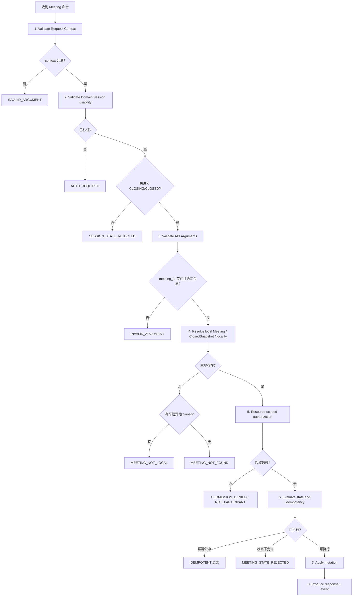

# Phase 1 - Step 1.4：Meeting 传输无关 API Contract、结果语义与错误码设计

## 1. 文档目的

本文为 Meeting MVP 定义**传输无关（transport-neutral）**的领域 API 契约、结果语义、错误码、视图对象与领域事件契约，作为 Step 1.5 时序设计与后续 Phase 3 Protocol V2 的共同输入。

本文只回答下列问题：

```text
调用者是谁
请求携带什么
服务端从哪里获得身份
成功返回什么
幂等返回什么
失败返回什么
事件包含什么
owner 信息如何表达与信任
request_id 起什么作用
```

本文**不**回答"这些字段如何编码成字节"。当前仓库中不存在 Meeting 领域实现、不存在 Meeting 消息 ID、不存在 Meeting 协议、不存在 Meeting 持久化，本文的所有类型与字段均为设计产物，不代表已实现。

## 2. 输入约束

本文继承且不得推翻以下已冻结内容：

| 来源 | 冻结内容 |
| --- | --- |
| Step 1.1 | 六项操作范围、Host/Participant 角色、四种 Meeting 状态、幂等语义、Host 离开规则、异常断线规则、`owner_chat_server_id` 归属、错误语义名称 |
| Step 1.2 | `(meeting_id, user_id)` 唯一逻辑成员、User/Device/Session/Participant/Binding 关系、有效会议 Session 谓词、ClosedMeetingSnapshot 字段与用途 |
| Step 1.3 | Session/Meeting/Participant/Binding 状态机、`CREATED → ACTIVE` 精确条件、Join 三情形、Leave 语义、Close 两阶段、Snapshot 原子性、事件产生规则、Single-Writer 并发模型、竞态裁决矩阵、State Invariants |
| Step 1.3 Review Fix | transport liveness 与 domain `connection_state` 分层、`SessionDisconnected` 多 Meeting fan-out、permission-before-idempotency |

本文不修改上述任何文档。若某处需要细化，只在本文内以 `Design Refinement / Compatibility Note` 形式说明。

## 3. Transport-neutral API 原则

1. **身份由服务端上下文产生。** 请求 payload 不得包含可覆盖已认证身份的字段。
2. **契约与编码分离。** 本文定义逻辑字段与语义；字节布局、消息 ID、编码格式、端序均由 Phase 3 决定。
3. **结果三段可辨。** 每个响应都能被区分成成功、幂等、错误三类之一，不用 HTTP 或 gRPC 的成功/失败概念表达。
4. **视图只表达领域语义。** 不暴露 `CSession`、socket、`io_context`、`LogicNode`、容器地址、锁或数据库字段。
5. **无可靠投递承诺。** 事件是 owner ChatServer 内的本地领域事实，Phase 1 不承诺 MQ、ACK、retry 或 exactly-once 投递。
6. **状态来源唯一。** 活动状态只能来自活动 Meeting 聚合；`CLOSED` 只能来自 ClosedMeetingSnapshot。
7. **求值顺序固定。** 认证与权限先于幂等结果（见第 19 节）。

### 3.1 明确禁止在本 Step 定义的内容

以下属于 Phase 3 Protocol V2，本文一律不定义：

```text
TCP header byte layout
message ID 数值
protobuf message 定义
JSON schema
HTTP path 与 HTTP status
WebSocket event frame
endian / magic / payload_length
sequence_id wire layout
```

当本文出现 `RequestId`、`MeetingId`、`UserId`、`SessionId`、`ServerId`、`Timestamp` 时，它们都是**逻辑领域类型**，不规定底层表示为 `uint32`、`uint64`、`fixed64`、固定长度字节或字符串。

## 4. 逻辑 ID / Type 语义

| 逻辑类型 | 语义 | 来源 |
| --- | --- | --- |
| `RequestId` | 一次请求与其响应、日志、未来 trace 的关联标识 | transport adapter 或内部生成 |
| `MeetingId` | Meeting 稳定标识；每次有效 Create 生成新值 | 领域创建时生成 |
| `UserId` | 用户稳定身份；复用现有认证产生的整数 `uid` | 服务端认证结果 |
| `SessionId` | 一次连接的稳定标识；沿用现有 `CSession` 的 UUID 字符串语义 | 服务端 Session |
| `ServerId` | ChatServer 节点标识；沿用配置 `[SelfServer] Name` 语义 | 服务端配置 |
| `DeviceId` | User 范围内的逻辑设备标识 | Session context；当前无 Device 时不得伪造 |
| `EventId` | 领域事件自身标识 | 事件产生时生成 |
| `Timestamp` | 领域事件或成员关系的时间点 | 服务端记录 |

这些类型在本文中只用于表达语义与约束。是否使用字符串、整数或复合结构由 Phase 3 决定。

## 5. MeetingRequestContext

所有六项 API 都通过同一个上下文获得调用者身份与可信定位信息。

| 字段 | 来源语义 | 是否必需 | 说明 |
| --- | --- | --- | --- |
| `request_id` | transport adapter / caller | 必需（adapter 可内部生成） | 仅用于关联，不是幂等键（见第 7 节） |
| `authenticated_user_id` | 现有认证 Session | 必需 | 业务身份的**唯一**来源 |
| `session_id` | 当前服务端 Session | 必需 | 当前连接标识，不得由客户端指定 |
| `handling_chat_server_id` | 当前 ChatServer 配置 | 必需 | 实际处理该请求的节点 |
| `device_id` | Session context | 可选 | 当前代码尚无 Device 概念时不得伪造 |
| `trusted_owner_chat_server_id` | 已验证的内部 routing context | 可选 | 见第 8 节；只能由服务端可信来源填充 |

### 5.1 Context 的构造者

`MeetingRequestContext` 由 **transport adapter** 构造，不由客户端 payload 填充。构造完成后领域层只读取该上下文，不再回看原始请求。

## 6. 身份信任边界

### 6.1 硬约束

1. 请求 payload **不得**包含可以覆盖 `authenticated_user_id` 的 `user_id`。
2. 业务调用**不得**由客户端指定另一个 `session_id`。
3. 请求 payload **不得**包含 `host_user_id`、`session_id`、`owner_chat_server_id` 等本应来自服务端的字段，除非该字段在本文中明确被定义为业务语义字段（六项 API 中只有 `meeting_id` 属于此类）。

### 6.2 禁止的形状

```text
client says user_id = 10086
→ domain trusts 10086          // 错误：身份可被伪造
```

要求的形状：

```text
authenticated Session
→ MeetingRequestContext.authenticated_user_id
→ domain uses this as the only caller identity
```

### 6.3 后果说明

若允许客户端自报身份，则 Host 权限体系、`PERMISSION_DENIED` 与 `HOST_MUST_CLOSE_MEETING` 全部失去意义：任意已认证用户都可以声明自己是 Host。因此该约束不是风格问题，而是权限模型成立的前提。

## 7. request_id

### 7.1 正式定义

> `request_id` 用于一次请求与响应、日志、未来 trace/event 的关联。它**不是**客户端幂等键。

### 7.2 必须明确的语义

```text
相同 request_id
≠ 同一个业务操作只能执行一次
```

### 7.3 CreateMeeting 的典型反例

```text
CreateMeeting(request_id = X)
CreateMeeting(request_id = X)
```

若两次请求都真正进入业务处理，根据 Step 1.1：

> **仍然是两个独立 CreateMeeting，生成两个不同的 `meeting_id`。**

不得因为 `request_id` 相同而自动去重 Create。

### 7.4 幂等性的真实来源

Join / Leave / Close 的幂等性来自：

```text
Meeting / Participant / Binding 当前领域状态
```

而不是 `request_id`。具体地：

| 操作 | 幂等判据 |
| --- | --- |
| Join | 该 Session 是否已有有效 `BOUND` Binding |
| Leave | 该 `(meeting_id, user_id)` 是否已为 `LEFT` |
| Close | Meeting 是否已处于 `ENDING` 或 `CLOSED` |

### 7.5 缺失 request_id 的处理

当前旧 TCP 协议没有 `request_id` 字段。未来 adapter 在 ingress 内生成一个内部 `request_id` 即可，不需要修改现有协议，也不需要客户端提供。

## 8. owner_chat_server_id 的传递与信任规则

### 8.1 三种身份必须严格区分

| 编号 | 场景 | 信任级别 | 说明 |
| --- | --- | --- | --- |
| A | Meeting / ClosedSnapshot 中保存的 `owner_chat_server_id` | 权威领域事实 | 由创建时的处理节点决定，客户端无法改写 |
| B | Response 的 MeetingView 中返回的 `owner_chat_server_id` | 客户端可观察信息 | 只用于展示与后续路由提示 |
| C | Request 中的 owner 信息 | 默认不可信 | 只有经验证的内部 routing context 才可信 |

### 8.2 正式设计

`trusted_owner_chat_server_id` 属于 **MeetingRequestContext**，而不是普通业务 payload。

只有以下来源可以填充它：

- 未来内部 routing adapter；
- 经过验证的 routing metadata；
- 未来 MeetingLocator。

一个未经验证的客户端 owner hint 最多只能是 transport 层 hint，**不得**直接映射为 trusted owner context。

### 8.3 MEETING_NOT_LOCAL 精确规则

对于 Join / Leave / Close / Query / List，先在本节点查找：

```text
active Meeting
+
ClosedMeetingSnapshot
```

若本节点不存在，按下表判定：

| 情况 | 条件 | 结果 | 响应内容 |
| --- | --- | --- | --- |
| A | 存在可信 `trusted_owner_chat_server_id`，且其值不等于 `handling_chat_server_id` | `MEETING_NOT_LOCAL` | 允许携带已知的 `owner_chat_server_id` |
| B | 没有可信 owner 信息 | `MEETING_NOT_FOUND` | 不携带 owner |
| C | 可信 owner 就是当前节点，但本地不存在 | `MEETING_NOT_FOUND` | 不携带 owner |

Phase 1 **不自动转发**，任何情况下都**不得**静默创建同 `meeting_id` 的本地副本。

### 8.4 仅凭客户端 hint 的结果

若客户端在 payload 中提供 owner hint 但没有可信 routing context，则按情况 B 处理，返回 `MEETING_NOT_FOUND`。不得仅凭该 hint 返回 `MEETING_NOT_LOCAL`。

## 9. Common Result Contract

### 9.1 公共字段

所有 Response 至少具备：

| 字段 | 语义 |
| --- | --- |
| `request_id` | 回显请求的关联标识 |
| `result_code` | 数值结果码，见第 10 节 |
| `result_name` | 结果码的名称，便于可读性与日志 |
| `result_disposition` | 结果分类：`SUCCESS` / `IDEMPOTENT` / `ERROR` |

### 9.2 result_disposition 的取值约束

只有三个值：

```text
SUCCESS
IDEMPOTENT
ERROR
```

不使用 HTTP success/failure 概念，不使用 `2xx`、`4xx`、`5xx` 语义。

判定规则：

| 结果 | disposition |
| --- | --- |
| `OK` | `SUCCESS` |
| `ALREADY_JOINED` | `IDEMPOTENT` |
| `ALREADY_LEFT` | `IDEMPOTENT` |
| `CLOSE_IN_PROGRESS` | `IDEMPOTENT` |
| `ALREADY_CLOSED` | `IDEMPOTENT` |
| 其余拒绝与错误 | `ERROR` |

### 9.3 diagnostic_message

可以存在 `diagnostic_message`，但必须明确：

> 客户端业务逻辑**不得**依赖 `diagnostic_message` 文本；必须依赖 `result_code` 与 `result_name`。该字段仅用于日志与人工排障，文本内容不构成契约。

## 10. ResultCode 数值表

### 10.1 数值定义

| 数值 | 名称 | disposition | 语义 |
| --- | --- | --- | --- |
| `0` | `OK` | `SUCCESS` | 操作成功或查询成功 |
| `100` | `ALREADY_JOINED` | `IDEMPOTENT` | 当前同一 Session 已具有有效 Binding，重复 Join 无业务变化 |
| `101` | `ALREADY_LEFT` | `IDEMPOTENT` | 已知历史 Participant 当前已不在活动成员集合 |
| `102` | `CLOSE_IN_PROGRESS` | `IDEMPOTENT` | Host 重复 Close，Meeting 已在 `ENDING` |
| `103` | `ALREADY_CLOSED` | `IDEMPOTENT` | Host 重复 Close，Meeting 已 `CLOSED` |
| `1000` | `AUTH_REQUIRED` | `ERROR` | Session 未完成认证 |
| `1001` | `SESSION_STATE_REJECTED` | `ERROR` | Session 已 `CLOSING`/`CLOSED`，不允许新业务命令 |
| `1002` | `INVALID_ARGUMENT` | `ERROR` | 请求缺少必要逻辑字段或字段语义非法 |
| `1100` | `PERMISSION_DENIED` | `ERROR` | 调用者无操作权限，例如非 Host Close |
| `1101` | `NOT_PARTICIPANT` | `ERROR` | 调用者从未成为该 Meeting Participant，或当前操作要求成员身份但不满足 |
| `1102` | `HOST_MUST_CLOSE_MEETING` | `ERROR` | Host 对开放 Meeting 调用 Leave |
| `1200` | `MEETING_NOT_FOUND` | `ERROR` | 本节点没有活动 Meeting/ClosedSnapshot，且无可信异地 owner |
| `1201` | `MEETING_NOT_LOCAL` | `ERROR` | 存在可信 owner 信息且 owner 为其他 ChatServer |
| `1202` | `MEETING_STATE_REJECTED` | `ERROR` | 当前 Meeting State 不允许该业务操作 |
| `9000` | `INTERNAL_ERROR` | `ERROR` | 领域不变量破坏或不可分类的内部失败 |

### 10.2 分段说明

| 区段 | 用途 |
| --- | --- |
| `0` | 成功 |
| `100`–`103` | 幂等结果（成功语义但无业务变化） |
| `1000`–`1002` | 调用上下文与参数问题 |
| `1100`–`1102` | 权限与成员身份问题 |
| `1200`–`1202` | 会议资源与状态问题 |
| `9000` | 内部失败 |

### 10.3 与传输层的关系

这些数值：

- 是 Meeting Domain API Contract 的一部分；
- **不等于** TCP message ID；
- **不等于** HTTP status；
- **不等于** gRPC status；
- Phase 3 可将其映射进正式协议。

数值一旦写入本文即视为 Phase 1 API Contract 的冻结项。若后续需要新增，必须给出明确业务原因，不得为"以后可能有用"批量预留未使用的 code。

### 10.4 SESSION_STATE_REJECTED 的引入理由

Step 1.3 指出：已认证但正在 `CLOSING`/`CLOSED` 的 Session 不应被误报为 `AUTH_REQUIRED`。因此新增 `1001 SESSION_STATE_REJECTED` 以区分两种不同的拒绝原因：

| 情形 | 结果 |
| --- | --- |
| Session 从未完成认证 | `AUTH_REQUIRED` |
| Session 已认证但进入 `CLOSING`/`CLOSED` | `SESSION_STATE_REJECTED` |

这是本文新增的唯一业务语义扩展（其余数值均对应 Step 1.1 已定义的语义名称）。

### 10.5 INTERNAL_ERROR 使用限制

`INTERNAL_ERROR` **不允许**成为"懒得分类"的默认业务错误。只用于例如：

- Meeting owner invariant 被破坏；
- Participant 唯一性内部损坏；
- 处于 `CLOSED` 状态却没有完整 ClosedSnapshot；
- 领域内部发生无法恢复的不变量违例。

正常业务拒绝必须使用明确的 domain code。

## 11. MeetingView

### 11.1 字段

| 字段 | 语义 | 必需 |
| --- | --- | --- |
| `meeting_id` | Meeting 标识 | 必需 |
| `owner_chat_server_id` | 保存并负责该 Meeting 运行态的节点 | 必需 |
| `host_user_id` | Host 的 User 标识 | 必需 |
| `meeting_state` | `CREATED` / `ACTIVE` / `ENDING` / `CLOSED` | 必需 |
| `active_participant_count` | 活动逻辑成员数 | 必需 |
| `created_at` | 创建时间 | 必需 |
| `closed_at` | 关闭完成时间 | `CLOSED` 时必需，其余为空 |

### 11.2 来源约束

| Meeting 状态 | 数据来源 |
| --- | --- |
| `CREATED` / `ACTIVE` / `ENDING` | 活动 Meeting 聚合 |
| `CLOSED` | **只能**来源于 ClosedMeetingSnapshot |

### 11.3 禁止内容

MeetingView **不得**包含：

```text
CSession* / shared_ptr<CSession>
socket / io_context
LogicNode*
Binding 容器地址
Meeting 对象指针
mutex / strand
Redis key
MySQL 字段或行
```

`CREATED`/`ACTIVE`/`ENDING` 下 `closed_at` 必须为空。

## 12. ParticipantView

### 12.1 字段

| 字段 | 语义 | 必需 |
| --- | --- | --- |
| `user_id` | 该逻辑成员的 User 标识 | 必需 |
| `role` | `HOST` 或 `PARTICIPANT` | 必需 |
| `participant_state` | `ACTIVE` 或 `LEFT` | 必需 |
| `joined_at` | 首次成为该 Meeting 逻辑成员的时间 | 必需 |
| `left_at` | 逻辑离会时间 | `LEFT` 时必需，`ACTIVE` 时为空 |

### 12.2 必须遵守的规则

1. 同一 `(meeting_id, user_id)` 只有一个逻辑 Participant。
2. 不按 Device/Session 展开重复 Participant。
3. `joined_at` 保持 Step 1.2 定义的**首次逻辑加入**语义，不因 Re-Join 重置。
4. `ACTIVE` 时 `left_at` 必须为空。
5. Re-Join 恢复 `ACTIVE` 时不得保留一个与 `ACTIVE` 冲突的非空 `left_at`。
6. **不向普通成员列表暴露内部 `binding_id` 或 `session_binding_ids`。**
7. 不得把 Session 列表塞进 ParticipantView。

### 12.3 明确不包含

ParticipantView 不包含 device 列表、socket、连接状态、在线标记（Presence 属于后续阶段）。

## 13. API 1：CreateMeeting

### 13.1 Request

MVP **不需要**任何业务字段。身份全部来自 `MeetingRequestContext`。

请求**不得**包含：

```text
host_user_id
owner_chat_server_id
user_id
session_id
```

这些都由服务器上下文产生。

### 13.2 Preconditions

- Session `connection_state == AUTHENTICATED`；
- request context 合法。

### 13.3 成功语义

每次真正执行产生：

```text
new Meeting
new meeting_id
host Participant ACTIVE
host Session Binding BOUND
meeting_state = CREATED
active_participant_count = 1
MeetingCreated 恰好一次
```

### 13.3.1 CreateMeeting 不产生 ParticipantJoined

`CreateMeeting` **只产生 `MeetingCreated`，不产生 `ParticipantJoined`**。

`ParticipantJoined` 的语义是：

```text
非 Host 用户：不存在 / LEFT → ACTIVE
```

Host 的初始 Participant 由 `CreateMeeting` 建立，不属于"加入一个已存在的会议"，因此不产生 `ParticipantJoined`。

下列情况均**不得**产生该事件：

```text
CreateMeeting 创建 Host
Host 初始 Participant 建立
Host 初始 Binding 建立
Host additional Session binding
同 Session duplicate Join
普通 Participant additional Session binding
```

因此本节与第 23 节的共同结论是：

```text
CreateMeeting → MeetingCreated exactly once
CreateMeeting → 不产生 ParticipantJoined
```

### 13.4 Response

| 字段 | 内容 |
| --- | --- |
| common result | `result_code = OK`，`result_disposition = SUCCESS` |
| `meeting` | MeetingView（`meeting_state = CREATED`） |
| `host_participant` | ParticipantView（`role = HOST`，`participant_state = ACTIVE`，`left_at` 空） |

### 13.5 重复 request_id 的行为

必须单独明确：

| 请求 | 结果 |
| --- | --- |
| `CreateMeeting(request_id = X)` | 创建 M1 |
| `CreateMeeting(request_id = X)` | 创建 M2，且 `M2 != M1` |

两次都返回 `OK`。不得因 `request_id` 相同而返回同一个 Meeting 或拒绝第二次。

### 13.6 错误

| 条件 | 结果 |
| --- | --- |
| Context 结构非法 | `INVALID_ARGUMENT` |
| 未认证 | `AUTH_REQUIRED` |
| Session 已 `CLOSING`/`CLOSED` | `SESSION_STATE_REJECTED` |
| 领域不变量破坏 | `INTERNAL_ERROR` |

本 API 无业务 payload，因此不存在 `meeting_id` 参数校验。

## 14. API 2：JoinMeeting

### 14.1 Request

| 字段 | 语义 | 必需 |
| --- | --- | --- |
| `meeting_id` | 目标 Meeting | 必需 |

用户身份与 `session_id` 来自 Context，payload 不得提供。

`meeting_id` 缺失或语义非法时，必须在 Meeting lookup 之前返回 `INVALID_ARGUMENT`（见 19.1.2 节），不得表现为 `MEETING_NOT_FOUND`。

### 14.2 JoinOutcome

| 值 | 含义 |
| --- | --- |
| `NEW_PARTICIPANT` | 首次逻辑加入 |
| `REJOINED_PARTICIPANT` | 历史 `LEFT` 成员重新激活 |
| `ADDITIONAL_SESSION_BOUND` | 已 `ACTIVE` 成员新增一条 Session Binding |
| `ALREADY_BOUND` | 该 Session 已有有效 Binding，无任何变化 |

### 14.3 四种 outcome 的详细语义

#### Case A：首次逻辑 Join（`NEW_PARTICIPANT`）

前置：不存在历史 Participant。

```text
Participant → ACTIVE
Binding → BOUND
active_participant_count + 1
ParticipantJoined
```

响应：

```text
result_code = OK
result_disposition = SUCCESS
join_outcome = NEW_PARTICIPANT
```

#### Case B：`LEFT` Participant Re-Join（`REJOINED_PARTICIPANT`）

```text
LEFT → ACTIVE
new/current Binding → BOUND
active_participant_count + 1
ParticipantJoined
```

响应：

```text
result_code = OK
result_disposition = SUCCESS
join_outcome = REJOINED_PARTICIPANT
```

`joined_at` 保持首次加入语义，不清空历史。

#### Case C：Participant 已 `ACTIVE`，新 Session Join（`ADDITIONAL_SESSION_BOUND`）

```text
Participant remains ACTIVE
new Binding BOUND
active_participant_count unchanged
no ParticipantJoined
```

响应：

```text
result_code = OK
result_disposition = SUCCESS
join_outcome = ADDITIONAL_SESSION_BOUND
```

这是"逻辑 Join 幂等 + Session Binding 增量更新"，多设备走该路径。

#### Case D：同一 Session 已有有效 Binding（`ALREADY_BOUND`）

无任何修改：

```text
result_code = ALREADY_JOINED
result_disposition = IDEMPOTENT
join_outcome = ALREADY_BOUND
```

不得重复产生事件。

### 14.4 允许的 Meeting 状态

只允许 `CREATED` 与 `ACTIVE`。

`ENDING` / `CLOSED` 返回 `MEETING_STATE_REJECTED`。

### 14.5 CREATED → ACTIVE

只有**第一个非 Host Participant** 的"不存在/`LEFT` → `ACTIVE`"触发该转换。

在 Response 中，MeetingView 必须反映转换后的**稳定状态**（即已为 `ACTIVE`）。

### 14.6 错误

| 条件 | 结果 |
| --- | --- |
| Context 结构非法 | `INVALID_ARGUMENT` |
| 未认证 | `AUTH_REQUIRED` |
| Session 已 `CLOSING`/`CLOSED` | `SESSION_STATE_REJECTED` |
| `meeting_id` 缺失或语义非法（先于 lookup） | `INVALID_ARGUMENT` |
| 本节点无记录且无可信异地 owner | `MEETING_NOT_FOUND` |
| 可信 owner 为其他节点 | `MEETING_NOT_LOCAL` |
| Meeting 为 `ENDING`/`CLOSED` | `MEETING_STATE_REJECTED` |

## 15. API 3：LeaveMeeting

### 15.1 Request

| 字段 | 语义 | 必需 |
| --- | --- | --- |
| `meeting_id` | 目标 Meeting | 必需 |

`meeting_id` 缺失或语义非法时，必须在 Meeting lookup 之前返回 `INVALID_ARGUMENT`（见 19.1.2 节）。

### 15.2 LeaveOutcome

| 值 | 含义 |
| --- | --- |
| `LEFT` | 本次实际完成逻辑离会 |

### 15.3 语义表

| 调用者情形 | Meeting 状态 | 结果码 | disposition | 状态变化 | 事件 |
| --- | --- | --- | --- | --- | --- |
| 任意（`meeting_id` 缺失或语义非法） | 不适用 | `INVALID_ARGUMENT` | `ERROR` | 无（先于 lookup） | 无 |
| 普通 `ACTIVE` Participant | `CREATED` / `ACTIVE` | `OK` | `SUCCESS` | `ACTIVE → LEFT`；该 User 全部 Binding `UNBOUND`；成员数 −1 | `ParticipantLeft` 一次 |
| 已知历史 Participant，当前 `LEFT` | `CREATED` / `ACTIVE` | `ALREADY_LEFT` | `IDEMPOTENT` | 无 | 无 |
| 从未加入过的用户 | `CREATED` / `ACTIVE` | `NOT_PARTICIPANT` | `ERROR` | 无 | 无 |
| Host | `CREATED` / `ACTIVE` | `HOST_MUST_CLOSE_MEETING` | `ERROR` | 无（不改状态、不解绑 Binding） | 无 |
| 普通 `ACTIVE` Participant | `ENDING` | `MEETING_STATE_REJECTED` | `ERROR` | 无 | 无 |
| 已知历史 Participant | `CLOSED` | `ALREADY_LEFT` | `IDEMPOTENT` | 无（不重新执行清理） | 无 |
| 从未加入过的用户 | `CLOSED` | `NOT_PARTICIPANT` | `ERROR` | 无 | 无 |
| Host | `ENDING` | `MEETING_STATE_REJECTED` | `ERROR` | 无 | 无 |
| Host | `CLOSED` | `ALREADY_LEFT` | `IDEMPOTENT` | 无 | 无 |

### 15.4 ALREADY_LEFT 与 NOT_PARTICIPANT 的区分

这两个结果必须严格区分：

| 结果 | 条件 | 含义 |
| --- | --- | --- |
| `ALREADY_LEFT` | 调用者**曾经**是该 Meeting 的逻辑成员（活动 Participant 集合或 ClosedSnapshot 历史身份中有记录），当前不在活动成员集合 | 幂等：会议关系已经终止 |
| `NOT_PARTICIPANT` | 调用者**从未**成为该 Meeting 的 Participant | 错误：越权或无关系 |

该区分是 CLOSED 历史成员鉴权的直接要求：只有历史成员才能得到幂等结果，未加入者不得据此推断会议存在与否之外的信息。

### 15.5 成功 Leave 的效果

成功 Leave 时必须在同一次串行化修改内完成：

```text
ACTIVE → LEFT
该 (meeting_id, user_id) 全部 Binding → UNBOUND
left_at 写入
active_participant_count − 1
ParticipantLeft 恰好一次
```

后续重复调用返回 `ALREADY_LEFT`，不再修改状态、不重复产生事件。

### 15.6 ENDING 与内部清理的边界

`ENDING` 下外部 `LeaveMeeting` 一律返回 `MEETING_STATE_REJECTED`。

内部 cleanup（`SessionDisconnected` fan-out、Close 清理）仍按 Step 1.3 独立进行，**不属于**本 API，也不产生 `ParticipantLeft`。

### 15.7 CLOSED 的约束

- 调用者是 ClosedSnapshot 中的历史 Participant 或 Host：`ALREADY_LEFT`；
- 调用者从未是历史 Participant：`NOT_PARTICIPANT`；
- 任何情况下不得重新激活 Meeting，不得修改 ClosedSnapshot。

## 16. API 4：CloseMeeting

### 16.1 Request

| 字段 | 语义 | 必需 |
| --- | --- | --- |
| `meeting_id` | 目标 Meeting | 必需 |

### 16.2 权限

只允许 Host。

非 Host **始终**返回 `PERMISSION_DENIED`，包括 Meeting 已处于 `ENDING` 或 `CLOSED` 时。不得先返回幂等结果。

### 16.3 CloseOutcome

| 值 | 含义 |
| --- | --- |
| `CLOSE_STARTED` | 本次请求合法启动了关闭流程，聚合已进入 `ENDING` |

### 16.4 语义表

| 调用者 | Meeting 状态 | 结果码 | disposition | close_outcome | 响应中的 meeting_state |
| --- | --- | --- | --- | --- | --- |
| Host | `CREATED` | `OK` | `SUCCESS` | `CLOSE_STARTED` | `ENDING` |
| Host | `ACTIVE` | `OK` | `SUCCESS` | `CLOSE_STARTED` | `ENDING` |
| Host | `ENDING` | `CLOSE_IN_PROGRESS` | `IDEMPOTENT` | 无 | `ENDING` |
| Host | `CLOSED` | `ALREADY_CLOSED` | `IDEMPOTENT` | 无 | `CLOSED` |
| 非 Host | 任意状态 | `PERMISSION_DENIED` | `ERROR` | 无 | 按可见规则返回或不返回 |

### 16.5 首次合法 Close 的正式执行模型

#### 16.5.1 两个独立的 serialized work item

正式冻结为：`CloseMeeting` 与 `FinalizeClose` 是**两个不同的 serialized domain operations**。

```text
CloseMeeting command
        ↓
serialized mutation #1
        ↓
权限 / 状态检查
        ↓
BeginClose
CREATED/ACTIVE → ENDING
        ↓
freeze close context
        ↓
enqueue / schedule one internal FinalizeClose work item
        ↓
构造并返回：
OK + CLOSE_STARTED + MeetingView(ENDING)

---------------- command boundary ----------------

FinalizeClose internal work item
        ↓
serialized mutation #2
        ↓
剩余 Binding 幂等 cleanup
        ↓
构造完整 ClosedMeetingSnapshot
        ↓
ENDING → CLOSED
        ↓
atomic publish CLOSED + Snapshot
        ↓
MeetingClosed exactly once
        ↓
释放活动 Meeting 聚合
```

二者可以使用同一个 LogicSystem single-writer queue，但**必须占据两个独立的逻辑 work item / queue turn**。

#### 16.5.2 Response 的正式定义

```text
result_code = OK
result_disposition = SUCCESS
close_outcome = CLOSE_STARTED
meeting_state = ENDING
```

**不得让第一次 CloseMeeting 的 Response 假装 FinalizeClose 已经完成。**

理由：

1. Step 1.3 已将 BeginClose 与 FinalizeClose 设计为两个逻辑阶段；
2. Step 1.3 允许 `ENDING` 被 Query 观察；
3. 若响应声称 `CLOSED`，会出现"响应表示已关闭但 `MeetingClosed` 尚未产生、快照尚未发布"的自相矛盾；
4. Step 1.4 已冻结"Response 必须反映请求处理完成时的真实稳定状态"。

推论的实现约束：既然已经冻结"首次 Close Response = `ENDING`"，那么实现模型就必须冻结为"BeginClose command 先返回，FinalizeClose 稍后发生"。**不得**在同一个 Close handler 中执行 `BeginClose → FinalizeClose → CLOSED` 后仍返回 `ENDING`。

#### 16.5.3 不是新线程

必须明确：上述模型**不意味着**：

- 新建线程；
- 后台线程池；
- MQ；
- timer thread；
- detached task。

Phase 1 可以继续使用：

```text
LogicSystem single worker
+
serialized queue
```

只是 `CloseMeeting` 处理完成时再向**同一领域串行化入口**提交：

```text
FinalizeClose(meeting_id, frozen_close_context)
```

具体 C++ command 类型与 queue 表达留给 Step 1.6。

### 16.5.4 CloseContext 最小关联语义

由于 `MeetingClosed` 后续才产生，`FinalizeClose` 必须能保留产生终态事件所需的稳定上下文。设计层至少冻结：

| 字段 | 用途 |
| --- | --- |
| `meeting_id` | 定位待关闭 Meeting |
| `host_user_id` | 终态快照中的 Host 身份与事件 `actor_user_id` |
| `owner_chat_server_id` | 事件与快照的归属节点 |
| `originating_request_id` | 与最初 Close command 建立 correlation |
| `close_started_at` 及必要时间戳 | `closed_at` 与审计 |
| 历史 Participant 身份 | 组装 ClosedMeetingSnapshot（见 Step 1.2） |
| 可通知 `session_id` 集合 | 关闭通知的目标集合 |

`originating_request_id` 允许后续 `MeetingClosed` 与最初 Close command 建立 correlation，但它仍然**不是幂等键**。

本 Step 不定义 C++ struct；上述仅为逻辑字段清单。

### 16.5.5 重复 Close 在两个 work item 之间的行为

若：

```text
CloseMeeting #1
→ Meeting = ENDING
→ FinalizeClose 已排队但尚未执行
```

此时第二个合法 Host Close：

```text
CLOSE_IN_PROGRESS
```

不得：

- 再排一个 `FinalizeClose`；
- 再冻结一次 CloseContext；
- 重复通知；
- 重复产生 `MeetingClosed`。

因此必须满足：

> **每个 Meeting 从 `CREATED`/`ACTIVE` 第一次进入 `ENDING` 时最多安排一个有效 `FinalizeClose`。**

具体去重实现留给 Step 1.6。

### 16.5.6 FinalizeClose 的失败边界

本 Step 不设计复杂 retry，但必须保持 Step 1.3 的目标：

```text
ENDING 最终必须收敛 CLOSED
```

- 普通客户端通知失败**不得**阻止 `FinalizeClose`；
- 不引入 MQ retry、durable job、distributed transaction 或 ACK protocol；
- 内部不可恢复的不变量违例仍可归入 `INTERNAL_ERROR`；
- `FinalizeClose` **不是**外部 API，因此**不**为客户端设计 `FinalizeCloseResponse`。

后续 FinalizeClose 完成：

```text
ENDING → CLOSED
MeetingClosed
```

由领域事件与后续 Query 观察。

### 16.6 CLOSED + Host Close

返回 `ALREADY_CLOSED`，并且**必须**返回 `CLOSED` 状态的 MeetingView（终态摘要），使调用者能够收敛自身状态视图。

### 16.7 错误

| 条件 | 结果 |
| --- | --- |
| Context 结构非法 | `INVALID_ARGUMENT` |
| 未认证 | `AUTH_REQUIRED` |
| Session 已 `CLOSING`/`CLOSED` | `SESSION_STATE_REJECTED` |
| `meeting_id` 缺失或语义非法（先于 lookup） | `INVALID_ARGUMENT` |
| 本节点无记录且无可信异地 owner | `MEETING_NOT_FOUND` |
| 可信 owner 为其他节点 | `MEETING_NOT_LOCAL` |
| 会议存在但调用者非 Host（含 `ENDING`/`CLOSED`） | `PERMISSION_DENIED` |

## 17. API 5：QueryMeeting

### 17.1 Request

| 字段 | 语义 | 必需 |
| --- | --- | --- |
| `meeting_id` | 目标 Meeting | 必需 |

`meeting_id` 缺失或语义非法时，必须在 Meeting lookup 之前返回 `INVALID_ARGUMENT`（见 19.1.2 节）。本 API 不需要其他业务参数。

### 17.2 授权与来源

#### CREATED / ACTIVE / ENDING

调用者必须是：

- Host；或
- 当前 `ACTIVE` Participant。

`LEFT` 的历史普通 Participant 在会议尚未 `CLOSED` 时**不得**继续查询私有会议信息，返回 `NOT_PARTICIPANT`。

数据来源：活动 Meeting 聚合。

#### CLOSED

允许：

- Host；
- ClosedMeetingSnapshot 中的历史 Participant。

其他用户返回 `NOT_PARTICIPANT`。

数据来源：**只能**从 ClosedMeetingSnapshot 构造。

### 17.3 成功响应

```text
OK
MeetingView
```

### 17.4 只读约束

QueryMeeting 不改变任何状态，不产生事件，不修改 ClosedSnapshot。

### 17.5 错误

| 条件 | 结果 |
| --- | --- |
| Context 结构非法 | `INVALID_ARGUMENT` |
| 未认证 | `AUTH_REQUIRED` |
| Session 已 `CLOSING`/`CLOSED` | `SESSION_STATE_REJECTED` |
| `meeting_id` 缺失或语义非法（先于 lookup） | `INVALID_ARGUMENT` |
| 本节点无记录且无可信异地 owner | `MEETING_NOT_FOUND` |
| 可信 owner 为其他节点 | `MEETING_NOT_LOCAL` |
| 调用者无可见权限（含 CLOSED 下非历史成员） | `NOT_PARTICIPANT` |
| Snapshot 已汰汰 | `MEETING_NOT_FOUND` |

## 18. API 6：ListParticipants

### 18.1 Request

| 字段 | 语义 | 必需 |
| --- | --- | --- |
| `meeting_id` | 目标 Meeting | 必需 |

`meeting_id` 缺失或语义非法时，必须在 Meeting lookup 之前返回 `INVALID_ARGUMENT`（见 19.1.2 节）。本 API 不需要其他业务参数。

### 18.2 授权

与 QueryMeeting 完全相同。

### 18.3 成功响应

| 字段 | 内容 |
| --- | --- |
| common result | `OK` / `SUCCESS` |
| `meeting` | MeetingView |
| `participant_view_scope` | `CURRENT` 或 `HISTORICAL` |
| `participants` | ParticipantView 列表 |

### 18.4 participant_view_scope

| Meeting 状态 | scope | 内容 |
| --- | --- | --- |
| `CREATED` / `ACTIVE` / `ENDING` | `CURRENT` | 只列活动逻辑 Participant |
| `CLOSED` | `HISTORICAL` | 读取 ClosedMeetingSnapshot 中的历史身份 |

`ENDING` 可读，但不能修改 membership。

该枚举是领域 API 枚举，不是 wire format。

### 18.5 约束

1. 同一个 User 不因多个 Device/Session 出现多次。
2. Phase 1 不设计分页。
3. 不凭空添加人数上限。
4. CLOSED 结果不得通过已释放的活动 Participant 或 `CSession` 推导。
5. Snapshot 被淘汰后返回 `MEETING_NOT_FOUND`。

## 19. 权限、状态与幂等求值顺序

### 19.1 正式顺序

继承 Step 1.3 的 `permission-before-idempotency`，并在本 Step 细化为八步：

```text
1. Validate Request Context
2. Validate Domain Session usability
3. Validate API Arguments
4. Resolve local Meeting / ClosedSnapshot / locality
5. Perform resource-scoped authorization
6. Evaluate state and idempotency
7. Apply mutation
8. Produce response / event
```

与早期七步版本的差别：把 **API Arguments 校验**从 Request Context 中拆出，成为独立步骤 3，使其明确地位于资源 lookup 之前。

### 19.1.1 Context invalid 与 payload invalid 的区分

两类"非法"必须分开表达：

| 类别 | 含义 | 示例 | 结果 |
| --- | --- | --- | --- |
| Request Context invalid | 服务端 adapter 无法形成必要的调用上下文 | 无法形成 `request_id`、`authenticated/session` 上下文、`handling_chat_server_id` | `INVALID_ARGUMENT` |
| API Argument invalid | 该 API 的业务参数缺失或语义非法 | `meeting_id` 缺失或语义非法 | `INVALID_ARGUMENT` |

说明：

- 具体哪些情况代表 transport adapter bug 或 `INTERNAL_ERROR`，不在本次扩展；
- 但**两类都属于 `INVALID_ARGUMENT`**，且都必须在资源 lookup 之前完成。

### 19.1.2 API Argument 校验必须先于 Meeting lookup

对于 `JoinMeeting`、`LeaveMeeting`、`CloseMeeting`、`QueryMeeting`、`ListParticipants`，`meeting_id` 都是必需业务字段。因此：

```text
meeting_id missing / semantically invalid
→ INVALID_ARGUMENT
```

并且必须发生在 Meeting lookup **之前**。

**不得**把一个缺失 `meeting_id` 的请求变成 `MEETING_NOT_FOUND`。

`CreateMeeting` 没有业务 payload，因此不需要 `meeting_id` 检查。

### 19.2 与 Step 1.3 的关系说明

Step 1.3 表达为：

```text
认证 → 权限 → 资源/状态 → 幂等
```

其核心约束是：

> **不得先因为 `ENDING`/`CLOSED` 返回一个看似成功的幂等结果，再跳过权限。**

本 Step 需要补充说明"为了完成权限判断需要先读取资源"这一点：

- 对于 **Host 权限**这类必须读取 Meeting 才能判断的权限，允许先完成**内部资源解析**（步骤 4）；
- 但在对调用者暴露 `ALREADY_CLOSED` / `CLOSE_IN_PROGRESS` 之前，**必须**先完成 Host 授权（步骤 5）。

也就是说：步骤 4 的内部解析结果**不得**直接作为对外响应；步骤 5 是步骤 6 的前置。

### 19.3 关键示例

```text
non-host
→ CloseMeeting(CLOSED meeting)
```

必须是 `PERMISSION_DENIED`，不能是 `ALREADY_CLOSED`。

### 19.4 Domain Session 可用性

所有六项 API 要求：

```text
connection_state == AUTHENTICATED
```

| 情形 | 结果 |
| --- | --- |
| 未认证 | `AUTH_REQUIRED` |
| 已认证但进入 `CLOSING` / `CLOSED` | `SESSION_STATE_REJECTED` |

不得把"已经认证但正在关闭"误报成 `AUTH_REQUIRED`。

### 19.5 辅助流程图



图中步骤 3 位于步骤 4 之前，与 19.1.2 节一致：参数校验不得被资源 lookup 掩盖。

`CreateMeeting` 没有业务参数，因此其路径跳过步骤 3 的参数检查。

该图只用于说明求值顺序，完整时序图由 Step 1.5 绘制。

## 20. 错误优先级矩阵

### 20.0 公共前缀顺序

所有带 `meeting_id` 的 API 共享同一前缀：

```text
Context structure
→ Authentication / Session usability
→ API argument validity
→ Resource lookup / locality
→ Authorization
→ State / idempotency
→ Mutation
```

### 20.1 CloseMeeting

| 顺序 | 条件 | 结果 |
| --- | --- | --- |
| 1 | Context 结构非法 | `INVALID_ARGUMENT` |
| 2 | 未认证 | `AUTH_REQUIRED` |
| 3 | Session `CLOSING`/`CLOSED` | `SESSION_STATE_REJECTED` |
| 4 | `meeting_id` 缺失或语义非法 | `INVALID_ARGUMENT`（必须先于 Meeting lookup） |
| 5 | Meeting 不存在 + 有可信异地 owner | `MEETING_NOT_LOCAL` |
| 6 | Meeting 不存在 + 无可信 owner | `MEETING_NOT_FOUND` |
| 7 | Meeting 存在 + 调用者非 Host | `PERMISSION_DENIED` |
| 8 | Host + `ENDING` | `CLOSE_IN_PROGRESS` |
| 9 | Host + `CLOSED` | `ALREADY_CLOSED` |
| 10 | Host + `CREATED`/`ACTIVE` | `OK`（`CLOSE_STARTED`） |

### 20.2 LeaveMeeting

| 顺序 | 条件 | 结果 |
| --- | --- | --- |
| 1 | Context 结构非法 | `INVALID_ARGUMENT` |
| 2 | 未认证 | `AUTH_REQUIRED` |
| 3 | Session `CLOSING`/`CLOSED` | `SESSION_STATE_REJECTED` |
| 4 | `meeting_id` 缺失或语义非法 | `INVALID_ARGUMENT`（必须先于 Meeting lookup） |
| 5 | Meeting 不存在 + 有可信异地 owner | `MEETING_NOT_LOCAL` |
| 6 | Meeting 不存在 + 无可信 owner | `MEETING_NOT_FOUND` |
| 7 | 调用者从未是该 Meeting Participant | `NOT_PARTICIPANT` |
| 8 | Host + `CREATED`/`ACTIVE` | `HOST_MUST_CLOSE_MEETING` |
| 9 | 当前 `ACTIVE` Participant + `CREATED`/`ACTIVE` | `OK`（`LEFT`） |
| 10 | 已知历史 Participant 当前 `LEFT` + `CREATED`/`ACTIVE` | `ALREADY_LEFT` |
| 11 | Host 或 Participant + `ENDING` | `MEETING_STATE_REJECTED` |
| 12 | 已知历史 Participant + `CLOSED` | `ALREADY_LEFT` |
| 13 | 从未加入 + `CLOSED` | `NOT_PARTICIPANT` |

### 20.3 JoinMeeting

| 顺序 | 条件 | 结果 |
| --- | --- | --- |
| 1 | Context 结构非法 | `INVALID_ARGUMENT` |
| 2 | 未认证 | `AUTH_REQUIRED` |
| 3 | Session `CLOSING`/`CLOSED` | `SESSION_STATE_REJECTED` |
| 4 | `meeting_id` 缺失或语义非法 | `INVALID_ARGUMENT`（必须先于 Meeting lookup） |
| 5 | Meeting 不存在 + 有可信异地 owner | `MEETING_NOT_LOCAL` |
| 6 | Meeting 不存在 + 无可信 owner | `MEETING_NOT_FOUND` |
| 7 | Meeting 为 `ENDING`/`CLOSED` | `MEETING_STATE_REJECTED` |
| 8 | 不存在历史 Participant | `OK` + `NEW_PARTICIPANT` |
| 9 | 历史 Participant 为 `LEFT` | `OK` + `REJOINED_PARTICIPANT` |
| 10 | Participant 为 `ACTIVE` 且当前 Session 无有效 Binding | `OK` + `ADDITIONAL_SESSION_BOUND` |
| 11 | Participant 为 `ACTIVE` 且当前 Session 已有有效 Binding | `ALREADY_JOINED` + `ALREADY_BOUND` |

### 20.4 QueryMeeting / ListParticipants

| 顺序 | 条件 | 结果 |
| --- | --- | --- |
| 1 | Context 结构非法 | `INVALID_ARGUMENT` |
| 2 | 未认证 | `AUTH_REQUIRED` |
| 3 | Session `CLOSING`/`CLOSED` | `SESSION_STATE_REJECTED` |
| 4 | `meeting_id` 缺失或语义非法 | `INVALID_ARGUMENT`（必须先于 Meeting lookup） |
| 5 | Meeting 不存在 + 有可信异地 owner | `MEETING_NOT_LOCAL` |
| 6 | Meeting 不存在 + 无可信 owner | `MEETING_NOT_FOUND` |
| 7 | `CREATED`/`ACTIVE`/`ENDING` 且调用者是 Host 或当前 `ACTIVE` Participant | `OK`（scope `CURRENT`） |
| 8 | `CREATED`/`ACTIVE`/`ENDING` 且调用者是 `LEFT` 历史成员或从未加入 | `NOT_PARTICIPANT` |
| 9 | `CLOSED` 且调用者是 Host 或历史 Participant | `OK`（scope `HISTORICAL`） |
| 10 | `CLOSED` 且调用者从未加入 | `NOT_PARTICIPANT` |
| 11 | Snapshot 已淘汰 | `MEETING_NOT_FOUND` |

### 20.5 CreateMeeting（无业务参数）

| 顺序 | 条件 | 结果 |
| --- | --- | --- |
| 1 | Context 结构非法 | `INVALID_ARGUMENT` |
| 2 | 未认证 | `AUTH_REQUIRED` |
| 3 | Session `CLOSING`/`CLOSED` | `SESSION_STATE_REJECTED` |
| 4 | 领域不变量破坏 | `INTERNAL_ERROR` |
| 5 | 其余 | `OK` |

### 20.6 优先级原则小结

上述矩阵的共同前缀顺序为：

```text
Context structure
→ 认证 / Session 可用性
→ API 参数合法性
→ 资源定位 / locality
→ 权限
→ 状态 / 幂等
```

两条不得违反的规则：

1. **参数校验先于资源 lookup**：缺失或非法的 `meeting_id` 必须得到 `INVALID_ARGUMENT`，不得表现为 `MEETING_NOT_FOUND`；
2. **权限先于状态/幂等暴露**：例如非 Host + `CLOSED` + CloseMeeting 仍为 `PERMISSION_DENIED`。

## 21. Domain Event Contract

### 21.1 公共字段

| 字段 | 语义 | 必需 |
| --- | --- | --- |
| `event_id` | 事件自身的稳定关联标识 | 必需 |
| `event_type` | `MeetingCreated` / `ParticipantJoined` / `ParticipantLeft` / `MeetingClosed` | 必需 |
| `meeting_id` | 事件所属 Meeting | 必需 |
| `owner_chat_server_id` | 产生该本地事件的节点 | 必需 |
| `occurred_at` | 事件发生时间 | 必需 |
| `actor_user_id` | 发起动作的 User | 视事件而定 |
| `participant_user_id` | 受影响的 Participant User | 视事件而定 |
| `meeting_state_after` | 事件产生后的 Meeting 稳定状态 | 必需 |
| `request_id` | 触发该事件的外部命令关联标识 | 可选 |

### 21.2 字段规则

#### event_id

事件自身的稳定关联标识。它才是未来事件去重的主要身份候选。

**不得**使用 `request_id` 代替 `event_id`。一次外部命令可能产生多个事件（例如 Close 完成后产生的 `MeetingClosed` 与若干内部清理），它们共享 `request_id` 但各有独立 `event_id`。

#### request_id

- 事件由某次外部 Command 直接触发时可携带对应 `request_id`；
- 内部触发事件（例如 `SessionDisconnected` 导致 `ParticipantLeft`）的 `request_id` **可以为空**；
- **不得伪造**一个客户端 `request_id`。

#### actor_user_id

- 用户主动命令：填写真实操作者；
- 系统断线清理：**可以为空**，并在后续实现中明确表达 `SYSTEM`/`INTERNAL` 来源；
- **不得伪造**一个普通用户作为操作者。

#### participant_user_id

- 仅 `ParticipantJoined` / `ParticipantLeft` 等成员事件需要；
- `MeetingCreated` / `MeetingClosed` 不强制填写。

#### meeting_state_after

必须表达事件产生后的稳定状态：

| 事件 | meeting_state_after |
| --- | --- |
| `MeetingCreated` | `CREATED` |
| `ParticipantJoined` | **固定为 `ACTIVE`** |
| `ParticipantLeft` | 当前 Meeting 状态（不因成员离会而回退） |
| `MeetingClosed` | `CLOSED` |

对 `ParticipantJoined` 固定为 `ACTIVE` 的说明：

1. `ParticipantJoined` 在 Phase 1 只能由 `JoinMeeting` 的 `NEW_PARTICIPANT` 或 `REJOINED_PARTICIPANT` 产生，即只能是非 Host 成员的激活；
2. 第一名非 Host 成员的真实激活与 `CREATED → ACTIVE` 在**同一个 serialized mutation** 内完成，因此事件产生时 Meeting 已是 `ACTIVE`；
3. 后续 Join 自然发生在已经 `ACTIVE` 的 Meeting 上；
4. `LEFT` 后的 Re-Join 也只能发生在已经 `ACTIVE` 的 Meeting 上（Step 1.3 规定 `ACTIVE` 永不回退 `CREATED`）。

因此 `meeting_state_after` **不得**出现“或 Host 场景下 `CREATED`”这类表达。

### 21.3 事件字段表

| 事件 | event_type | actor_user_id | participant_user_id | meeting_state_after | request_id |
| --- | --- | --- | --- | --- | --- |
| 创建 | `MeetingCreated` | Host（必需） | 不强制 | `CREATED` | 外部命令触发时有 |
| 加入 | `ParticipantJoined` | 该 User（Case A/B） | 该 User（必需） | `ACTIVE`（固定） | 外部命令触发时有 |
| 离开 | `ParticipantLeft` | 用户主动时为其 User；断线清理时可为空 | 该 User（必需） | 当前状态 | 用户主动时有；断线清理时为空 |
| 关闭 | `MeetingClosed` | Host | 不强制 | `CLOSED` | Host Close 流程触发时有 |

### 21.4 事件与传输的关系

- 这些是 owner ChatServer 内的**本地领域事件契约**；
- 不代表已接入 Kafka、RabbitMQ、其他 MQ；
- 不承诺可靠投递、ACK、retry 或 exactly-once delivery；
- 外部表达与关联字段的编码由 Phase 3 决定。

## 22. MeetingCreated

### 22.1 产生条件

`CreateMeeting` 第一次成功时产生，**恰好一次**。

`CreateMeeting` **不产生** `ParticipantJoined`（见 13.3.1 节）。

### 22.2 最低语义

```text
meeting_id
actor_user_id = host
meeting_state_after = CREATED
```

### 22.3 不产生的情形

任何失败路径（`AUTH_REQUIRED`、`SESSION_STATE_REJECTED`、`INVALID_ARGUMENT`、`INTERNAL_ERROR`）均不产生该事件。

## 23. ParticipantJoined

### 23.1 产生条件

**只可能由 `JoinMeeting` 的以下两种 outcome 产生：**

```
NEW_PARTICIPANT
REJOINED_PARTICIPANT
```

即非 Host 用户的：

```text
不存在 / LEFT → ACTIVE
```

### 23.1.1 正式产生条件汇总

| 场景 | 是否产生 |
| --- | --- |
| `JoinMeeting` → `NEW_PARTICIPANT` | 产生一次 |
| `JoinMeeting` → `REJOINED_PARTICIPANT` | 产生一次（新 `event_id`） |
| `CreateMeeting` 创建 Host | **不产生** |
| Host 初始 Participant 建立 | **不产生** |
| Host 初始 Binding 建立 | **不产生** |
| Host additional Session binding | **不产生** |
| 同 Session duplicate Join（`ALREADY_BOUND`） | **不产生** |
| 普通 Participant additional Session binding（`ADDITIONAL_SESSION_BOUND`） | **不产生** |
| 任何幂等命中路径 | **不产生** |

### 23.2 meeting_state_after

`ParticipantJoined.meeting_state_after` 在 Phase 1 中固定为：

```text
ACTIVE
```

不得表达为“`ACTIVE`（或 Host 场景下 `CREATED`）”。理由见 21.2 节。

### 23.3 Re-Join

`LEFT` 后的 Re-Join 可以产生**新的** `ParticipantJoined`，并拥有**新的 `event_id`**。

该事件表达"活动成员集合新增一名成员"，不是"该 User 历史上第一次加入"。同一 User 的多次 activation 通过 `event_id` 与时间区分，本 Step 不引入额外的 activation 版本字段（见第 28 节）。

## 24. ParticipantLeft

### 24.1 产生条件

只在真实发生 `ACTIVE → LEFT` 时产生。

### 24.2 Disconnect fan-out 的粒度

`SessionDisconnected` fan-out 时，对每个真实发生该转换的 `(meeting_id, user_id)` **最多产生一个事件**。

若同一 Session 跨 M1、M2 且两者都真实发生离会，则各产生一个事件，`request_id` 均为空或为该会话清理的内部关联值。

### 24.3 不产生的情形

| 情形 | 是否产生 |
| --- | --- |
| 重复 Leave / 重复 Disconnect / 重复 cleanup | 不产生 |
| Host 单纯 Disconnect | 不产生 |
| Host 全部 Session 断开（含跨多个 Meeting） | 不产生 |
| Meeting `ENDING` 后由关闭流程统一清理 | 不产生 |
| 非活动成员（`LEFT`）再次被清理 | 不产生 |
| 内部幂等清理未真实改变 membership | 不产生 |

## 25. MeetingClosed

### 25.1 产生条件

只在 `ENDING → CLOSED` 第一次完成时产生，恰好一次。

### 25.2 不产生的情形

| 情形 | 是否产生 |
| --- | --- |
| 重复 Close（`ENDING` 或 `CLOSED`） | 不产生 |
| 非 Host 的 Close 尝试 | 不产生（且被拒绝） |
| BeginClose 完成（仅进入 `ENDING`） | 不产生 |

### 25.3 与首次 Close Response 的关系

首次 `CloseMeeting` 返回 `CLOSE_STARTED` 且 `meeting_state = ENDING`，此时**尚未**产生 `MeetingClosed`。

`MeetingClosed` 在 `FinalizeClose` 完成收敛后产生，由后续 Query 或事件观察。

## 26. CLOSED Snapshot 的 API 语义

### 26.1 只读来源

| API | CLOSED 时数据来源 |
| --- | --- |
| `QueryMeeting` | 只能从 ClosedMeetingSnapshot 构造 MeetingView |
| `ListParticipants` | 只能从 ClosedMeetingSnapshot 读取历史身份，scope = `HISTORICAL` |

禁止通过已释放的活动 Participant 或 `CSession` 推导 CLOSED 数据。

### 26.2 鉴权

CLOSED 下的授权依据是 Snapshot 中的：

```text
host_user_id
participant_identities（历史 User 身份）
```

未加入过会议的用户不得借此枚举成员。

### 26.3 淘汰

Snapshot 保留时间与淘汰策略由后续 Step 决定。淘汰后查询返回 `MEETING_NOT_FOUND`。

### 26.4 不重新激活

任何 API 都不得使 `CLOSED` Meeting 重新激活，不得修改 ClosedSnapshot。

### 26.5 snapshot_version 暂不对外暴露

Step 1.2 允许 ClosedMeetingSnapshot 内部保留可选的 `snapshot_version`。本 Step **不要求**对外暴露该字段。

## 27. 与当前 TCP / LogicSystem 的未来适配关系

### 27.1 当前事实

```text
CSession
→ LogicNode
→ LogicSystem callback
```

当前回调注册只覆盖登录、好友与文本聊天消息，不存在 Meeting 回调。

### 27.2 未来的适配路径

```text
Legacy TCP message
        ↓
构造 MeetingRequestContext
        ↓
构造 Transport-Neutral Command
        ↓
Meeting Domain
        ↓
Transport-Neutral Response
        ↓
映射回现有 / 未来协议
```

### 27.3 本 Step 的边界

**本 Step 不完成这层映射。**

- 不修改 `message.proto`；
- 不分配 TCP message ID；
- 不新增 `LogicSystem` 回调或消息类型；
- 当前 legacy TCP 不存在 `request_id` 时，未来 adapter 可生成内部 `request_id`。

## 28. 关于 Meeting Revision 的评估

### 28.1 Step 1.3 提出的候选

Step 1.3 提到未来可能需要：

```text
aggregate revision
activation sequence
snapshot version
```

### 28.2 本 Step 的正式决定

MVP **暂不**把 `meeting_revision` / `participant_activation_version` 设为外部 API 必填字段。

理由：

1. 当前 Single-Writer 已保证 owner 进程内的转换顺序；
2. 当前没有可靠 MQ；
3. 当前没有 optimistic concurrency 需求；
4. 当前没有客户端 conditional update；
5. `event_id` 已能区分 Re-Join 产生的新事件。

### 28.3 记录为未来扩展点

该能力记录为未来扩展点，待出现"客户端条件更新"或"跨节点并发"的真实需求时再设计。

**不得**为了"未来可能需要"增加一整套版本控制协议。

ClosedMeetingSnapshot 内部可继续保留可选 `snapshot_version` 概念，但本 Step 不要求对外暴露。

## 29. 六个操作总表

| API | Required Context | Payload | Authorization | Allowed Meeting State | Success Result | Idempotent Result | Main Error | Produces Event |
| --- | --- | --- | --- | --- | --- | --- | --- | --- |
| `CreateMeeting` | 已认证 Session + 合法 context | 无业务字段 | 任意已认证用户 | 不适用（创建新会议） | `OK` + MeetingView + host ParticipantView | 无（重复 request_id 仍创建新会议） | `AUTH_REQUIRED` | 仅 `MeetingCreated`（**不产生** `ParticipantJoined`） |
| `JoinMeeting` | 已认证 Session + 合法 context | `meeting_id` | 任意已认证用户 | `CREATED` / `ACTIVE` | `OK` + `NEW_PARTICIPANT` / `REJOINED_PARTICIPANT` / `ADDITIONAL_SESSION_BOUND` | `ALREADY_JOINED` + `ALREADY_BOUND` | `INVALID_ARGUMENT` / `MEETING_STATE_REJECTED` | `ParticipantJoined`（仅 Case A/B） |
| `LeaveMeeting` | 已认证 Session + 合法 context | `meeting_id` | 非 Host 的 Participant | `CREATED` / `ACTIVE`（`CLOSED` 仅幂等） | `OK` + `LEFT` | `ALREADY_LEFT` | `INVALID_ARGUMENT` / `HOST_MUST_CLOSE_MEETING` / `NOT_PARTICIPANT` | `ParticipantLeft` |
| `CloseMeeting` | 已认证 Session + 合法 context | `meeting_id` | 仅 Host | `CREATED` / `ACTIVE` | `OK` + `CLOSE_STARTED`（state `ENDING`） | `CLOSE_IN_PROGRESS` / `ALREADY_CLOSED` | `INVALID_ARGUMENT` / `PERMISSION_DENIED` | 首次为无（FinalizeClose 后 `MeetingClosed`） |
| `QueryMeeting` | 已认证 Session + 合法 context | `meeting_id` | Host 或成员（含 CLOSED 历史成员） | 全部（`CLOSED` 读 Snapshot） | `OK` + MeetingView | 无（只读） | `INVALID_ARGUMENT` / `NOT_PARTICIPANT` | 无 |
| `ListParticipants` | 已认证 Session + 合法 context | `meeting_id` | 同 QueryMeeting | 全部（`CLOSED` 读 Snapshot） | `OK` + MeetingView + scope + 列表 | 无（只读） | `INVALID_ARGUMENT` / `NOT_PARTICIPANT` | 无 |

## 30. JoinOutcome 表

| outcome | 前置状态 | 参与者集合变化 | Binding 变化 | participant_count | 事件 | 结果码 |
| --- | --- | --- | --- | --- | --- | --- |
| `NEW_PARTICIPANT` | 不存在历史 Participant | 新增逻辑成员 | 新建 `BOUND` | +1 | `ParticipantJoined` | `OK` |
| `REJOINED_PARTICIPANT` | 历史 Participant 为 `LEFT` | 复用逻辑成员并激活 | 新建/恢复 `BOUND` | +1 | `ParticipantJoined`（新 `event_id`） | `OK` |
| `ADDITIONAL_SESSION_BOUND` | Participant 为 `ACTIVE`，当前 Session 无有效 Binding | 不变 | 新建/恢复 `BOUND` | 不变 | 无 | `OK` |
| `ALREADY_BOUND` | Participant 为 `ACTIVE`，当前 Session 已有有效 Binding | 不变 | 无 | 不变 | 无 | `ALREADY_JOINED` |

## 31. Query / List 授权表

| Meeting 状态 | 调用者 | 结果 | 数据来源 | scope |
| --- | --- | --- | --- | --- |
| `CREATED` / `ACTIVE` / `ENDING` | Host | `OK` | 活动聚合 | `CURRENT` |
| `CREATED` / `ACTIVE` / `ENDING` | 当前 `ACTIVE` Participant | `OK` | 活动聚合 | `CURRENT` |
| `CREATED` / `ACTIVE` / `ENDING` | `LEFT` 历史成员 | `NOT_PARTICIPANT` | — | — |
| `CREATED` / `ACTIVE` / `ENDING` | 从未加入 | `NOT_PARTICIPANT` | — | — |
| `CLOSED` | Host | `OK` | ClosedSnapshot | `HISTORICAL` |
| `CLOSED` | 历史 Participant | `OK` | ClosedSnapshot | `HISTORICAL` |
| `CLOSED` | 从未加入 | `NOT_PARTICIPANT` | — | — |
| Snapshot 已淘汰 | 任意 | `MEETING_NOT_FOUND` | — | — |

## 32. 可推导的测试场景

本 Step 不写测试代码，但契约必须能直接推导以下场景。

### Case 1：Create 重复 request_id

```text
CreateMeeting(request_id = R1) → meeting_id M1
CreateMeeting(request_id = R1) → meeting_id M2
断言：M1 != M2；两次均 OK；不因 request_id 去重
```

### Case 2：同 User、同 Session 重复 Join

```text
第一次 → OK + NEW_PARTICIPANT
第二次 → ALREADY_JOINED + ALREADY_BOUND
断言：participant_count 不变；仅一次 ParticipantJoined
```

### Case 3：同 User 第二个 Session Join

```text
→ OK + ADDITIONAL_SESSION_BOUND
断言：participant_count 不变；不产生 ParticipantJoined
```

### Case 4：Leave 后 Re-Join

```text
Leave  → OK + LEFT；产生 ParticipantLeft
Re-Join → OK + REJOINED_PARTICIPANT；产生 ParticipantJoined（新 event_id）
断言：两次事件的 event_id 不同
```

### Case 5：非 Host Close CLOSED Meeting

```text
断言：PERMISSION_DENIED
不允许：ALREADY_CLOSED
```

### Case 6：Host Close 全流程

```text
第一次 Close      → OK + CLOSE_STARTED；meeting_state = ENDING
第二次（未 Finalize） → CLOSE_IN_PROGRESS
Finalize 完成      → 产生 MeetingClosed；meeting_state = CLOSED
再次 Close        → ALREADY_CLOSED
```

### Case 7：普通 Participant Disconnect

```text
无外部 request_id
若为最后一个有效会议 Session：
  → ParticipantLeft
  → event.request_id 为空（absent）
```

### Case 8：Meeting 位于其他节点但无可信 owner context

```text
当前节点查不到
客户端提供未经验证的 owner hint
断言：MEETING_NOT_FOUND
不允许：MEETING_NOT_LOCAL
```

### Case 9：可信 owner 指向其他节点

```text
→ MEETING_NOT_LOCAL
→ 响应携带已知 owner_chat_server_id
断言：Phase 1 不转发
```

### Case 10：CLOSED ListParticipants

```text
历史 Participant 查询 → OK；participant_view_scope = HISTORICAL
从未加入用户查询     → NOT_PARTICIPANT
```

### Case 11：CreateMeeting 的事件集合

```text
CreateMeeting
→ MeetingCreated exactly once
→ 不产生 ParticipantJoined

断言：
  meeting_state = CREATED
  Host Participant.participant_state = ACTIVE
  事件集合中只有 MeetingCreated
```

### Case 12：Close 的两个 serialized work item

```text
CloseMeeting
→ BeginClose
→ ENDING
→ 返回 OK + CLOSE_STARTED

FinalizeClose 尚未执行期间：
  → second Close
  → CLOSE_IN_PROGRESS
  → 不得安排第二个 FinalizeClose

FinalizeClose 执行：
→ CLOSED
→ MeetingClosed exactly once

再次 Close：
→ ALREADY_CLOSED
```

断言：

```text
每个 Meeting 从 CREATED/ACTIVE 首次进入 ENDING 时
最多存在一个有效 FinalizeClose work item
MeetingClosed 全局只产生一次
```

### Case 13：Invalid meeting_id

分别对以下 API 传入缺失或语义非法的 `meeting_id`：

```text
JoinMeeting
LeaveMeeting
CloseMeeting
QueryMeeting
ListParticipants
```

断言：

```text
全部返回 INVALID_ARGUMENT
不得返回 MEETING_NOT_FOUND
参数校验必须发生在 Meeting lookup 之前
```

## 33. 留给 Step 1.5 的时序问题

Step 1.4 只定义 Contract。Step 1.5 再绘制完整时序，包括：

- Create；
- Join；
- Join duplicate（Case D）；
- second Session Join（Case C）；
- Leave；
- `SessionDisconnected` fan-out；
- Close 的 Begin / Finalize；
- repeated Close；
- Query CLOSED；
- 非 owner 请求。

### 33.1 Step 1.5 必须能画出的 Close 边界

由于 16.5 节已冻结 BeginClose 与 FinalizeClose 为两个独立 work item，Step 1.5 的时序图必须能明确表达：

```text
Client CloseMeeting
        ↓
LogicSystem / MeetingDomain：BeginClose
        ↑
← ENDING Response

MeetingDomain
        ↓
serialized queue: FinalizeClose

later:
FinalizeClose
        ↓
CLOSED
        ↓
MeetingClosed
```

如果 Step 1.4 不先冻结这个边界，Step 1.5 会产生歧义。该边界现已冻结。

Step 1.4 不重复 Step 1.5 的时序图，只保留第 19.5 节的辅助求值顺序图。

## 34. 留给 Phase 3 Protocol V2 的问题

以下仍未决定，不得在本 Step 提前确定：

| 未决项 | 归属 |
| --- | --- |
| TCP message ID 分配 | Phase 3 |
| Frame `message_type` | Phase 3 |
| `request_id` wire encoding | Phase 3 |
| error code wire encoding | Phase 3 |
| protobuf / JSON / binary payload | Phase 3 |
| endian | Phase 3 |
| payload size 与 `payload_length` | Phase 3 |
| protocol version / `magic` | Phase 3 |
| `sequence_id` | Phase 3 |
| TCP response correlation | Phase 3 |
| WebSocket 映射 | Phase 4 以后 |
| HTTP 映射 | Phase 4 以后 |

本文定义的 `ResultCode` 数值是领域契约，Phase 3 负责将其映射进正式协议。

## 35. 明确不实现内容

本 Step 不引入、不实现、也不声称已具备：

- Meeting C++ module；
- `MeetingRegistry`；
- `SessionRegistry`；
- Binding reverse index；
- Redis Meeting Route；
- Meeting gRPC；
- Kafka / RabbitMQ / 其他 MQ；
- HTTP Meeting API；
- WebSocket Meeting API；
- SIP / SDP / WebRTC / PJSIP；
- Media Server；
- MySQL Meeting table 或数据库迁移；
- Protocol V2；
- benchmark 或性能数据；
- Mute / Kick / TransferHost / Room Lock / Co-host；
- Presence 与设备在线状态。

本 Step 也不编写任何 Meeting C++ 实现代码，不修改任何源码、协议或工程配置。

### 35.1 本次 Review Fix 明确不实现的内容

本轮修正未引入、也未实现：

- Meeting C++ 实现；
- `FinalizeClose` 实现；
- `LogicSystem` queue 修改；
- internal command 类型；
- MeetingRegistry / SessionRegistry；
- 线程池；
- MQ；
- wire format。

`CloseContext` 与 `FinalizeClose(meeting_id, frozen_close_context)` 在本 Step 中只是**设计层字段清单与逻辑边界**，不是 C++ 类型，也不代表已排队的 work item。

## 36. 验收标准

完成本步骤应满足：

1. 新增本文档，覆盖六项 API 与四类领域事件。
2. 定义 `MeetingRequestContext`，且明确身份只来自服务端认证上下文。
3. 明确 `request_id` 仅为 correlation 标识，不是幂等键，且重复 `request_id` 的 Create 仍生成两个 Meeting。
4. 定义 `trusted_owner_chat_server_id` 的信任边界与 `MEETING_NOT_LOCAL` 的三种判定情况。
5. 定义 Common Result Contract（`request_id` / `result_code` / `result_name` / `result_disposition`）与 15 个数值 ResultCode。
6. 定义 `MeetingView` 与 `ParticipantView`，并明确 CLOSED 数据只能来自 ClosedSnapshot。
7. 给出六项 API 的 request / precondition / authorization / state / success / idempotency / error 语义。
8. 定义 `JoinOutcome` 四种值，并区分"新增逻辑成员"与"新增 Session Binding"。
9. 定义 `LeaveOutcome`，并严格区分 `ALREADY_LEFT` 与 `NOT_PARTICIPANT`。
10. 明确首次 Close 返回 `CLOSE_STARTED` + `ENDING`，并说明不假装 FinalizeClose 已完成。
11. 明确非 Host 对 `ENDING`/`CLOSED` 会议 Close 均为 `PERMISSION_DENIED`。
12. 定义 CLOSED 下 Query / List 只读 Snapshot，并定义 `participant_view_scope`。
13. 提供六个操作总表、ResultCode 表、JoinOutcome 表、Leave 语义表、Close 语义表、Query/List 授权表、Event 字段表、错误优先级矩阵。
14. 给出至少 10 个可从契约直接推导的测试场景。
15. 明确列出留给 Step 1.5 与 Phase 3 的问题，且本文未定义任何 wire format。
16. 不暴露任何内部对象（`CSession`、socket、容器地址、锁、数据库字段）。
17. 文档为 UTF-8 编码，Markdown 与 Mermaid 围栏完整，表格列数一致。
18. 本轮未修改 `.cpp`、`.h`、`.hpp`、`message.proto`、TCP message ID、Qt Client、工程文件、配置、Redis key、MySQL schema、README 以及 Step 1.1 / 1.2 / 1.3 文档。

### 36.1 Review Fix 修正项验收（本文档修订后追加）

| # | 修正项 | 验收依据 |
| --- | --- | --- |
| F1 | `CreateMeeting` 只产生 `MeetingCreated` | 13.3.1、22.1、29 节 |
| F2 | `ParticipantJoined` 不由 Create / Host 初始 Participant / Host Binding / additional Session binding 产生 | 13.3.1、23.1.1 节 |
| F3 | `ParticipantJoined` 只由 `NEW_PARTICIPANT` / `REJOINED_PARTICIPANT` 产生 | 23.1 节 |
| F4 | `ParticipantJoined.meeting_state_after` 固定为 `ACTIVE` | 21.2、23.2 节 |
| F5 | 首次 Close Response 仍为 `ENDING` / `CLOSE_STARTED` | 16.4、16.5.2 节 |
| F6 | `FinalizeClose` 明确为后续独立 serialized work item | 16.5.1 节 |
| F7 | 不存在"同一次 Close handler 立即 Finalize 后仍返回 ENDING"的表达 | 16.5.2 节末段 |
| F8 | ENDING 期间重复 Host Close 为 `CLOSE_IN_PROGRESS` | 16.4、16.5.5 节 |
| F9 | 每个 Meeting 最多安排一个有效 `FinalizeClose` | 16.5.5 节 |
| F10 | 五个带 `meeting_id` 的 API 缺失或非法参数均为 `INVALID_ARGUMENT` | 13.6、14.1、14.6、15.1、15.3、16.7、17.1、17.5、18.1、18.5、19.1.2、20.1–20.4 节 |
| F11 | 参数校验位于资源 lookup 之前 | 19.1、19.1.2、20.0、20.6 节 |
| F12 | 非 Host 对 `CLOSED` 会议 Close 仍为 `PERMISSION_DENIED` | 16.2、16.4、16.7、19.3、20.1 节 |
| F13 | ResultCode 数值未发生变化 | 第 10 节全表与修前一致（15 个，数值与名称均未改动） |
| F14 | 未定义任何 wire format | 3.1、34 节 |
| F15 | 测试场景共 13 个（新增 Case 11–13） | 第 32 节 |
| F16 | Close 的 Begin/Finalize 边界已冻结，供 Step 1.5 直接绘制 | 16.5.1、33.1 节 |
