# Phase 1 - Step 1.5：Meeting 核心时序与执行路径设计

## 1. 文档目的

本文把 Step 1.1～1.4 已经冻结的规则**按实际时间顺序串联**，形成可直接指导 Step 1.6 编码切分的执行路径。

本文回答的是"一个请求从进入系统到产生响应与事件，中间按什么顺序发生什么"，而不是重新定义业务规则。所有状态、转换条件、幂等语义、错误码与事件产生条件均以 Step 1.1～1.4 为权威来源，本文不新增规则。

本文仍然是设计文档。当前仓库中不存在 Meeting 领域实现、不存在 Meeting 消息、不存在 Meeting 协议。

## 2. 输入文档与冻结边界

| 来源 | 本文引用的冻结内容 |
| --- | --- |
| Step 1.1 | 六项操作范围、Host/Participant 角色、幂等语义名称、`owner_chat_server_id` 归属、CLOSED 安全幂等要求 |
| Step 1.2 | `(meeting_id, user_id)` 唯一逻辑成员、User/Device/Session/Participant/Binding 关系、有效会议 Session 谓词、ClosedMeetingSnapshot 字段 |
| Step 1.3 | 四类状态机、`CREATED → ACTIVE` 精确条件、Join 三情形、Leave 语义、Close 两阶段、Snapshot 原子性、Single-Writer、竞态裁决、不变量 |
| Step 1.3 Review Fix | transport liveness 与 domain `connection_state` 分层、`SessionDisconnected` 多 Meeting fan-out、permission-before-idempotency |
| Step 1.4 | `MeetingRequestContext`、`request_id` correlation-only、ResultCode、JoinOutcome、Leave 语义、BeginClose/FinalizeClose 两 work item、Event Contract、CLOSED Snapshot API |
| Step 1.4 Review Fix | Create 只产生 `MeetingCreated`、`ParticipantJoined.meeting_state_after = ACTIVE`、八步求值顺序、`INVALID_ARGUMENT` 优先于 lookup |

**本文不修改 Step 1.1–1.4 文档。** 若发现已有设计之间存在真实冲突，按第 26 节 `Design Consistency Resolution Record` 记录并等待指挥官裁决，不自行发明第三种答案。

## 3. 当前实现与目标设计组件说明

### 3.1 当前代码真实存在的组件

依据当前源码（`Server/ChatServer/ChatServer/`）：

| 组件 | 现状 |
| --- | --- |
| Client | 存在（Qt 客户端） |
| `CSession` | 存在；持有 socket、UUID `_session_id`、`int _user_uid`、`bool _b_close` |
| `LogicNode` | 存在；持有 `shared_ptr<CSession>` 与 `RecvNode` |
| `LogicSystem` queue | 存在；`std::queue<std::shared_ptr<LogicNode>> _msg_que` |
| `LogicSystem` single worker | 存在；单个 `_worker_thread` 执行 `DealMsg()` |
| `CServer` | 存在；`_sessions` 映射与 `ClearSession` |
| `UserMgr` | 存在；`user_id → 单个 Session` 映射 |
| `AsioIOServicePool` | 存在；网络回调运行于其中的 `io_context` 线程 |

### 3.2 Phase 1 的目标概念（当前尚未实现）

以下全部属于**设计目标概念**，当前仓库中不存在对应 C++ 类型：

```text
Meeting Domain
Meeting Registry
Domain Session record
Participant / Binding model
Closed Snapshot Registry
Local Domain Event context
Transport Adapter
FinalizeClose internal work item
```

本文的时序图可以使用这些概念，但**必须能被读者识别为目标概念**（见第 4 节标记约定），不得让读者误认为这些 C++ 类已经存在。

## 4. 时序图阅读约定

### 4.1 Lifeline 标记

| 标记 | 含义 |
| --- | --- |
| 无标记 | 该 lifeline 对应**当前已存在**的组件（可能被赋予新的职责，但组件本身存在） |
| `*` | 该 lifeline 包含 **Phase 1 目标概念**，当前尚未实现 |

统一 lifeline 集合：

| Lifeline | 标记 | 说明 |
| --- | --- | --- |
| `Client` | — | 当前存在 |
| `CSession / Transport Adapter` | `*` | `CSession` 存在，Transport Adapter 为 Target Phase 1 Concept |
| `Serialized Domain Queue` | `*` | 目标上复用 `LogicSystem` queue，但领域串行化入口为 Target Phase 1 Concept |
| `Meeting Domain` | `*` | Target Phase 1 Concept |
| `Domain Session Context` | `*` | Target Phase 1 Concept |
| `Local Event Context` | `*` | Target Phase 1 Concept |
| `Client Notification Adapter` | `*` | Target Phase 1 Concept |
| `Closed Snapshot Store` | `*` | Target Phase 1 Concept |

具体图中只保留实际需要的 lifeline，避免每张图过宽。

### 4.2 其他约定

- 图中只使用**逻辑命令名**（例如 `CreateMeeting`），不出现任何字节布局、消息 ID 或编码格式。
- `serialized domain operation` / `queue turn` 表示该次处理独占串行化边界；同一 queue turn 内不插入其他 Meeting 修改。
- 领域事件与网络通知在图中分开表达（见第 21 节）。
- 每张图只画对该时序最重要的错误路径；**完整错误矩阵以 Step 1.4 第 20 节为权威来源**。

### 4.3 Design Consistency Resolution Record 标记

若某处发现已有文档之间存在真实冲突，本文使用如下标记：

```text
[Design Consistency Issue #N]
```

并在第 26 节集中记录来源章节、原规则、最终裁决、裁决依据与修正位置。已解决的条目保留完整过程并标记 **superseded / resolved**，避免被误读为当前契约。

### 4.4 Target Phase 1 Concept 标记

凡属于 Phase 1 目标设计、当前尚未实现的 lifeline，一律加上 `*` 后缀，并在说明文字中标注 **Target Phase 1 Concept**。

读者应当把带 `*` 的 lifeline 理解为"设计目标位"，而不是"已存在的 C++ 类型"。

## 5. Transport / Domain Thread Boundary

### 5.1 边界总览

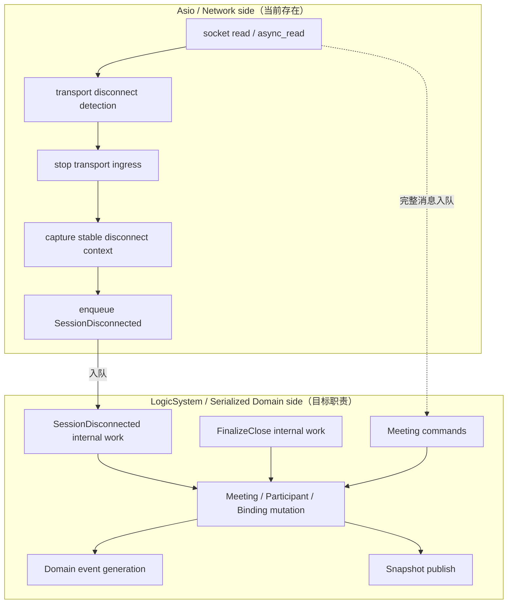
```mermaid
flowchart TD
    subgraph NET["Asio / Network side（当前存在）"]
        N1["socket read / async_read"]
        N2["transport disconnect detection"]
        N3["stop transport ingress"]
        N4["capture stable disconnect context"]
        N5["enqueue SessionDisconnected"]
    end
    subgraph DOM["LogicSystem / Serialized Domain side（目标职责）"]
        D1["Meeting commands"]
        D2["SessionDisconnected internal work"]
        D3["FinalizeClose internal work"]
        D4["Meeting / Participant / Binding mutation"]
        D5["Domain event generation"]
        D6["Snapshot publish"]
    end
    N1 --> N2 --> N3 --> N4 --> N5
    N5 -->|"入队"| D2
    N1 -.->|"完整消息入队"| D1
    D2 --> D4
    D3 --> D4
    D1 --> D4
    D4 --> D5
    D4 --> D6
```

### 5.2 网络侧允许与禁止

| 网络侧（Asio / `CSession`）负责 | 网络侧**不得**做 |
| --- | --- |
| socket 读取与分帧 | 修改 Meeting 聚合 |
| 检测 transport 终止 | 修改 Participant 集合或成员数 |
| 停止 transport ingress | 修改 Binding |
| 捕获稳定断线上下文 | 写入 Domain `connection_state` |
| 向串行化入口入队 | 判定 Participant 是否应离会 |

### 5.3 依据

该边界继承 Step 1.3 §3.3、§5.5、§13.1：**transport liveness 与 domain `connection_state` 是相关但不等价的两个事实**，后者只能由领域串行化入口修改。

## 6. Sequence 1：CreateMeeting

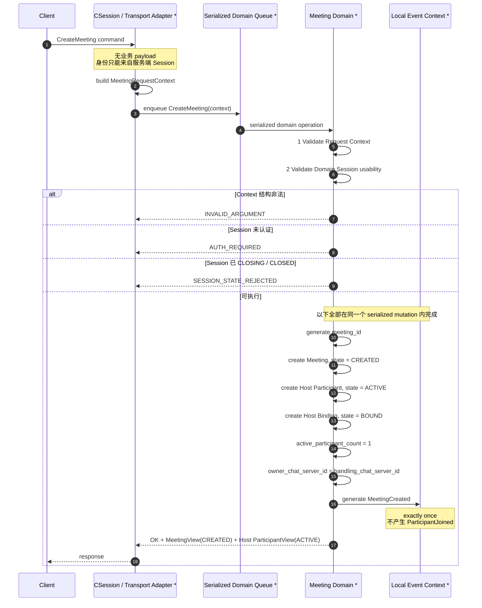
```mermaid
sequenceDiagram
    autonumber
    participant C as Client
    participant A as CSession / Transport Adapter *
    participant Q as Serialized Domain Queue *
    participant M as Meeting Domain *
    participant E as Local Event Context *

    C->>A: CreateMeeting command
    Note over A: 无业务 payload<br/>身份只能来自服务端 Session
    A->>A: build MeetingRequestContext
    A->>Q: enqueue CreateMeeting(context)
    Q->>M: serialized domain operation
    M->>M: 1 Validate Request Context
    M->>M: 2 Validate Domain Session usability
    alt Context 结构非法
        M-->>A: INVALID_ARGUMENT
    else Session 未认证
        M-->>A: AUTH_REQUIRED
    else Session 已 CLOSING / CLOSED
        M-->>A: SESSION_STATE_REJECTED
    else 可执行
        Note over M,E: 以下全部在同一个 serialized mutation 内完成
        M->>M: generate meeting_id
        M->>M: create Meeting, state = CREATED
        M->>M: create Host Participant, state = ACTIVE
        M->>M: create Host Binding, state = BOUND
        M->>M: active_participant_count = 1
        M->>M: owner_chat_server_id = handling_chat_server_id
        M->>E: generate MeetingCreated
        Note over E: exactly once<br/>不产生 ParticipantJoined
        M-->>A: OK + MeetingView(CREATED) + Host ParticipantView(ACTIVE)
        A-->>C: response
    end
```

### 6.1 关键断言

| 断言 | 依据 |
| --- | --- |
| `MeetingCreated` 恰好一次 | Step 1.4 §22.1 |
| **不产生** `ParticipantJoined` | Step 1.4 §13.3.1、§23.1.1 |
| Host Participant 为 `ACTIVE`，但其建立不构成"加入" | Step 1.4 §13.3.1 |
| Meeting 状态为 `CREATED`（非 `ACTIVE`） | Step 1.3 §8.2 |
| 无业务参数，因此无参数校验步骤 | Step 1.4 §13.6、§19.1.2 |

### 6.2 request_id 不是幂等键

```text
CreateMeeting(request_id = X) → meeting_id M1
CreateMeeting(request_id = X) → meeting_id M2, 且 M2 != M1
```

两次都真正执行时都会创建新 Meeting 并各返回 `OK`。**不得**因为 `request_id` 相同而返回同一个 Meeting 或去重第二次。

## 7. Sequence 2：JoinMeeting - NEW_PARTICIPANT

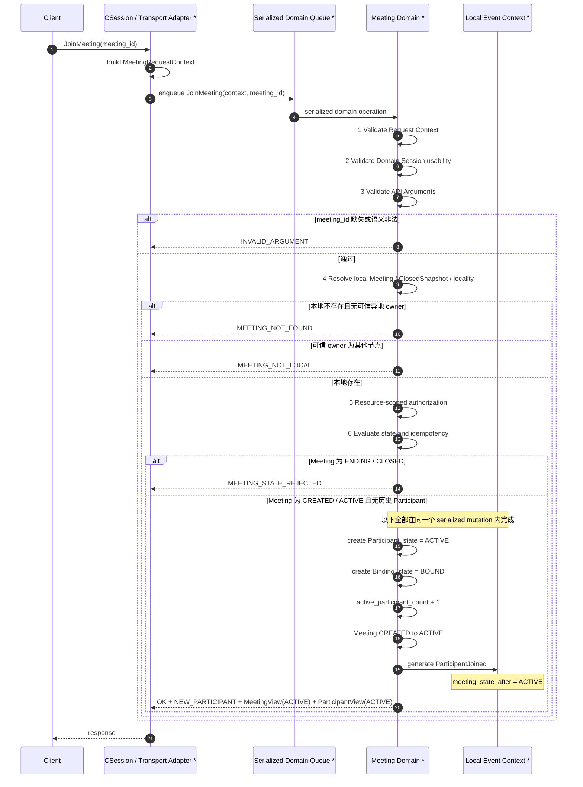
```mermaid
sequenceDiagram
    autonumber
    participant C as Client
    participant A as CSession / Transport Adapter *
    participant Q as Serialized Domain Queue *
    participant M as Meeting Domain *
    participant E as Local Event Context *

    C->>A: JoinMeeting(meeting_id)
    A->>A: build MeetingRequestContext
    A->>Q: enqueue JoinMeeting(context, meeting_id)
    Q->>M: serialized domain operation
    M->>M: 1 Validate Request Context
    M->>M: 2 Validate Domain Session usability
    M->>M: 3 Validate API Arguments
    alt meeting_id 缺失或语义非法
        M-->>A: INVALID_ARGUMENT
    else 通过
        M->>M: 4 Resolve local Meeting / ClosedSnapshot / locality
        alt 本地不存在且无可信异地 owner
            M-->>A: MEETING_NOT_FOUND
        else 可信 owner 为其他节点
            M-->>A: MEETING_NOT_LOCAL
        else 本地存在
            M->>M: 5 Resource-scoped authorization
            M->>M: 6 Evaluate state and idempotency
            alt Meeting 为 ENDING / CLOSED
                M-->>A: MEETING_STATE_REJECTED
            else Meeting 为 CREATED / ACTIVE 且无历史 Participant
                Note over M,E: 以下全部在同一个 serialized mutation 内完成
                M->>M: create Participant, state = ACTIVE
                M->>M: create Binding, state = BOUND
                M->>M: active_participant_count + 1
                M->>M: Meeting CREATED to ACTIVE
                M->>E: generate ParticipantJoined
                Note over E: meeting_state_after = ACTIVE
                M-->>A: OK + NEW_PARTICIPANT + MeetingView(ACTIVE) + ParticipantView(ACTIVE)
            end
        end
    end
    A-->>C: response
```

### 7.1 关键断言

| 断言 | 依据 |
| --- | --- |
| 第一个非 Host 成员的激活与 `CREATED → ACTIVE` 在**同一** serialized mutation 内 | Step 1.3 §8.1 |
| Response 中的 MeetingView 反映转换后的稳定状态（`ACTIVE`） | Step 1.3 §8.1、Step 1.4 §14.5 |
| `ParticipantJoined.meeting_state_after = ACTIVE` | Step 1.4 §21.2、§23.2 |
| 参数校验先于资源 lookup | Step 1.4 §19.1.2 |
| 测试场景对应 | Step 1.4 §32 Case 2 首次部分 |

## 8. Sequence 3：Duplicate Join - ALREADY_BOUND

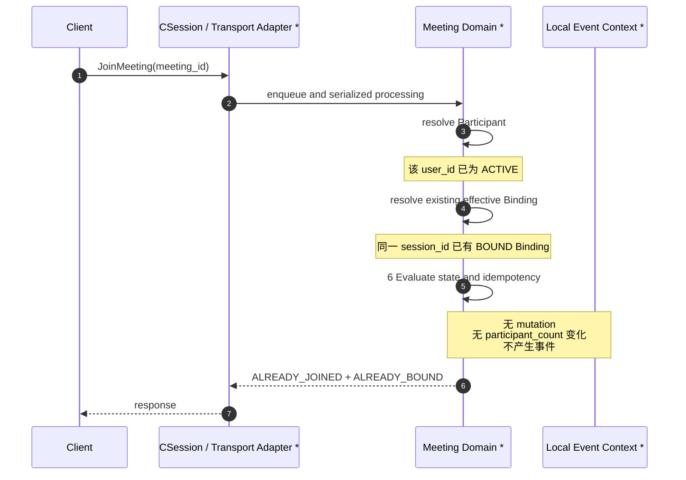
```mermaid
sequenceDiagram
    autonumber
    participant C as Client
    participant A as CSession / Transport Adapter *
    participant M as Meeting Domain *
    participant E as Local Event Context *

    C->>A: JoinMeeting(meeting_id)
    A->>M: enqueue and serialized processing
    M->>M: resolve Participant
    Note over M: 该 user_id 已为 ACTIVE
    M->>M: resolve existing effective Binding
    Note over M: 同一 session_id 已有 BOUND Binding
    M->>M: 6 Evaluate state and idempotency
    Note over M,E: 无 mutation<br/>无 participant_count 变化<br/>不产生事件
    M-->>A: ALREADY_JOINED + ALREADY_BOUND
    A-->>C: response
```

### 8.1 关键断言

| 断言 | 依据 |
| --- | --- |
| 无状态变化、无成员数变化、无事件 | Step 1.4 §14.3 Case D、§30 |
| 幂等来自**领域状态**，不是 `request_id` 去重 | Step 1.4 §7.4 |
| `ALREADY_JOINED` 的 disposition 为 `IDEMPOTENT` | Step 1.4 §10.1 |

**不得**在图中画成 `request_id dedupe`。第二类幂等路径（Case B 的 `ADDITIONAL_SESSION_BOUND`）见第 9 节。

## 9. Sequence 4：Additional Session Join（第二个 Session）

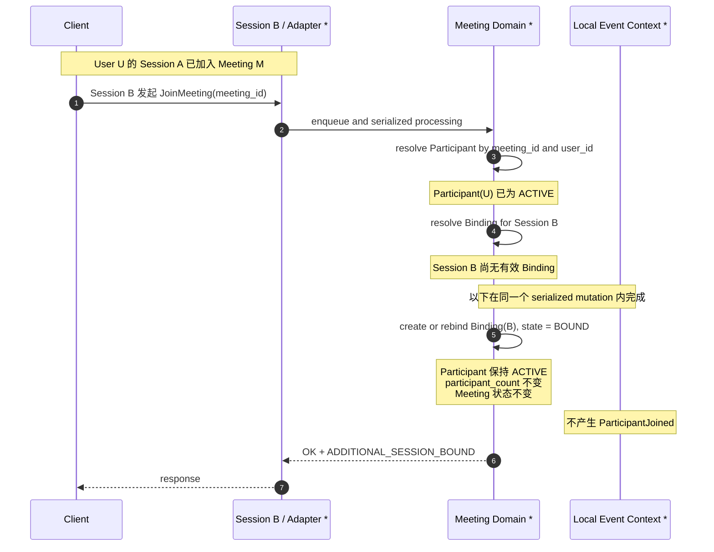
```mermaid
sequenceDiagram
    autonumber
    participant C as Client
    participant A2 as Session B / Adapter *
    participant M as Meeting Domain *
    participant E as Local Event Context *

    Note over C,A2: User U 的 Session A 已加入 Meeting M
    C->>A2: Session B 发起 JoinMeeting(meeting_id)
    A2->>M: enqueue and serialized processing
    M->>M: resolve Participant by meeting_id and user_id
    Note over M: Participant(U) 已为 ACTIVE
    M->>M: resolve Binding for Session B
    Note over M: Session B 尚无有效 Binding
    Note over M,E: 以下在同一个 serialized mutation 内完成
    M->>M: create or rebind Binding(B), state = BOUND
    Note over M: Participant 保持 ACTIVE<br/>participant_count 不变<br/>Meeting 状态不变
    Note over E: 不产生 ParticipantJoined
    M-->>A2: OK + ADDITIONAL_SESSION_BOUND
    A2-->>C: response
```

### 9.1 关键断言

| 断言 | 依据 |
| --- | --- |
| 不创建第二个 Participant | Step 1.3 §15.3、Step 1.4 §14.3 Case C |
| `participant_count` 不变 | Step 1.4 §30 |
| 不产生 `ParticipantJoined` | Step 1.4 §23.1.1 |
| 测试场景对应 | Step 1.4 §32 Case 3 |

### 9.2 语义要点

> User / Participant 是**逻辑成员**，Session Binding 是**连接关系**。

同一 User 的第二条 Session 只增加接入关系，不增加逻辑成员。区分二者是 `participant_count` 与 `ParticipantJoined` 正确性的前提。

## 10. Sequence 5：Re-Join（历史 LEFT 成员重新加入）

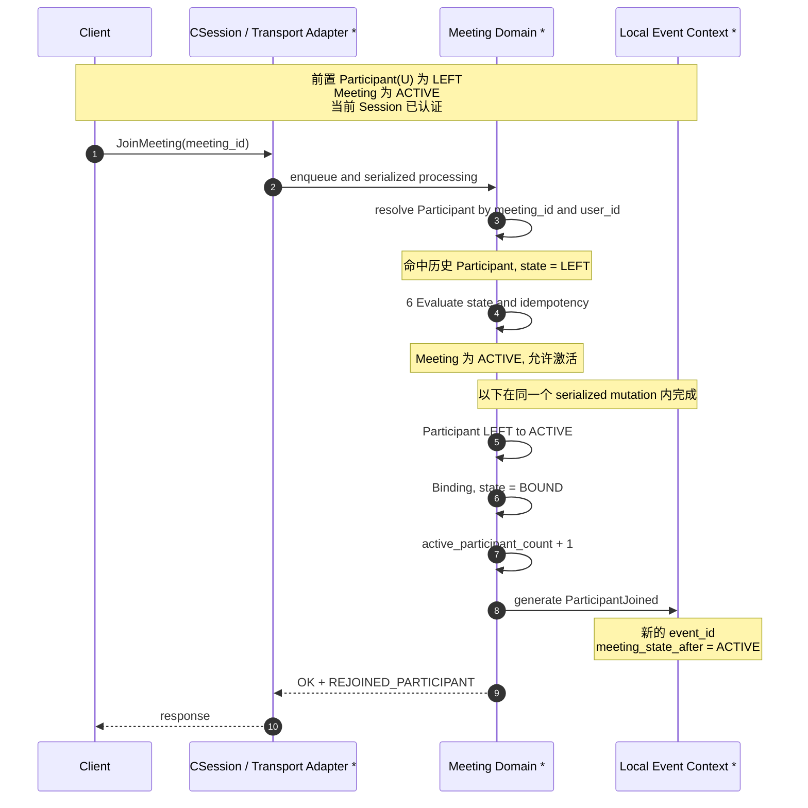
```mermaid
sequenceDiagram
    autonumber
    participant C as Client
    participant A as CSession / Transport Adapter *
    participant M as Meeting Domain *
    participant E as Local Event Context *

    Note over C,E: 前置 Participant(U) 为 LEFT<br/>Meeting 为 ACTIVE<br/>当前 Session 已认证
    C->>A: JoinMeeting(meeting_id)
    A->>M: enqueue and serialized processing
    M->>M: resolve Participant by meeting_id and user_id
    Note over M: 命中历史 Participant, state = LEFT
    M->>M: 6 Evaluate state and idempotency
    Note over M: Meeting 为 ACTIVE, 允许激活
    Note over M,E: 以下在同一个 serialized mutation 内完成
    M->>M: Participant LEFT to ACTIVE
    M->>M: Binding, state = BOUND
    M->>M: active_participant_count + 1
    M->>E: generate ParticipantJoined
    Note over E: 新的 event_id<br/>meeting_state_after = ACTIVE
    M-->>A: OK + REJOINED_PARTICIPANT
    A-->>C: response
```

### 10.1 关键断言

| 断言 | 依据 |
| --- | --- |
| Meeting **不回退** `CREATED` | Step 1.3 §8.5 |
| 事件 `meeting_state_after` 仍为 `ACTIVE` | Step 1.4 §23.2 |
| 可产生新的 `ParticipantJoined`，拥有新 `event_id` | Step 1.3 §10.2、Step 1.4 §23.3 |
| `joined_at` 保持首次加入语义 | Step 1.2 §9.1、Step 1.4 §12.2 |
| 测试场景对应 | Step 1.4 §32 Case 4 |

## 11. Sequence 6：LeaveMeeting

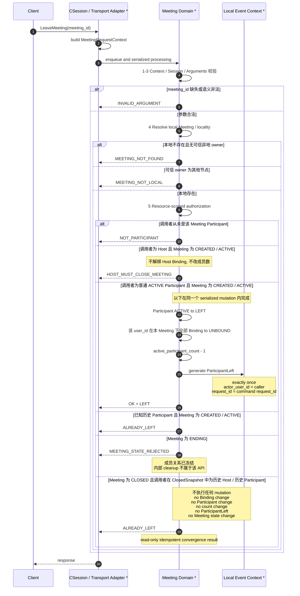
```mermaid
sequenceDiagram
    autonumber
    participant C as Client
    participant A as CSession / Transport Adapter *
    participant M as Meeting Domain *
    participant E as Local Event Context *

    C->>A: LeaveMeeting(meeting_id)
    A->>A: build MeetingRequestContext
    A->>M: enqueue and serialized processing
    M->>M: 1-3 Context / Session / Arguments 校验
    alt meeting_id 缺失或语义非法
        M-->>A: INVALID_ARGUMENT
    else 参数合法
        M->>M: 4 Resolve local Meeting / locality
        alt 本地不存在且无可信异地 owner
            M-->>A: MEETING_NOT_FOUND
        else 可信 owner 为其他节点
            M-->>A: MEETING_NOT_LOCAL
        else 本地存在
            M->>M: 5 Resource-scoped authorization
            alt 调用者从未是该 Meeting Participant
                M-->>A: NOT_PARTICIPANT
            else 调用者为 Host 且 Meeting 为 CREATED / ACTIVE
                Note over M: 不解绑 Host Binding, 不改成员数
                M-->>A: HOST_MUST_CLOSE_MEETING
            else 调用者为普通 ACTIVE Participant 且 Meeting 为 CREATED / ACTIVE
                Note over M,E: 以下在同一个 serialized mutation 内完成
                M->>M: Participant ACTIVE to LEFT
                M->>M: 该 user_id 在本 Meeting 下全部 Binding to UNBOUND
                M->>M: active_participant_count - 1
                M->>E: generate ParticipantLeft
                Note over E: exactly once<br/>actor_user_id = caller<br/>request_id = command request_id
                M-->>A: OK + LEFT
            else 已知历史 Participant 且 Meeting 为 CREATED / ACTIVE
                M-->>A: ALREADY_LEFT
            else Meeting 为 ENDING
                M-->>A: MEETING_STATE_REJECTED
                Note over M: 成员关系已冻结<br/>内部 cleanup 不属于该 API
            else Meeting 为 CLOSED 且调用者在 ClosedSnapshot 中为历史 Host / 历史 Participant
                Note over M,E: 不执行任何 mutation<br/>no Binding change<br/>no Participant change<br/>no count change<br/>no ParticipantLeft<br/>no Meeting state change
                M-->>A: ALREADY_LEFT
                Note over M: read-only idempotent convergence result
            end
        end
    end
    A-->>C: response
```

`CLOSED` + 从未加入的用户已在 authorization 分支处理为 `NOT_PARTICIPANT`，因此该图中 CLOSED 合法历史调用者分支只需要返回 `ALREADY_LEFT`。

### 11.1 关键断言

| 断言 | 依据 |
| --- | --- |
| Leave 是 **User 级**离会，解除该 User 在**本 Meeting 下全部** Binding | Step 1.3 §16.2、Step 1.4 §15.5 |
| 成员数只减一次，事件只产生一次 | Step 1.3 §16.2 |
| Host 对开放会议调用不改状态、不解绑 Binding | Step 1.3 §16.3、Step 1.4 §15.3 |
| `ENDING` + external Leave 一律 `MEETING_STATE_REJECTED` | Step 1.3 §7.5.2、§16.3 |
| `CLOSED` + 历史 Host / 历史 Participant → `ALREADY_LEFT` | Step 1.3 §7.5、Step 1.4 §15.3 |
| `CLOSED` + 从未加入 → `NOT_PARTICIPANT` | Step 1.3 §7.5、Step 1.4 §15.3 |
| `ALREADY_LEFT` 与 `NOT_PARTICIPANT` 严格区分 | Step 1.4 §15.4 |
| 测试场景对应 | Step 1.4 §32 Case 4 前半、Step 1.3 §23.4 Case 6 |

### 11.2 LeaveMeeting 的状态/身份矩阵

| Meeting 状态 | 调用者身份 | 结果 | mutation | 事件 |
| --- | --- | --- | --- | --- |
| `CREATED` / `ACTIVE` | Host | `HOST_MUST_CLOSE_MEETING` | 无 | 无 |
| `CREATED` / `ACTIVE` | 当前 `ACTIVE` Participant | `OK` + `LEFT` | `ACTIVE → LEFT`；全部 Binding `UNBOUND`；count −1 | `ParticipantLeft` ×1 |
| `CREATED` / `ACTIVE` | 已 `LEFT` 的历史 Participant | `ALREADY_LEFT` | 无 | 无 |
| `CREATED` / `ACTIVE` | 从未加入 | `NOT_PARTICIPANT` | 无 | 无 |
| `ENDING` | Host 或历史 Participant | `MEETING_STATE_REJECTED` | 无 | 无 |
| `CLOSED` | 历史 Host / 历史 Participant | `ALREADY_LEFT` | **无**（read-only convergence） | 无 |
| `CLOSED` | 从未加入 | `NOT_PARTICIPANT` | 无 | 无 |

### 11.3 为什么 `CLOSED` 返回 `ALREADY_LEFT` 不违反终态

`ALREADY_LEFT` 是 **read-only idempotent convergence result**：调用者要求达到的"已经离开会议"这一后置条件，在 `CLOSED` Meeting 中已经成立。

它**绝不**表示允许 `CLOSED` Meeting 修改成员关系。该路径必须满足：

```text
Meeting state remains CLOSED
ClosedMeetingSnapshot unchanged
Participant history unchanged
Binding unchanged
participant_count unchanged
no ParticipantLeft
no other domain event
no Meeting reactivation
```

即**禁止执行任何新的 cleanup mutation**。详见 Step 1.3 §7.5.1。

### 11.4 外部 Leave 与内部 cleanup 的区别

| 对比项 | External `LeaveMeeting`（本节） | Internal cleanup（第 12、13 节） |
| --- | --- | --- |
| 触发者 | 已认证 Session 发起的业务命令 | 网络断线事件、FinalizeClose cleanup |
| `ENDING` 下行为 | **被拒绝**（`MEETING_STATE_REJECTED`） | 允许必要的幂等 `UNBOUND`，但不改 membership |
| `CLOSED` 下行为 | 无任何 membership mutation；历史身份 `ALREADY_LEFT`，否则 `NOT_PARTICIPANT` | 仅安全的幂等收尾，不得改变 membership 或 Snapshot |
| 是否产生 `ParticipantLeft` | 真实 `ACTIVE → LEFT` 时一次 | 仅当首次真实达成该转换时；关闭清理不产生 |
| 是否有 Response | 有 | 无外部 Response |

特别强调：`ALREADY_LEFT` **不是** internal cleanup，而是外部 API 返回的幂等结果，只是不伴随任何 mutation。

## 12. Sequence 7：SessionDisconnected fan-out

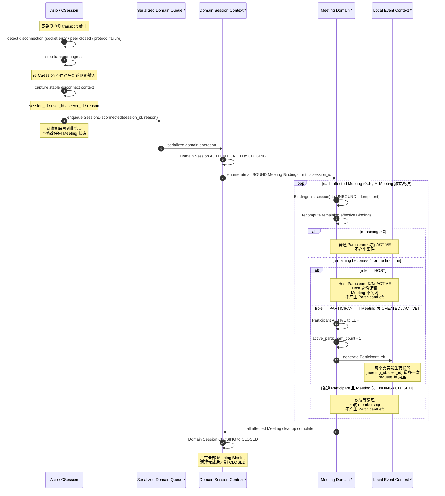
```mermaid
sequenceDiagram
    autonumber
    participant N as Asio / CSession
    participant Q as Serialized Domain Queue *
    participant S as Domain Session Context *
    participant M as Meeting Domain *
    participant E as Local Event Context *

    Note over N: 网络侧检测 transport 终止
    N->>N: detect disconnection (socket error / peer closed / protocol failure)
    N->>N: stop transport ingress
    Note over N: 该 CSession 不再产生新的网络输入
    N->>N: capture stable disconnect context
    Note over N: session_id / user_id / server_id / reason
    N->>Q: enqueue SessionDisconnected(session_id, reason)
    Note over N: 网络侧职责到此结束<br/>不修改任何 Meeting 状态

    Q->>S: serialized domain operation
    S->>S: Domain Session AUTHENTICATED to CLOSING
    S->>M: enumerate all BOUND Meeting Bindings for this session_id
    loop each affected Meeting (0..N, 各 Meeting 独立裁决)
        M->>M: Binding(this session) to UNBOUND (idempotent)
        M->>M: recompute remaining effective Bindings
        alt remaining > 0
            Note over M,E: 普通 Participant 保持 ACTIVE<br/>不产生事件
        else remaining becomes 0 for the first time
            alt role == HOST
                Note over M,E: Host Participant 保持 ACTIVE<br/>Host 身份保留<br/>Meeting 不关闭<br/>不产生 ParticipantLeft
            else role == PARTICIPANT 且 Meeting 为 CREATED / ACTIVE
                M->>M: Participant ACTIVE to LEFT
                M->>M: active_participant_count - 1
                M->>E: generate ParticipantLeft
                Note over E: 每个真实发生转换的<br/>(meeting_id, user_id) 最多一次<br/>request_id 为空
            else 普通 Participant 且 Meeting 为 ENDING / CLOSED
                Note over M,E: 仅幂等清理<br/>不改 membership<br/>不产生 ParticipantLeft
            end
        end
    end
    M-->>S: all affected Meeting cleanup complete
    S->>S: Domain Session CLOSING to CLOSED
    Note over S: 只有全部 Meeting Binding<br/>清理完成后才能 CLOSED
```

### 12.1 关键断言

| 断言 | 依据 |
| --- | --- |
| 网络回调不直接修改 Meeting | Step 1.3 §13.1、§13.4 |
| 可 fan-out 0 / 1 / N 个 Meeting | Step 1.3 §13.2 |
| 各 Meeting 裁决互不影响 | Step 1.3 §13.2 规则 2 |
| Host 的最后有效 Session 断开仍 `ACTIVE`，无事件 | Step 1.3 §14.1、Step 1.4 §24.3 |
| `ParticipantLeft` 粒度为 `(meeting_id, user_id)` | Step 1.3 §13.2 规则 3 |
| Session 仅在全部清理完成后 `CLOSED` | Step 1.3 §13.2 规则 4 |
| 断线清理事件的 `request_id` 为空 | Step 1.4 §21.2、§32 Case 7 |
| 测试场景对应 | Step 1.4 §32 Case 7 |

### 12.2 fan-out 为 0 的情形

若该 Session 已认证但未加入任何 Meeting，则循环体不执行，仅完成 Domain Session 的 `AUTHENTICATED → CLOSING → CLOSED`。这是合法路径，不产生任何事件。

## 13. Sequence 8：CloseMeeting（BeginClose → FinalizeClose）

### 13.1 Queue turn 1：BeginClose

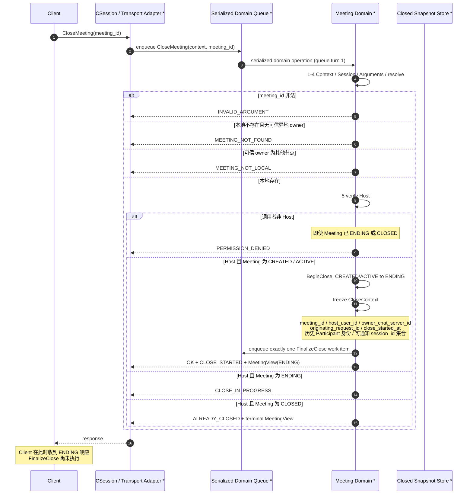
```mermaid
sequenceDiagram
    autonumber
    participant C as Client
    participant A as CSession / Transport Adapter *
    participant Q as Serialized Domain Queue *
    participant M as Meeting Domain *
    participant P as Closed Snapshot Store *

    C->>A: CloseMeeting(meeting_id)
    A->>Q: enqueue CloseMeeting(context, meeting_id)
    Q->>M: serialized domain operation (queue turn 1)
    M->>M: 1-4 Context / Session / Arguments / resolve
    alt meeting_id 非法
        M-->>A: INVALID_ARGUMENT
    else 本地不存在且无可信异地 owner
        M-->>A: MEETING_NOT_FOUND
    else 可信 owner 为其他节点
        M-->>A: MEETING_NOT_LOCAL
    else 本地存在
        M->>M: 5 verify Host
        alt 调用者非 Host
            Note over M: 即使 Meeting 已 ENDING 或 CLOSED
            M-->>A: PERMISSION_DENIED
        else Host 且 Meeting 为 CREATED / ACTIVE
            M->>M: BeginClose, CREATED/ACTIVE to ENDING
            M->>M: freeze CloseContext
            Note over M: meeting_id / host_user_id / owner_chat_server_id<br/>originating_request_id / close_started_at<br/>历史 Participant 身份 / 可通知 session_id 集合
            M->>Q: enqueue exactly one FinalizeClose work item
            M-->>A: OK + CLOSE_STARTED + MeetingView(ENDING)
        else Host 且 Meeting 为 ENDING
            M-->>A: CLOSE_IN_PROGRESS
        else Host 且 Meeting 为 CLOSED
            M-->>A: ALREADY_CLOSED + terminal MeetingView
        end
    end
    A-->>C: response
    Note over C: Client 在此时收到 ENDING 响应<br/>FinalizeClose 尚未执行
```

### 13.2 Queue turn 2：FinalizeClose

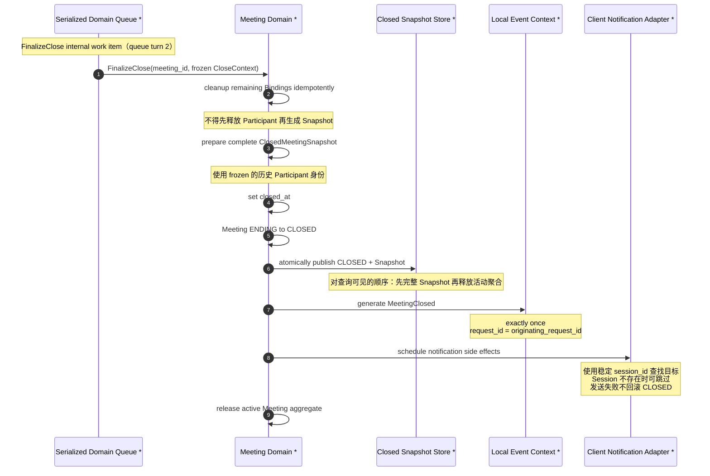
```mermaid
sequenceDiagram
    autonumber
    participant Q as Serialized Domain Queue *
    participant M as Meeting Domain *
    participant P as Closed Snapshot Store *
    participant E as Local Event Context *
    participant N as Client Notification Adapter *

    Note over Q: FinalizeClose internal work item（queue turn 2）
    Q->>M: FinalizeClose(meeting_id, frozen CloseContext)
    M->>M: cleanup remaining Bindings idempotently
    Note over M: 不得先释放 Participant 再生成 Snapshot
    M->>M: prepare complete ClosedMeetingSnapshot
    Note over M: 使用 frozen 的历史 Participant 身份
    M->>M: set closed_at
    M->>M: Meeting ENDING to CLOSED
    M->>P: atomically publish CLOSED + Snapshot
    Note over P: 对查询可见的顺序：先完整 Snapshot 再释放活动聚合
    M->>E: generate MeetingClosed
    Note over E: exactly once<br/>request_id = originating_request_id
    M->>N: schedule notification side effects
    Note over N: 使用稳定 session_id 查找目标<br/>Session 不存在时可跳过<br/>发送失败不回滚 CLOSED
    M->>M: release active Meeting aggregate
```

### 13.3 关键断言

| 断言 | 依据 |
| --- | --- |
| `CloseMeeting` 与 `FinalizeClose` 是两个独立 serialized work item | Step 1.4 §16.5.1 |
| 首次 Close Response 为 `OK + CLOSE_STARTED + ENDING` | Step 1.4 §16.5.2 |
| Response 早于 `MeetingClosed` | Step 1.4 §16.5.2、§25.3 |
| 非 Host 即使 `ENDING`/`CLOSED` 也返回 `PERMISSION_DENIED` | Step 1.4 §16.2、§19.3 |
| 不得先释放 Participant 再生成 Snapshot | Step 1.3 §17.3、§18.2 |
| Snapshot 发布先于活动聚合释放 | Step 1.3 §18.2 |
| `MeetingClosed` 恰好一次 | Step 1.4 §25.1 |
| 通知失败不回滚 `CLOSED` | Step 1.3 §14.3、Step 1.4 §16.5.6 |
| 测试场景对应 | Step 1.4 §32 Case 6 前半 |

## 14. Sequence 9：Repeated Close

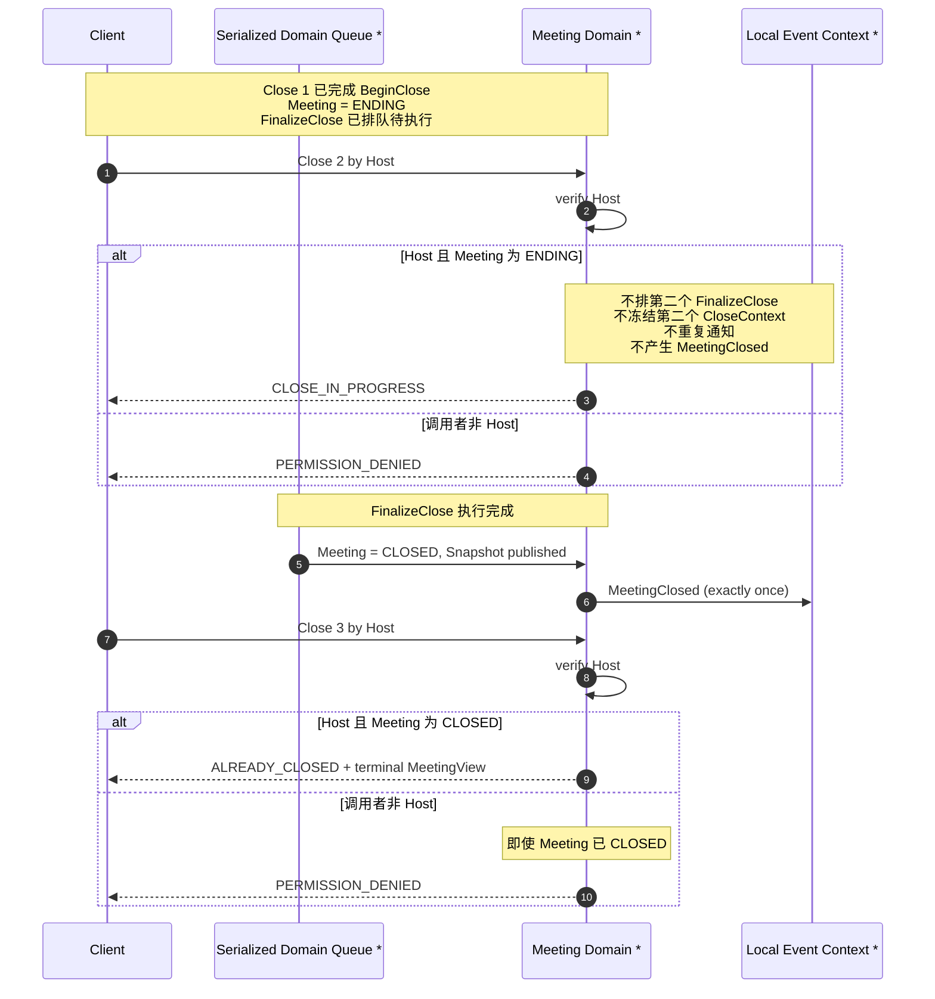
```mermaid
sequenceDiagram
    autonumber
    participant C as Client
    participant Q as Serialized Domain Queue *
    participant M as Meeting Domain *
    participant E as Local Event Context *

    Note over C,M: Close 1 已完成 BeginClose<br/>Meeting = ENDING<br/>FinalizeClose 已排队待执行

    C->>M: Close 2 by Host
    M->>M: verify Host
    alt Host 且 Meeting 为 ENDING
        Note over M,E: 不排第二个 FinalizeClose<br/>不冻结第二个 CloseContext<br/>不重复通知<br/>不产生 MeetingClosed
        M-->>C: CLOSE_IN_PROGRESS
    else 调用者非 Host
        M-->>C: PERMISSION_DENIED
    end

    Note over Q,M: FinalizeClose 执行完成
    Q->>M: Meeting = CLOSED, Snapshot published
    M->>E: MeetingClosed (exactly once)

    C->>M: Close 3 by Host
    M->>M: verify Host
    alt Host 且 Meeting 为 CLOSED
        M-->>C: ALREADY_CLOSED + terminal MeetingView
    else 调用者非 Host
        Note over M: 即使 Meeting 已 CLOSED
        M-->>C: PERMISSION_DENIED
    end
```

### 14.1 三个时间窗口

| Case | 时间窗口 | Host 结果 | 非 Host 结果 |
| --- | --- | --- | --- |
| A | `FinalizeClose` 尚未执行（Meeting = `ENDING`） | `CLOSE_IN_PROGRESS` | `PERMISSION_DENIED` |
| B | `FinalizeClose` 已完成（Meeting = `CLOSED`） | `ALREADY_CLOSED` + terminal MeetingView | `PERMISSION_DENIED` |
| C | 任意窗口，调用者非 Host | — | `PERMISSION_DENIED` |

### 14.2 为什么只安排一个 FinalizeClose

因为 `BeginClose` 是 `CREATED`/`ACTIVE → ENDING` 的单向转换，且第一次转换时就会冻结 CloseContext 并排入一个 `FinalizeClose`。第二次 Close 到达时 Meeting 已处于 `ENDING`，求值顺序在第 6 步（state / idempotency）就命中 `CLOSE_IN_PROGRESS` 并返回，**不会进入 mutation 步骤**，因此不可能再排第二个 work item。

正式约束（Step 1.4 §16.5.5）：

> 每个 Meeting 从 `CREATED`/`ACTIVE` 第一次进入 `ENDING` 时最多安排一个有效 `FinalizeClose`。

具体去重实现留给 Step 1.6。

## 15. Sequence 10：Query during ENDING

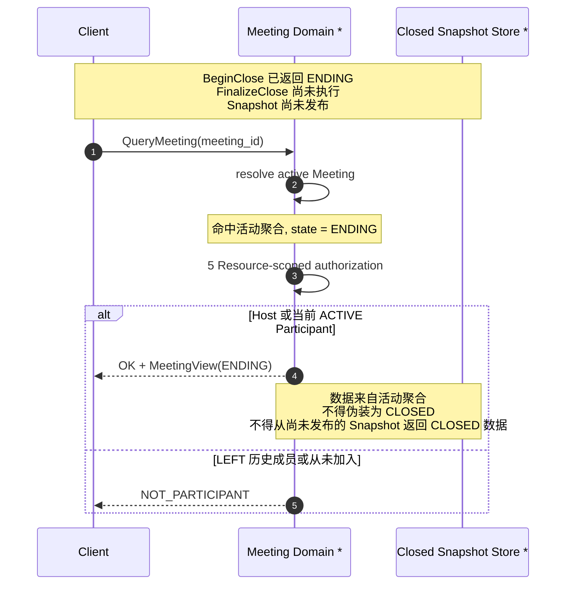
```mermaid
sequenceDiagram
    autonumber
    participant C as Client
    participant M as Meeting Domain *
    participant P as Closed Snapshot Store *

    Note over C,P: BeginClose 已返回 ENDING<br/>FinalizeClose 尚未执行<br/>Snapshot 尚未发布

    C->>M: QueryMeeting(meeting_id)
    M->>M: resolve active Meeting
    Note over M: 命中活动聚合, state = ENDING
    M->>M: 5 Resource-scoped authorization
    alt Host 或当前 ACTIVE Participant
        M-->>C: OK + MeetingView(ENDING)
        Note over M,P: 数据来自活动聚合<br/>不得伪装为 CLOSED<br/>不得从尚未发布的 Snapshot 返回 CLOSED 数据
    else LEFT 历史成员或从未加入
        M-->>C: NOT_PARTICIPANT
    end
```

### 15.1 关键断言

| 断言 | 依据 |
| --- | --- |
| `ENDING` 可被 Query 观察 | Step 1.3 §18.3、Step 1.4 §17.2 |
| `ENDING` 数据来源为活动聚合，不是 Snapshot | Step 1.4 §11.2 |
| `ENDING` 期间不可修改 membership | Step 1.3 §17.1、Step 1.4 §18.4 |

## 16. Sequence 11：Query CLOSED Meeting

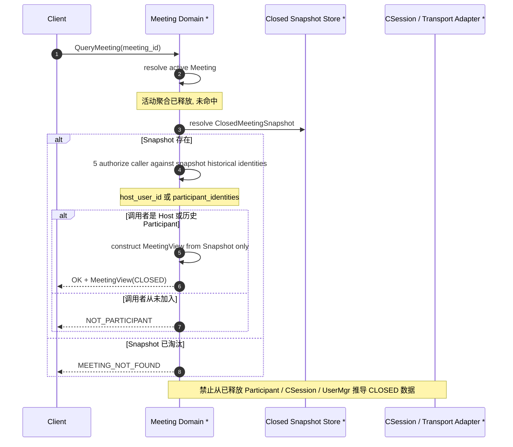
```mermaid
sequenceDiagram
    autonumber
    participant C as Client
    participant M as Meeting Domain *
    participant P as Closed Snapshot Store *
    participant S as CSession / Transport Adapter *

    C->>M: QueryMeeting(meeting_id)
    M->>M: resolve active Meeting
    Note over M: 活动聚合已释放, 未命中
    M->>P: resolve ClosedMeetingSnapshot
    alt Snapshot 存在
        M->>M: 5 authorize caller against snapshot historical identities
        Note over M: host_user_id 或 participant_identities
        alt 调用者是 Host 或历史 Participant
            M->>M: construct MeetingView from Snapshot only
            M-->>C: OK + MeetingView(CLOSED)
        else 调用者从未加入
            M-->>C: NOT_PARTICIPANT
        end
    else Snapshot 已淘汰
        M-->>C: MEETING_NOT_FOUND
    end
    Note over M,S: 禁止从已释放 Participant / CSession / UserMgr 推导 CLOSED 数据
```

### 16.1 关键断言

| 断言 | 依据 |
| --- | --- |
| CLOSED 数据来源只能是 `ClosedMeetingSnapshot` | Step 1.3 §22.4、Step 1.4 §26.1 |
| 鉴权依据 Snapshot 中的 `host_user_id` 与历史身份 | Step 1.2 §13.3、Step 1.4 §26.2 |
| 未加入者不得借此枚举成员 | Step 1.1 §13.2、Step 1.4 §26.2 |
| Snapshot 淘汰后返回 `MEETING_NOT_FOUND` | Step 1.4 §26.3 |
| `ListParticipants` 的 CLOSED 路径同源，scope = `HISTORICAL` | Step 1.4 §18.4 |
| 测试场景对应 | Step 1.4 §32 Case 10 |

## 17. Sequence 12：Non-owner / Locality

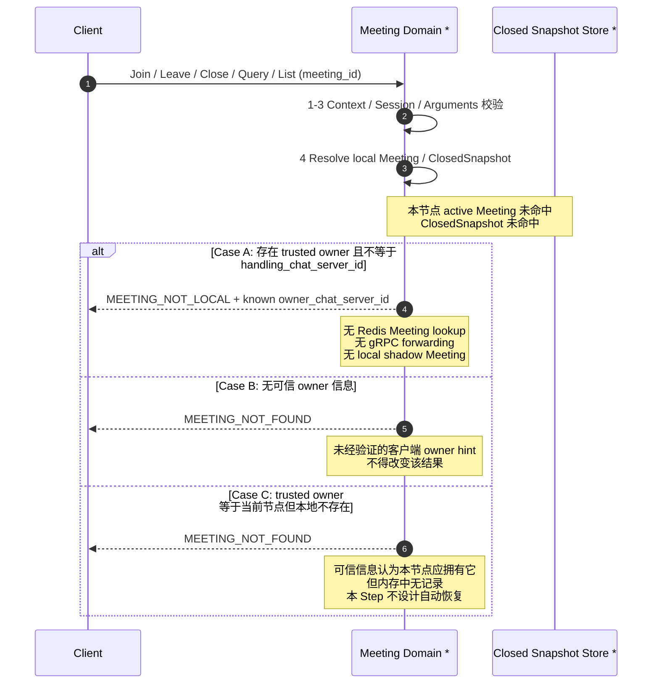
```mermaid
sequenceDiagram
    autonumber
    participant C as Client
    participant M as Meeting Domain *
    participant P as Closed Snapshot Store *

    C->>M: Join / Leave / Close / Query / List (meeting_id)
    M->>M: 1-3 Context / Session / Arguments 校验
    M->>M: 4 Resolve local Meeting / ClosedSnapshot
    Note over M,P: 本节点 active Meeting 未命中<br/>ClosedSnapshot 未命中
    alt Case A: 存在 trusted owner 且不等于 handling_chat_server_id
        M-->>C: MEETING_NOT_LOCAL + known owner_chat_server_id
        Note over M: 无 Redis Meeting lookup<br/>无 gRPC forwarding<br/>无 local shadow Meeting
    else Case B: 无可信 owner 信息
        M-->>C: MEETING_NOT_FOUND
        Note over M: 未经验证的客户端 owner hint<br/>不得改变该结果
    else Case C: trusted owner 等于当前节点但本地不存在
        M-->>C: MEETING_NOT_FOUND
        Note over M: 可信信息认为本节点应拥有它<br/>但内存中无记录<br/>本 Step 不设计自动恢复
    end
```

### 17.1 三种情况

| Case | 条件 | 结果 | 附带信息 |
| --- | --- | --- | --- |
| A | 存在可信 `trusted_owner_chat_server_id` 且 ≠ `handling_chat_server_id` | `MEETING_NOT_LOCAL` | 可返回已知 `owner_chat_server_id` |
| B | 没有可信 owner 信息 | `MEETING_NOT_FOUND` | 不携带 owner |
| C | 可信 owner == 当前节点，但本地不存在 | `MEETING_NOT_FOUND` | 不携带 owner |

### 17.2 关键断言

| 断言 | 依据 |
| --- | --- |
| Phase 1 **没有** Redis `meeting_id → server_id` 路由 | Step 1.1 §18.3、Step 1.3 §12 |
| Phase 1 **没有**跨节点 Meeting gRPC 转发 | Step 1.1 §18.3 |
| 未经验证的客户端 owner hint 不得产生 `MEETING_NOT_LOCAL` | Step 1.4 §8.4 |
| 任何情况下不得创建本地 shadow Meeting | Step 1.1 §18.7、Step 1.4 §8.3 |
| 测试场景对应 | Step 1.4 §32 Case 8、Case 9 |

## 18. Sequence 13：Join vs Close（顺序裁决）

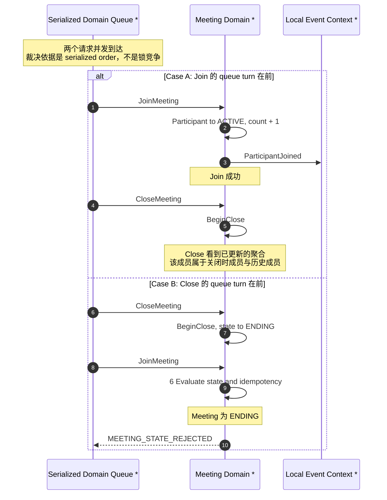
```mermaid
sequenceDiagram
    autonumber
    participant Q as Serialized Domain Queue *
    participant M as Meeting Domain *
    participant E as Local Event Context *

    Note over Q: 两个请求并发到达<br/>裁决依据是 serialized order，不是锁竞争

    alt Case A: Join 的 queue turn 在前
        Q->>M: JoinMeeting
        M->>M: Participant to ACTIVE, count + 1
        M->>E: ParticipantJoined
        Note over M: Join 成功
        Q->>M: CloseMeeting
        M->>M: BeginClose
        Note over M: Close 看到已更新的聚合<br/>该成员属于关闭时成员与历史成员
    else Case B: Close 的 queue turn 在前
        Q->>M: CloseMeeting
        M->>M: BeginClose, state to ENDING
        Q->>M: JoinMeeting
        M->>M: 6 Evaluate state and idempotency
        Note over M: Meeting 为 ENDING
        M-->>Q: MEETING_STATE_REJECTED
    end
```

### 18.1 关键断言

| 断言 | 依据 |
| --- | --- |
| 裁决依据为**入队顺序** | Step 1.3 §21.3 原则 1 |
| `ENDING` 后不得新增逻辑 Participant | Step 1.3 §23.1 I6 |
| 不需要第二套并发控制机制 | Step 1.3 §20.3 |

## 19. Sequence 14：Leave vs Disconnect（顺序裁决）

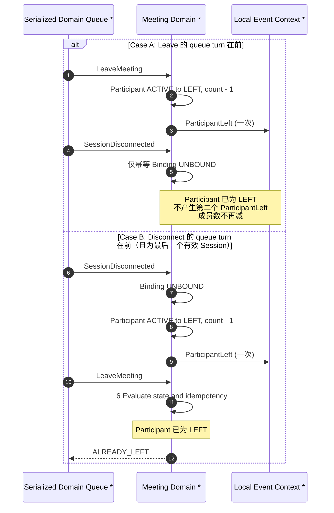
```mermaid
sequenceDiagram
    autonumber
    participant Q as Serialized Domain Queue *
    participant M as Meeting Domain *
    participant E as Local Event Context *

    alt Case A: Leave 的 queue turn 在前
        Q->>M: LeaveMeeting
        M->>M: Participant ACTIVE to LEFT, count - 1
        M->>E: ParticipantLeft (一次)
        Q->>M: SessionDisconnected
        M->>M: 仅幂等 Binding UNBOUND
        Note over M,E: Participant 已为 LEFT<br/>不产生第二个 ParticipantLeft<br/>成员数不再减
    else Case B: Disconnect 的 queue turn 在前（且为最后一个有效 Session）
        Q->>M: SessionDisconnected
        M->>M: Binding UNBOUND
        M->>M: Participant ACTIVE to LEFT, count - 1
        M->>E: ParticipantLeft (一次)
        Q->>M: LeaveMeeting
        M->>M: 6 Evaluate state and idempotency
        Note over M: Participant 已为 LEFT
        M-->>Q: ALREADY_LEFT
    end
```

### 19.1 关键断言

| 断言 | 依据 |
| --- | --- |
| 最多一次真实 `ACTIVE → LEFT` | Step 1.3 §21.1 第 4 条 |
| 最多一次 `ParticipantLeft` | Step 1.3 §16.5 |
| 成员数不得减两次 | Step 1.3 §23.1 I10 |
| 测试场景对应 | Step 1.4 §32 Case 4 与 Case 7 的组合 |

## 20. Command / Query / Internal Work / Event 分类

| 类型 | 示例 | 是否外部调用 | 是否有 Response | 是否修改领域状态 |
| --- | --- | --- | --- | --- |
| External Command | `CreateMeeting` / `JoinMeeting` / `LeaveMeeting` / `CloseMeeting` | 是 | 是 | 是 |
| External Query | `QueryMeeting` / `ListParticipants` | 是 | 是 | 否 |
| Internal Work Item | `SessionDisconnected` / `FinalizeClose` | 否 | 无外部 Response | 是 |
| Domain Event | `MeetingCreated` / `ParticipantJoined` / `ParticipantLeft` / `MeetingClosed` | 否 | 不适用 | 是状态变更后的事实 |

### 20.1 特别注意

1. **`FinalizeClose` 不是外部 API。** 它由 `BeginClose` 在同一串行化入口内排入，没有客户端 Response。Step 1.4 §16.5.6 明确不为客户端设计 `FinalizeCloseResponse`。
2. **`SessionDisconnected` 不是客户端 command。** 它由网络侧观测断线后生成，客户端无法主动构造。
3. **`MeetingClosed` 不是 command。** 它是 `ENDING → CLOSED` 完成后的事实，不是可被调用的操作。
4. **Domain Event 不是 Response。** 事件的接收方是 owner ChatServer 内的本地事件上下文，不是请求调用者。

## 21. Response / Event / Notification 顺序

### 21.1 通用原则

领域状态修改完成后：

```text
commit stable domain state
        ↓
generate corresponding Domain Event
        ↓
build Response / schedule notification side effects
```

本原则不引入数据库 transaction 概念，只表达"事件与响应都不得先于状态变更产生"。

### 21.2 Close 的跨 work item 顺序

```text
Queue turn 1（BeginClose）
    commit ENDING
    → build Response (OK + CLOSE_STARTED + ENDING)

Queue turn 2（FinalizeClose）
    commit CLOSED
    → generate MeetingClosed
    → schedule notification side effects
```

因此：

| 顺序 | 事实 |
| --- | --- |
| 1 | Close command 的 Response 在 turn 1 返回 |
| 2 | `MeetingClosed` 在 turn 2 产生 |
| 3 | 通知 side effect 在 turn 2 之后被调度 |

**Close command 的 Response 早于 `MeetingClosed`。这是设计要求，不是缺陷。**

### 21.3 Event 与 Notification 的区别

| 概念 | 含义 | Phase 1 保证 |
| --- | --- | --- |
| Domain Event | 领域事实，例如 `MeetingClosed` | 在状态变更成功后产生一次 |
| Client Notification | 未来通过 Session 向客户端推送的 side effect | **不保证**可靠投递、ACK、retry、MQ 或 exactly-once |

**不得**把"事件已产生"画成"所有客户端都成功收到"。

### 21.4 Notification side effect 的约束

| 约束 | 说明 |
| --- | --- |
| 目标查找 | 使用稳定 `session_id` 查找 |
| Session 不存在 | 可跳过 |
| 发送失败 | 不回滚领域状态 |
| ACK / retry | 当前没有 |
| 交付保证 | 不保证所有客户端收到 |

通知**不是**状态机正确性的前置条件。

## 22. Thread & Serialization View

### 22.1 Network / Asio side

负责：

```text
socket read
transport disconnect detection
stop ingress
stable disconnect context capture
enqueue
```

不负责：

```text
Meeting mutation
Participant mutation
Binding domain cleanup
```

### 22.2 LogicSystem / Serialized Domain side

目标上负责：

```text
Meeting commands
SessionDisconnected
FinalizeClose
Meeting / Participant / Binding mutation
event generation
snapshot publish
```

当前源码中已经存在一个 `LogicSystem` worker 线程与 `_msg_que` 队列；Meeting 未来如何具体接入属于 Step 1.6。

### 22.3 三个 work item 类型的入队来源

| Work item | 入队来源 | Queue turn 数 |
| --- | --- | --- |
| Meeting Command（Create/Join/Leave/Close/Query/List） | 客户端消息 → Transport Adapter → 入队 | 1 |
| `SessionDisconnected` | 网络侧断线检测 → 捕获上下文 → 入队 | 1（内部含 N 个 Meeting 裁决） |
| `FinalizeClose` | `BeginClose` 在处理 Close 命令时入队 | 1（独立 turn） |

### 22.4 串行化边界的含义

一个 queue turn 内：

- 独占 Meeting 聚合、Participant 集合、Binding 与 Snapshot 的修改权；
- 不插入其他 Meeting 修改；
- 结束时聚合处于领域稳定状态（Step 1.3 §23.0）。

Phase 1 **不新建线程、不引入线程池、不引入 MQ**。

## 23. CLOSED Snapshot Publication Path

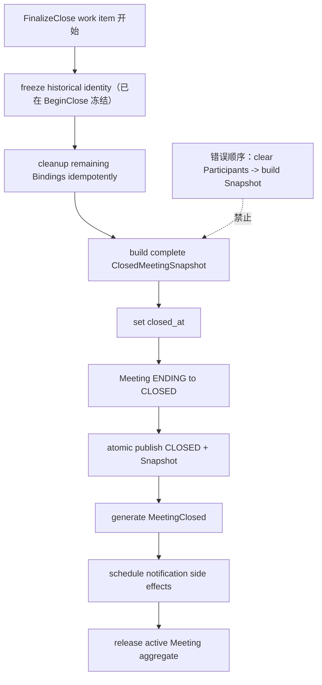
```mermaid
flowchart TD
    A["FinalizeClose work item 开始"] --> B["freeze historical identity（已在 BeginClose 冻结）"]
    B --> C["cleanup remaining Bindings idempotently"]
    C --> D["build complete ClosedMeetingSnapshot"]
    D --> E["set closed_at"]
    E --> F["Meeting ENDING to CLOSED"]
    F --> G["atomic publish CLOSED + Snapshot"]
    G --> H["generate MeetingClosed"]
    H --> I["schedule notification side effects"]
    I --> J["release active Meeting aggregate"]

    X["错误顺序：clear Participants -> build Snapshot"] -.->|"禁止"| D
```

### 23.1 顺序约束

| 约束 | 依据 |
| --- | --- |
| 先冻结历史身份，再清理 | Step 1.3 §17.1 |
| 先生成完整 Snapshot，再发布 `CLOSED` | Step 1.3 §18.2 |
| 发布 Snapshot 先于释放活动聚合 | Step 1.3 §18.2 |
| **不得**先释放 Participant 再生成 Snapshot | Step 1.3 §17.3 |

### 23.2 原子观察语义

任何查询都不得观察到：

```text
Meeting 已 CLOSED 但 Snapshot 只组装了一半
活动聚合已被删除但 Snapshot 尚未建立
伪完整的 CLOSED 状态
```

## 24. State / Event Trace Summary

本表用于交叉检查全部 Mermaid 与 Step 1.3 / 1.4 是否一致。

| # | Scenario | Initial State | Domain Mutation | Final State | Event | Response |
| --- | --- | --- | --- | --- | --- | --- |
| 1 | CreateMeeting | 不存在 | 建 Meeting、Host Participant、Host Binding；count = 1 | Meeting `CREATED`、Host `ACTIVE` | `MeetingCreated` ×1 | `OK` |
| 2 | First non-Host Join | Meeting `CREATED`、count = 1 | 建 Participant、Binding；count +1；`CREATED → ACTIVE` | Meeting `ACTIVE`、count = 2 | `ParticipantJoined` ×1（after = `ACTIVE`） | `OK` + `NEW_PARTICIPANT` |
| 3 | Duplicate Join | Participant `ACTIVE`、Binding `BOUND` | 无 | 不变 | 无 | `ALREADY_JOINED` + `ALREADY_BOUND` |
| 4 | Second Session Join | Participant `ACTIVE`、Session B 无 Binding | 建/恢复 Binding(B) | Participant 仍 `ACTIVE`、count 不变 | 无 | `OK` + `ADDITIONAL_SESSION_BOUND` |
| 5 | Re-Join | Participant `LEFT`、Meeting `ACTIVE` | `LEFT → ACTIVE`；Binding `BOUND`；count +1 | Participant `ACTIVE` | `ParticipantJoined` ×1（新 `event_id`） | `OK` + `REJOINED_PARTICIPANT` |
| 6 | LeaveMeeting（非 Host） | Participant `ACTIVE`、Meeting `ACTIVE` | `ACTIVE → LEFT`；该 User 全部 Binding `UNBOUND`；count −1 | Participant `LEFT` | `ParticipantLeft` ×1 | `OK` + `LEFT` |
| 7 | Last Session Disconnect（非 Host） | Participant `ACTIVE`、仅一条有效 Binding | Binding `UNBOUND`；`ACTIVE → LEFT`；count −1；Session `CLOSING → CLOSED` | Participant `LEFT`、Session `CLOSED` | `ParticipantLeft` ×1（`request_id` 空） | 无外部 Response |
| 8 | Host Disconnect（最后一个 Session） | Host `ACTIVE`、Meeting `CREATED`/`ACTIVE` | 仅 Binding `UNBOUND`；Session `CLOSING → CLOSED` | Host 仍 `ACTIVE`、Meeting 状态不变 | 无 | 无外部 Response |
| 9 | BeginClose | Meeting `CREATED`/`ACTIVE`、调用者 Host | `CREATED`/`ACTIVE → ENDING`；冻结 CloseContext；排入一个 `FinalizeClose` | Meeting `ENDING` | 无 | `OK` + `CLOSE_STARTED` + `ENDING` |
| 10 | FinalizeClose | Meeting `ENDING`、CloseContext 已冻结 | 幂等清理；组装 Snapshot；设 `closed_at`；`ENDING → CLOSED`；原子发布；释放聚合 | Meeting `CLOSED` + 完整 Snapshot | `MeetingClosed` ×1 | 无外部 Response |
| 11 | Repeated Close（`ENDING`、Host） | Meeting `ENDING` | 无 | 不变 | 无 | `CLOSE_IN_PROGRESS` |
| 12 | Repeated Close（`CLOSED`、Host） | Meeting `CLOSED` | 无 | 不变 | 无 | `ALREADY_CLOSED` + terminal MeetingView |
| 13 | CLOSED Query（历史成员） | `CLOSED` + Snapshot 存在 | 无（只读） | 不变 | 无 | `OK` + MeetingView(`CLOSED`) |
| 14 | CLOSED Leave（历史 Host / 历史 Participant） | `CLOSED` + Snapshot 存在 | **无**（read-only convergence） | 不变 | 无 | `ALREADY_LEFT` |
| 15 | CLOSED Leave（从未加入） | `CLOSED` + Snapshot 存在 | 无 | 不变 | 无 | `NOT_PARTICIPANT` |

## 25. Phase 1 不实现的通信路径

以下能力**不在**本 Step 的任何主执行时序中，Phase 1 不实现：

| 未实现能力 | 说明 |
| --- | --- |
| Redis `meeting_id → server_id` 路由 | 见第 17 节 |
| Meeting 跨节点 gRPC | 见第 17 节 |
| Kafka / RabbitMQ / 其他 MQ | 事件仅为本地领域语义 |
| HTTP Meeting API | 属于 Phase 4 以后 |
| WebSocket Meeting API | 属于 Phase 4 以后 |
| MySQL Meeting 持久化 | 运行态与 Snapshot 均为内存态 |
| 独立 MeetingServer 进程 | Meeting 内置于 owner ChatServer |
| SIP / SDP / WebRTC / PJSIP | Advanced 阶段 |
| Media Server | Advanced 阶段 |

上述能力的后续演进只作为方向记录，**不出现在主执行时序图中**。

## 26. Design Consistency Resolution Record

本节记录 Step 1.5 在串联时序时发现的设计不一致、指挥官裁决与修正落点。已解决的条目保留完整过程，便于追溯；文中引用的旧规则一律标记为 **superseded / resolved**，**不得**被误读为当前契约。

### 26.0 当前有效规则一览

以下为修正后的**当前有效**规则：

```text
CLOSED + historical Participant / Host + LeaveMeeting
→ ALREADY_LEFT（ResultCode 101, IDEMPOTENT）

CLOSED + never-participant + LeaveMeeting
→ NOT_PARTICIPANT

ENDING + external LeaveMeeting
→ MEETING_STATE_REJECTED

CLOSED + JoinMeeting
→ MEETING_STATE_REJECTED
```

### 26.1 Issue #1：`Host + CLOSED + LeaveMeeting` 的结果存在两处不同定义

#### 状态

**Resolved**（指挥官已裁决）

#### Issue 来源

Step 1.5 在绘制 Sequence 6（LeaveMeeting）时，串联 Step 1.3 与 Step 1.4 的状态规则，发现同一请求在两份文档中给出不同结果。

#### Step 1.3 原规则（**superseded / resolved**）

| 来源 | 原定义 |
| --- | --- |
| Step 1.3 §7.3（Meeting 转换表） | `CLOSED` + 外部成员关系命令（Join / LeaveMeeting）→ "拒绝且不得重新激活" |
| Step 1.3 §16.3（Host 的 Leave） | Host + `ENDING` / `CLOSED` → `MEETING_STATE_REJECTED` |
| Step 1.3 §16.4 | "外部 `LeaveMeeting` 在 `ENDING`/`CLOSED` 上就是拒绝" |

**失效点**：把 `ENDING` 与 `CLOSED` 合并处理，未区分"关闭进行中"与"关闭已完成"两种状态。

#### Step 1.4 原规则（保留，视为对 Step 1.1 的 API 具体化）

| 来源 | 定义 |
| --- | --- |
| Step 1.4 §15.3（Leave 语义表） | Host 对 `CLOSED` → `ALREADY_LEFT`（`IDEMPOTENT`） |
| Step 1.4 §15.7 | 调用者是 ClosedSnapshot 中的历史 Participant **或 Host**：`ALREADY_LEFT` |

#### 冲突点

同一个 `Host + CLOSED + LeaveMeeting` 请求：Step 1.3 给出 `MEETING_STATE_REJECTED`（`ERROR`），Step 1.4 给出 `ALREADY_LEFT`（`IDEMPOTENT`）。

**相关但一致的部分**：Host + `ENDING` + Leave 在两份文档中均为 `MEETING_STATE_REJECTED`，无冲突。

#### 最终裁决

```text
ENDING + external LeaveMeeting
→ MEETING_STATE_REJECTED

CLOSED + historical Participant / Host + LeaveMeeting
→ ALREADY_LEFT

CLOSED + never-participant + LeaveMeeting
→ NOT_PARTICIPANT
```

其中 `ALREADY_LEFT` 沿用 Step 1.4 已冻结定义：`ResultCode = 101`，`Disposition = IDEMPOTENT`。

#### 裁决依据

Step 1.1 已冻结以下业务原则：

```text
重复 Leave 必须幂等；
必须区分"本次实际移除"和"已经不在会议中"。

CLOSED 状态收到 Leave 或清理回调时：
必须安全且幂等；
不得重新打开 Meeting。
```

角色规则还明确：

```text
Host:
开放状态 Leave 被拒绝；
关闭后只做幂等清理语义。
```

因此 Step 1.4 的 `历史 Participant / Host + CLOSED → ALREADY_LEFT` 属于对 Step 1.1 需求的 API 具体化；Step 1.3 中 `ENDING / CLOSED → MEETING_STATE_REJECTED` 是过早将两种状态合并处理，应予以细化。

#### 核心语义：`ALREADY_LEFT` 是 read-only idempotent convergence result

`CLOSED + LeaveMeeting → ALREADY_LEFT` **绝不**表示允许 `CLOSED` Meeting 修改成员关系。它只表达：

> 调用者要求达到的"已经离开会议"这一业务后置条件，在 `CLOSED` Meeting 中已经成立。

因此该路径必须满足：

```text
Meeting state remains CLOSED
ClosedMeetingSnapshot unchanged
Participant history unchanged
Binding unchanged
participant_count unchanged
no ParticipantLeft
no other domain event
no Meeting reactivation
```

即**禁止执行任何新的 cleanup mutation**。

#### 为什么 `ENDING` 与 `CLOSED` 不同

| 对比项 | `ENDING` | `CLOSED` |
| --- | --- | --- |
| 活动聚合是否存在 | 存在 | 已释放 |
| membership 是否冻结 | 冻结中 | 已不存在 |
| `FinalizeClose` 是否完成 | 未完成 | 已完成 |
| 终态 Snapshot 是否权威 | 尚未发布 | 是 |
| 外部 `LeaveMeeting` 结果 | `MEETING_STATE_REJECTED` | 历史身份 → `ALREADY_LEFT`；否则 `NOT_PARTICIPANT` |

`ENDING` 期间关闭流程仍在进行，清理由关闭流程统一负责，因此外部 Leave 必须被拒绝。`CLOSED` 期间终态 Snapshot 是权威事实来源，对其中可确认的历史身份做幂等确认是安全的。

#### 修正位置

| 文件 | 章节 | 修正内容 |
| --- | --- | --- |
| `STEP-1.3-state-machines.md` | §7.3 | 拆分 `CLOSED` 下的 Join 与 LeaveMeeting 行；拆分 `CREATED`/`ACTIVE` 下 `ENDING`/`CLOSED` 混合行 |
| `STEP-1.3-state-machines.md` | §7.5（新增） | `CLOSED` 下 LeaveMeeting 身份矩阵；§7.5.1 read-only convergence 语义；§7.5.2 `ENDING`/`CLOSED` 对比 |
| `STEP-1.3-state-machines.md` | §9.5 | 增加 `LEFT` + `CLOSED` + Leave 行 |
| `STEP-1.3-state-machines.md` | §16.3 | 重写为完整状态/身份矩阵，拆分 `ENDING` 与 `CLOSED` |
| `STEP-1.3-state-machines.md` | §16.4 | 重写对照表；正式表述 `ENDING` 拒绝、`CLOSED` 幂等确认、`ALREADY_LEFT` 不是 internal cleanup |
| `STEP-1.3-state-machines.md` | §21.2 | Leave 分支 Mermaid 增加 Meeting 状态判定与 `CLOSED` 身份判定 |
| `STEP-1.3-state-machines.md` | §21.3 | 新增原则 7（`CLOSED` 下外部 Leave 只是幂等确认） |
| `STEP-1.3-state-machines.md` | §23.4 | 新增 Case 6（Case A–F 六场景） |
| `STEP-1.3-state-machines.md` | §24.3 | 新增非法转换行：因 `CLOSED` Leave 执行 membership mutation |
| `STEP-1.3-state-machines.md` | §28.2（新增） | Design Consistency Fix 验收表 D1–D10 |
| `STEP-1.5-core-sequences.md` | §11 | Sequence 6 移除 unresolved 分支；新增 §11.2 状态/身份矩阵、§11.3 终态说明、§11.4 对照表 |
| `STEP-1.5-core-sequences.md` | §24 | Trace 表新增 `CLOSED` Leave 行 |
| `STEP-1.5-core-sequences.md` | §26 | 本节 |

#### 未改变的行为

以下规则在本次修正中**完全不变**：

```text
Host + CREATED/ACTIVE + Leave                → HOST_MUST_CLOSE_MEETING
Participant ACTIVE + CREATED/ACTIVE + Leave  → OK + LEFT
Participant already LEFT + open Meeting      → ALREADY_LEFT
Host / Participant + ENDING + external Leave → MEETING_STATE_REJECTED
CLOSED + Join                                → MEETING_STATE_REJECTED
```

不得因为本次修正放宽 `CLOSED` + Join。

#### 不得产生 Event 的路径

以下路径全部不得产生 `ParticipantLeft`：

```text
already LEFT + Leave
Host open Meeting + Leave rejected
ENDING + Leave rejected
CLOSED + historical Participant/Host + Leave
never Participant + Leave
```

只有真实 `ACTIVE → LEFT` 才产生 `ParticipantLeft`，且恰好一次。

### 26.2 Issue #2：`CLOSED` + 非 Host 历史成员 Leave

#### 状态

**Resolved**（随 Issue #1 一并解决）

#### Issue 来源

Step 1.5 在绘制 Sequence 6 时，发现 Step 1.3 §7.3 的笼统表述"拒绝"与 Step 1.4 §15.3 的具体结果不一致。

#### 原规则（**superseded / resolved**）

| 来源 | 原定义 |
| --- | --- |
| Step 1.3 §7.3 | `CLOSED` + 外部成员关系命令 → "拒绝且不得重新激活" |
| Step 1.4 §15.3 | 已知历史 Participant（非 Host）+ `CLOSED` → `ALREADY_LEFT` |

#### 最终裁决

```text
CLOSED + historical non-Host Participant + LeaveMeeting
→ ALREADY_LEFT（ResultCode 101, IDEMPOTENT）
```

与 Issue #1 属同一族语义，统一按"历史身份 → 幂等确认，从未加入 → `NOT_PARTICIPANT`"处理。**不再保留为开放问题。**

#### 修正位置

与 Issue #1 相同（Step 1.3 §7.5、§16.3、§16.4；Step 1.5 §11）。

### 26.3 开放问题

无。截至本文修订，Issue #1 与 Issue #2 均已 Resolved。

## 27. 从时序推导出的 Step 1.6 编码输入

以下只列**编码设计问题**，不在本 Step 给出最终 C++ 类与文件。

### 27.1 入队与串行化

1. Meeting Command 如何进入现有 `LogicSystem` queue（复用 `LogicNode` 还是新增消息形态）。
2. `SessionDisconnected` 如何作为 internal work item 入队（现有队列只承载 `LogicNode`）。
3. `FinalizeClose` 如何在同一串行化入口再次入队，以及如何表达"每个 Meeting 最多一个有效 `FinalizeClose`"。
4. 现有 `LogicSystem::DealMsg` 单 worker 是否需要新增内部请求类型分发。

### 27.2 领域注册表与查询

5. Meeting Registry 的最小职责边界。
6. Domain Session / Binding 如何被查询。
7. `session_id → affected meeting bindings` 的反向查找需求（fan-out 依赖，Step 1.3 §26 已列为待办）。

### 27.3 上下文与身份

8. 如何构造 `MeetingRequestContext`（适配层落点）。
9. 如何从现有 `CSession` 读取认证身份，以及如何处理"已认证但 `CLOSING`"。

### 27.4 响应与事件

10. Response Adapter 放在哪里。
11. Local Event 如何被表示与存放（是否需要 event id 生成器）。
12. 通知如何通过 `session_id` 查找活动 `CSession`。

### 27.5 Snapshot 与生命周期

13. `ClosedSnapshot` 如何与 active Meeting registry 做原子切换。
14. 活动聚合释放时机与 Snapshot 保留/淘汰策略。
15. 断线路径与现有 `CServer::ClearSession` / `UserMgr` 的关系（Step 1.3 §25 已列为差异项）。

### 27.6 顺序与断言

16. 如何保证"参数校验先于资源 lookup"在一个可测试的函数边界内成立。
17. 如何让 `ParticipantJoined.meeting_state_after` 恒为 `ACTIVE` 可被断言。
18. 如何在测试中观测"Close Response 早于 `MeetingClosed`"。

## 28. 验收标准

完成本步骤应满足：

1. 新增本文档，覆盖 10 类必需核心时序与 4 类关键分支。
2. 全部时序图区分"当前已有组件"与"Phase 1 目标概念"。
3. 明确 Transport / Domain 线程边界，且图中不出现网络线程直接修改 Meeting。
4. `CreateMeeting` 图明确只产生 `MeetingCreated`，不产生 `ParticipantJoined`。
5. `JoinMeeting` 图区分 `NEW_PARTICIPANT` / `ALREADY_BOUND` / `ADDITIONAL_SESSION_BOUND`，并单独给出 Re-Join 图。
6. `LeaveMeeting` 图体现 User 级离会与"解除该 User 全部 Binding"，并覆盖 `ALREADY_LEFT`、`NOT_PARTICIPANT`、`HOST_MUST_CLOSE_MEETING`、`MEETING_STATE_REJECTED`。
7. `SessionDisconnected` 图体现 transport/domain 分界、`0/1/N` Meeting fan-out、Host 不迁移、Session 最后 `CLOSED`。
8. `CloseMeeting` 图明确拆为两个 serialized work item，且 queue turn 1 的 Response 为 `ENDING`。
9. 重复 Close 图覆盖 `CLOSE_IN_PROGRESS`、`ALREADY_CLOSED`、`PERMISSION_DENIED` 三个窗口。
10. Query 图区分 `ENDING` 与 `CLOSED` 的不同数据来源。
11. Non-owner 图覆盖三种情况且不含 Redis 路由或 gRPC 转发。
12. 提供 `State / Event Trace Summary` 表，13 个场景与 Step 1.3 / 1.4 一致。
13. 提供 Command / Query / Internal Work / Event 分类表。
14. 提供 Snapshot 发布路径图且顺序正确。
15. 提供 Thread & Serialization View。
16. 从时序提取 Step 1.6 编码输入清单。
17. 若发现已有设计冲突，以第 26 节 `Design Consistency Resolution Record` 记录，不自行发明第三种答案。
18. 文档为 UTF-8 编码，Markdown 与 Mermaid 围栏完整，表格列数一致。
19. 本轮未修改任何 `.cpp`、`.h`、`.hpp`、`message.proto`、TCP message ID、Qt Client、工程文件、配置、Redis key、MySQL schema、README 以及 Step 1.1 / 1.2 / 1.3 / 1.4 文档。
20. `CLOSED` + Leave 的历史身份分支返回 `ALREADY_LEFT`，从未加入返回 `NOT_PARTICIPANT`，且不产生任何 mutation 或事件（见 §11.2、§11.3）。

## 29. 关键断言核对表

本表逐项记录本文必须成立的设计断言、其依据章节与在本文中的体现位置，用于防止时序图与 Step 1.1～1.4 漂移。

| # | 断言 | 依据 | 本文体现位置 |
| --- | --- | --- | --- |
| 1 | Create 不产生 `ParticipantJoined` | Step 1.4 §13.3.1 | Sequence 1 §6.1、Trace 表第 1 行 |
| 2 | First non-host Join 可使 `CREATED → ACTIVE` | Step 1.3 §8.1 | Sequence 2 §7.1、Trace 表第 2 行 |
| 3 | Duplicate Join 不改状态、不发事件 | Step 1.4 §14.3 Case D | Sequence 3 §8.1、Trace 表第 3 行 |
| 4 | Second Session Join 不增加 `participant_count` | Step 1.4 §30 | Sequence 4 §9.1、Trace 表第 4 行 |
| 5 | Leave 是 User 级离会，解除该 User 在 Meeting 下所有 Binding | Step 1.3 §16.2 | Sequence 6 §11.1、Trace 表第 6 行 |
| 6 | Network callback 不直接改 Meeting | Step 1.3 §13.1 | §5.2、Sequence 7 首段 |
| 7 | `SessionDisconnected` 可 fan-out 0/1/N Meeting | Step 1.3 §13.2 | Sequence 7 `loop` 段、§12.2 |
| 8 | Host 最后 Session 断开仍 `ACTIVE` | Step 1.3 §14.1 | Sequence 7 Host 分支、Trace 表第 8 行 |
| 9 | Session 只有所有 Meeting cleanup 后才 `CLOSED` | Step 1.3 §13.2 规则 4 | Sequence 7 末尾、§12.1 |
| 10 | First Close 返回 `ENDING` | Step 1.4 §16.5.2 | Sequence 8.1 §13.3 |
| 11 | `FinalizeClose` 是后续独立 work item | Step 1.4 §16.5.1 | Sequence 8.2、§13.3 |
| 12 | `ENDING` 中重复 Close 不再安排 `FinalizeClose` | Step 1.4 §16.5.5 | Sequence 9 §14.2、Trace 表第 11 行 |
| 13 | Query 可以看到 `ENDING` | Step 1.3 §18.3 | Sequence 10 §15.1 |
| 14 | CLOSED 查询只读 Snapshot | Step 1.4 §26.1 | Sequence 11 §16.1 |
| 15 | Snapshot 发布先于 active aggregate 释放 | Step 1.3 §18.2 | Sequence 8.2、§23.1 |
| 16 | Non-owner Phase 1 不查 Redis 路由、不 gRPC 转发 | Step 1.2 §11.2、Step 1.4 §8.3 | Sequence 12 §17.2 |
| 17 | 未经验证 owner hint 不产生 `MEETING_NOT_LOCAL` | Step 1.4 §8.4 | Sequence 12 Case B |
| 18 | Domain Event 不代表客户端一定收到 | Step 1.3 §19.5、Step 1.4 §21.4 | §21.3、§21.4 |
| 19 | `request_id` 没有被用成 idempotency key | Step 1.4 §7 | Sequence 1 §6.2、§21.2 |
| 20 | 不存在 wire format | Step 1.4 §3.1、§34 | §4.2、§25 |
| 21 | `CLOSED` + 历史身份 + Leave → `ALREADY_LEFT`，无 mutation、无事件 | Step 1.3 §7.5 | §11 图、§11.2、§11.3、Trace 表第 14 行 |
| 22 | `CLOSED` + 从未加入 + Leave → `NOT_PARTICIPANT` | Step 1.3 §7.5 | §11 图、§11.2、Trace 表第 15 行 |
| 23 | `ENDING` + external Leave → `MEETING_STATE_REJECTED`（未改变） | Step 1.3 §7.5.2 | §11 图、§11.2、§11.4 |
| 24 | `CLOSED` + Join → `MEETING_STATE_REJECTED`（未放宽） | Step 1.4 §14.4 | §11.2、§26.1 |
| 25 | `ALREADY_LEFT` 不是 internal cleanup | Step 1.3 §16.4 | §11.4 |
