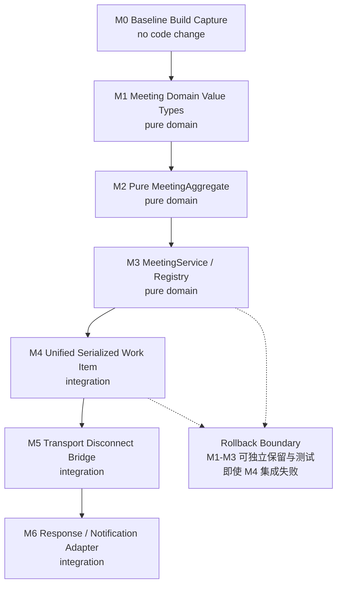
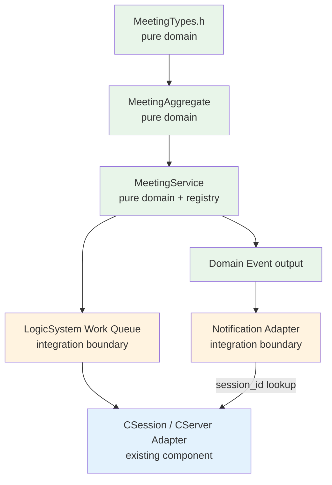

# Phase 1 - Step 1.6：首轮编码切分、目录落点与测试策略

## 1. 文档目的

本文回答一个问题：

> Phase 1 已经把 Meeting 的业务、数据、状态、API、时序设计清楚了，那么真正开始写 C++ 时，第一刀切在哪里、第二刀切在哪里，每刀允许改什么、怎么编译、怎么测试、失败时怎么回滚？

本文是**编码计划与测试策略**，不是编码 Step。本文不含任何 `.h`、`.cpp` 或工程文件改动，也不代表 Meeting 已实现。

本文完成后，Phase 1 的设计阶段才算正式结束。**但 Phase 1 完成不等于自动跳过项目总路线中的 Phase 2 / Phase 3 / Phase 4**——是否立即执行某个 Meeting Coding Task，由设计指挥官根据总体路线决定。

## 2. 输入文档与冻结边界

| 来源 | 本文依赖的冻结内容 |
| --- | --- |
| Step 1.1 | 六项操作范围、角色、幂等语义、错误语义名称 |
| Step 1.2 | `(meeting_id, user_id)` 唯一逻辑成员、Binding 模型、Snapshot 字段与历史身份用途 |
| Step 1.3 | 四类状态机、竞态裁决矩阵、不变量 I1–I12、Single-Writer、`ENDING`/`CLOSED` 语义 |
| Step 1.4 | 15 个 ResultCode、`MeetingRequestContext`、JoinOutcome、Close 两 work item、Event Contract |
| Step 1.5 | 14 类核心时序、Thread & Serialization View、Snapshot 发布路径、Design Consistency Resolution |
| Step 1.5 §27 | **18 项编码输入问题**（本文第 27 节逐项回应） |

本文不修改上述任何文档。

## 3. 当前代码事实核对（只读核实）

本节记录**已经过只读核实**的当前事实，不写目标设计。凡本文后续结论依赖的事实，均在此列出。

### 3.1 LogicSystem

文件：`Server/ChatServer/ChatServer/LogicSystem.h`

| 事实 | 内容 |
| --- | --- |
| 队列类型 | `std::queue<std::shared_ptr<LogicNode>> _msg_que` |
| 消费者 | 单个 `std::thread _worker_thread` 执行 `DealMsg()` |
| 同步原语 | `std::mutex _mutex` + `std::condition_variable _consume` + `bool _b_stop` |
| 分发方式 | `std::map<short, FunCallBack> _fun_callbacks`，按 `short` 消息 ID 查表 |
| 入队方法 | `PostMsgToQue(std::shared_ptr<LogicNode>)` |
| 已注册回调 | `MSG_CHAT_LOGIN`、`ID_SEARCH_USER_REQ`、`ID_ADD_FRIEND_REQ`、`ID_AUTH_FRIEND_REQ`、`ID_TEXT_CHAT_MSG_REQ` |
| 生命周期 | `LogicSystem` 是 `Singleton<LogicSystem>` |

**队列元素表达能力**（`LogicSystem.h` 尾部的 `LogicNode`）：

```text
LogicNode
  → std::shared_ptr<CSession> _session
  → std::shared_ptr<RecvNode>  _recvnode
```

结论：当前队列元素只表达"某条连接上收到的一条完整消息"，**不是**通用 Domain Work Queue，也无法表达"没有 CSession 的内部工作项"。

### 3.2 CSession

文件：`Server/ChatServer/ChatServer/CSession.h` / `.cpp`

| 事实 | 内容 |
| --- | --- |
| 标识 | `std::string _session_id`，构造时用 `boost::uuids::random_generator()` 生成 |
| 用户 | `int _user_uid`（**构造函数未初始化该成员**，仅由 `SetUserId` 赋值） |
| 关闭标记 | `bool _b_close`，无连接状态枚举 |
| 发送队列 | `std::queue<std::shared_ptr<SendNode>> _send_que` + `std::mutex _send_lock` |
| 公开方法 | `GetSocket`、`GetSessionId`、`SetUserId`、`GetUserId`、`Start`、`Send`（两个重载）、`Close`、`SharedSelf`、`AsyncReadBody`、`AsyncReadHead` |
| 生命周期 | 继承 `std::enable_shared_from_this<CSession>`；异步回调通过 `SharedSelf()` 延长生命周期 |
| 断线路径 | `AsyncReadHead` / `AsyncReadBody` 在错误或长度非法时调用 `Close()` 与 `_server->ClearSession(_session_id)` |

结论：`CSession` 已提供 `GetSessionId()` / `GetUserId()` 供只读使用，Meeting Domain 后续可以据此获得稳定 ID，**但不能因此持有 `shared_ptr<CSession>`**。

### 3.3 CServer

文件：`Server/ChatServer/ChatServer/CServer.h` / `.cpp`

| 事实 | 内容 |
| --- | --- |
| 连接表 | `std::map<std::string, std::shared_ptr<CSession>> _sessions`，键为 `session_id` |
| 保护 | `std::mutex _mutex`（仅在 `HandleAccept` 插入与 `ClearSession` 擦除时加锁） |
| 清理方法 | `void ClearSession(std::string session_id)` |
| `ClearSession` 行为 | ① `_sessions.find(session_id)`（**未持锁**）② 取该 Session 的 uid ③ **无条件**调用 `UserMgr::RmvUserSession(uid)` ④ 在 `_mutex` 下 `_sessions.erase(session_id)` |
| 是否提供查找 | **否**，没有 `FindSession` 之类的查询接口 |

结论：`_sessions` 是"按 `session_id` 查找活动 Session"的**唯一现成结构**，未来通知查找应优先考虑复用它（见第 15 节），而不是依赖 `UserMgr`。

### 3.4 UserMgr

文件：`Server/ChatServer/ChatServer/UserMgr.h` / `.cpp`

| 事实 | 内容 |
| --- | --- |
| 映射 | `std::unordered_map<int, std::shared_ptr<CSession>> _uid_to_session` |
| 基数 | **一个 `user_id` 对应一个 `Session`** |
| 写入 | `SetUserSession(uid, session)` 直接 `_uid_to_session[uid] = session`（覆盖写） |
| 写入 | `RmvUserSession(uid)` 直接 `erase(uid)`，**不校验被删 Session 是否仍是该 uid 的当前映射** |
| 保护 | `std::mutex _session_mtx` |

结论：`UserMgr` 与 Step 1.2 的多 Device/Session 目标模型**结构上不相容**，不能作为 Meeting Binding 的底座。

### 3.5 构建与工程文件

| 事实 | 内容 |
| --- | --- |
| 权威入口 | `Server/ChatServer/ChatServer.sln`（Solution File Format Version 12.00，`# Visual Studio Version 17`，`VisualStudioVersion = 17.14.36603.0`） |
| 项目数 | solution 中**只有一个** project：`ChatServer\ChatServer.vcxproj` |
| solution 配置 | `Debug\|x64`、`Debug\|x86`、`Release\|x64`、`Release\|x86`（其中 `x86` 映射到项目的 `Win32`） |
| 项目配置 | `Debug\|Win32`、`Release\|Win32`、`Debug\|x64`、`Release\|x64` |
| 工具集 | `PlatformToolset = v143` |
| `VCProjectVersion` | `17.0` |
| 语言标准 | **未设置 `LanguageStandard` / `/std:`**（vcxproj 与 `PropertySheet.props` 均无该项） |
| 源文件清单 | 显式列在 `ChatServer.vcxproj` 的 `ClCompile` / `ClInclude` 项中 |
| 过滤器 | `ChatServer.vcxproj.filters` 含三个 Filter：`源文件`、`头文件`、`资源文件` |
| PostBuild | `xcopy config.ini` 与 `xcopy *.dll` 到 `$(SolutionDir)$(Platform)\$(Configuration)\` |

**`PropertySheet.props` 导入范围（关键事实）**：

| 项目配置 | 是否 `Import PropertySheet.props` |
| --- | --- |
| `Debug\|Win32` | **否** |
| `Release\|Win32` | **否** |
| `Debug\|x64` | **是** |
| `Release\|x64` | **否** |

即包含 boost / MySQL / hiredis / json / gRPC 全部 include 与 library 路径的 `PropertySheet.props`，**只在 `Debug|x64` 生效**。因此 `Release|x64` 与两个 `Win32` 配置缺少这些依赖路径，**其可构建性未被证明**。

**`PropertySheet.props` 中的机器绝对路径**（实测存在性见 3.6）：

```text
F:\cppsoft\mysql_connector\include
F:\cppsoft\reids\deps\hiredis
F:\cppsoft\libjson\include
F:\minGw\boost_1_89_0
F:\cppsoft\grpc\include
F:\cppsoft\grpc\third_party\...
```

### 3.6 本机环境实测

| 项目 | 结果 |
| --- | --- |
| Visual Studio | `Visual Studio Community 2022`，版本 `17.14.36603.0`（由 `vswhere.exe -latest` 读取） |
| `msbuild` 是否在 PATH | **否**（需要用完整路径或 Developer Command Prompt） |
| `F:\cppsoft\mysql_connector\include` | 存在 |
| `F:\cppsoft\reids\deps\hiredis` | 存在 |
| `F:\cppsoft\libjson\include` | 存在 |
| `F:\minGw\boost_1_89_0` | 存在 |
| `F:\cppsoft\grpc\include` | 存在 |
| 既有编译产物 | `Server/ChatServer/x64/Debug/` 下存在 `ChatServer.exe`（19106 KB，`2025-11-28 16:54:36`）、`ChatServer.pdb`、`config.ini`、`mysqlcppconn-9-vs14.dll`、`mysqlcppconn8-2-vs14.dll` |

**重要说明**：

- 既有产物**只能说明历史上曾在某台机器上成功构建过 `Debug|x64`**，不能推断该状态当前仍然成立；
- **本次 Step 未执行任何构建**，因此本文中所有构建结论的状态一律为 `not verified in this Step`；
- 不得据此声称"构建已验证"。

### 3.7 仓库中不存在的设施（经检索确认）

| 设施 | 状态 |
| --- | --- |
| `CMakeLists.txt` / `*.cmake` | **不存在** |
| `Makefile` / `conanfile.txt` / `vcpkg.json` | **不存在** |
| `test/` / `tests/` / `gtest/` / `googletest/` 目录 | **不存在** |
| 任何 C++ 单元测试工程 | **不存在** |
| `meeting/` 目录 | **不存在** |
| Meeting 相关类型、消息 ID、协议 | **不存在** |

### 3.8 ChatServer2 与 ChatServer 的关系

| 检查项 | 结果 |
| --- | --- |
| 两侧文件数 | 各 **41** 个 |
| `LogicSystem.h` | 逐行比较 **完全一致** |
| `UserMgr.h` | 逐行比较 **完全一致** |
| `CSession.h` | 逐行比较 **完全一致** |

结论：`ChatServer2` 是 `ChatServer` 的**人工复制工程**（源码同源、文件一一对应）。这构成长期重复维护风险，处理方式见第 22 节。

## 4. 设计问题理解

### 4.1 为什么必须 Domain-first

Meeting 的全部实质复杂度都在领域层：状态机、成员唯一性、幂等、竞态裁决、快照原子性。这些规则与 ChatServer 现有网络栈的耦合极浅——它们只需要稳定 ID 和一个串行化入口。

若先接网络再写领域，任何状态错误都会被 TCP 帧、Session 生命周期、发送队列、线程切换等因素混合成难以复现的现象；反之若先做纯领域，M2/M3 阶段就能用零依赖的单元测试把全部业务规则锁死，之后接网络时若出问题，可以立即判定"领域是对的、问题在适配层"。

### 4.2 为什么 `MeetingService` 不应依赖 `CSession`

`CSession` 由 `AsioIOServicePool` 的 `io_context` 线程驱动，其生命周期由 `enable_shared_from_this` 与异步回调共同决定（`LogicNode` 也会延长它）。领域对象若持有它，就同时继承了"当前在哪个线程执行"与"对象何时析构"两个与业务无关的问题，并容易形成 `CSession ↔ Participant` 循环引用。

领域层只应认识 `session_id` / `user_id` 这类稳定值；"把 ID 变成可发送的连接"属于适配层职责。

### 4.3 为什么 Internal Work 不能伪装 TCP message

`LogicSystem::_fun_callbacks` 是按 `short` 消息 ID 查表分发的，而这些 ID 是**客户端协议的一部分**。若为 `SessionDisconnected` / `FinalizeClose` 编造假 `msg_id` 再包装成 `LogicNode`：

1. 内部调度与 wire protocol 被绑死，Phase 3 设计 Protocol V2 时无法区分协议号与内部标记；
2. `FinalizeClose` 没有客户端请求，也没有客户端 Response，造一个假请求只是让类型通过编译；
3. 假 ID 会占用协议号空间，可能与应用层 ID 冲突。

正确做法是让统一 work item 显式区分 `EXTERNAL_MESSAGE` 与内部种类（见第 12 节）。

### 4.4 为什么三类 mutation 必须共用一个 FIFO

Step 1.3 §21.3 与 Step 1.5 §18/§19 冻结的全部竞态裁决——Join vs Close、Leave vs Disconnect、重复 Close、BeginClose 与 FinalizeClose 的先后——都建立在同一条前提上：

> **按进入串行化队列的顺序裁决。**

若三类操作进入不同队列并由不同消费者处理，它们之间的先后重新变成调度竞争，"顺序即裁决"立即失效，且这些竞态变得不可测试。串行化的价值来自**单一顺序**，不是"每类操作各自有序"。

### 4.5 为什么 `SessionDisconnected` 必须在 `ClearSession` 前捕获稳定 context

`CServer::ClearSession` 的行为是：查表取 uid → 调 `UserMgr::RmvUserSession(uid)` → `_sessions.erase(session_id)`。一旦执行完成：

- `_sessions` 中不再有该 `session_id`；
- `UserMgr` 中该 uid 的映射已被删除。

若领域清理在其之后才尝试定位"这个 Session 参与了哪些 Meeting"，就可能失去定位依据。因此网络侧必须先**只读地**捕获稳定上下文（`session_id` / `user_id` / `server_id` / reason），再入队。这与 Step 1.3 §3.3 的 transport/domain 分层一致：网络线程只改 transport 事实，领域状态由串行化入口修改。

### 4.6 为什么 `UserMgr` 不能作为 Meeting 多 Session 模型基础

`UserMgr` 是 `user_id → 一个 Session`，且 `SetUserSession` 是覆盖写。而 Step 1.2 的目标模型是"一个用户多个 Device/Session，同一 Meeting 内只算一个 Participant"。

若 Meeting Binding 建在 `UserMgr` 上：用户开第二台设备登录会覆盖第一条映射，第一条会话的会议关系随即失去归属；此外 `RmvUserSession` 不校验归属，旧 Session 的迟到清理可能误删新 Session 的映射。这两个行为都与多 Session 语义直接冲突。

因此 Meeting 必须使用独立的 `(meeting_id, user_id, session_id)` Binding 与独立索引。

### 4.7 为什么测试要分四层

不同层次的失败意味着不同性质的缺陷：

| 层 | 失败含义 | 依赖成本 |
| --- | --- | --- |
| Layer A 纯领域 | 业务规则写错 | 无外部依赖 |
| Layer B 顺序 | 串行化边界坏了 | 无外部依赖 |
| Layer C 集成 | 适配层、生命周期、线程边界问题 | 需要 ChatServer 组件 |
| Layer D E2E | 协议或网络问题 | 需要真实客户端与协议 |

若不分层，一个断言失败的成因可能在四处之间，排查成本与不确定性显著上升。Layer A/B 不需要任何外部依赖，可以在 M2/M3 就全部跑通，是性价比最高的回归网；Layer D 依赖尚不存在的 Protocol V2，必须显式延期。

### 4.8 为什么当前不能声称 portable build

`PropertySheet.props` 内的 include/library 路径是 `F:\cppsoft\...`、`F:\minGw\boost_1_89_0` 这类机器绝对路径。更关键的是经核实该 props **只在 `Debug|x64` 被导入**：`Release|x64` 与两个 `Win32` 配置完全没有这些依赖路径。

因此以下说法都**不是已证明事实**：

```text
四种配置都能构建
clone 到任意机器即可编译
存在可移植构建
可以使用 cmake / ctest
```

仓库中也不存在 `CMakeLists.txt`。这些属于待解决的工程基础设施债（见第 31 节），不得写成现状。

### 4.9 为什么 Step 1.6 完成仍不等于 Meeting 已实现

本文的产物是一份**计划与策略**：任务卡、允许/禁止范围、测试矩阵、风险清单。它描述"将来怎么做"，不含任何实现。

当前仓库中仍然：不存在 `meeting/` 目录、不存在 `MeetingAggregate` / `MeetingService`、不存在 Meeting 命令与事件类型、不存在 Meeting 协议。文档完成只意味着"可以开始按计划编码"，不意味着"会议功能可以运行"。

## 5. 代码落点规划

### 5.1 目标目录

Meeting Core 首轮代码集中放在：

```text
Server/ChatServer/ChatServer/meeting/
```

不要再把十几个 Meeting 类型继续堆在 `ChatServer/` 根目录，也不要过度拆分。

### 5.2 首轮文件清单（最多五个）

| 文件 | 职责 |
| --- | --- |
| `meeting/MeetingTypes.h` | 全部值类型、枚举、ResultCode、view/context/event/snapshot 值类型 |
| `meeting/MeetingAggregate.h` | 单个 Meeting 聚合的接口 |
| `meeting/MeetingAggregate.cpp` | 单个 Meeting 聚合的实现 |
| `meeting/MeetingService.h` | 注册表、API 应用服务、fan-out、FinalizeClose 的接口 |
| `meeting/MeetingService.cpp` | 上述实现 |

名称为规划建议，实现时可按仓库风格做**极小**调整，但必须保持职责等价。

### 5.3 首轮明确不创建的抽象层

```text
repository/
dao/
controller/
factory/
mediator/
event_bus/
distributed/
persistence/
```

这些抽象在第一版没有真实复杂度支撑，提前引入只会增加间接层与维护面。

## 6. 依赖与所有权裁决

### 6.1 依赖方向

```text
MeetingTypes        → 仅标准库
MeetingAggregate    → MeetingTypes
MeetingService      → MeetingTypes + MeetingAggregate
LogicSystem         → MeetingService（集成阶段）
CSession / CServer  → 不依赖 Meeting
```

**禁止反向依赖**。特别是 Meeting 领域不得包含 `CSession.h`、`RedisMgr.h`、`MysqlMgr.h`、`ChatGrpcClient.h`。

### 6.2 `MeetingAggregate` 的职责边界

只负责**单个** Meeting 内部的一致性：

```text
Meeting state
Host identity
Participant collection
Binding collection
historical Participant identity（用于 Snapshot）
Join
Leave
BeginClose
FinalizeClose 所需 snapshot material
query projection
```

**明确不得**：

| 禁止 | 原因 |
| --- | --- |
| 调 Redis | 破坏纯领域可测试性 |
| 调 MySQL | 同上 |
| 调 gRPC | 同上 |
| `Send` TCP | 网络是副作用，不属于聚合 |
| 找 `CSession` | 依赖网络对象 |
| 管理多个 Meeting | 属于 `MeetingService` |
| 拥有 `LogicSystem` | 反向依赖 |
| 自己创建线程 | 并发模型由串行化边界统一决定 |

### 6.3 Ownership 规则

Meeting 对 Participant / Binding 一律使用：

```text
ID
value object
STL container
```

**禁止**：

```text
Meeting      → shared_ptr<CSession>
Participant  → shared_ptr<CSession>
CSession     → shared_ptr<Participant>
```

不得形成网络对象与领域对象之间的所有权耦合或循环引用。

### 6.4 `MeetingService` 不应是 Singleton

第一版引入一个**普通可实例化对象** `MeetingService`，不做新的全局 Singleton。

理由：

1. 更容易单元测试（每个用例可独立构造与销毁）；
2. 生命周期由现有 ChatServer / LogicSystem 明确拥有，而非隐式全局；
3. 避免继续扩大 Singleton 依赖面（`LogicSystem`、`UserMgr`、`RedisMgr`、`ConfigMgr`、`MysqlMgr`、`ChatGrpcClient` 已经是 Singleton）；
4. 将来拆分为独立服务时更容易抽离。

推荐目标 ownership：

```text
LogicSystem
    owns
MeetingService
```

具体用 `std::unique_ptr` 还是直接成员，由后续编码 Step 决定。

**Meeting Domain 本身不得调用 `LogicSystem::GetInstance()`。**

### 6.5 `MeetingService` 最小职责

```text
active meeting registry
closed snapshot registry
session → affected meeting/binding reverse index
Meeting API application service
SessionDisconnected fan-out
FinalizeClose domain operation
local domain event collection / output
```

第一轮**不要**拆出：

```text
MeetingRegistry class
ClosedSnapshotRepository class
BindingRepository class
EventRepository class
```

除非实现过程中出现真实复杂度。优先保持**一个**可测试的 `MeetingService`。

## 7. C++ 语言约束

### 7.1 当前事实

`ChatServer.vcxproj` 与 `PropertySheet.props` **均未设置 `LanguageStandard`**，即没有 `/std:c++11`、`/std:c++14`、`/std:c++17` 等显式声明。因此生效标准由工具集（`v143`）默认值决定，而非由项目显式承诺。

本文不修改该设置，但为**降低风险**，规划代码时统一遵守下列约束。

### 7.2 明确禁止使用的 C++17 能力

```text
std::optional
std::variant
std::string_view
structured bindings（auto [a, b] = ...）
if constexpr
std::filesystem
inline variables
```

### 7.3 需要 optional 语义时的候选方案

Step 1.5 §1 的 `closed_at`、`left_at` 等字段需要"可能为空"的语义。候选方案：

| 方案 | 说明 | 备注 |
| --- | --- | --- |
| A. `boost::optional` | 项目已依赖 Boost（`F:\minGw\boost_1_89_0`） | 需要在 MeetingTypes 中引入 Boost 头，领域会多一个外部依赖 |
| B. 显式 presence flag + 值字段 | 例如 `bool has_closed_at; Timestamp closed_at;` | 零新依赖，但对不变量表达较弱 |
| C. 空值哨兵 | 例如用空字符串/0 表示"未设置" | 最弱，容易与真实值混淆 |

**本文不实现**，只列出候选。具体选择由 M1 的 Coding Prompt 决定，并须说明为何不破坏"CLOSED 时必须有 `closed_at`"这类不变量。

### 7.4 其他语言约束

| 约束 | 原因 |
| --- | --- |
| 不使用 C++20 的 `std::span`、concepts、ranges | 工具集与标准未承诺 |
| 容器优先 `std::unordered_map` / `std::vector` / `std::map` | 与现有代码风格一致 |
| 字符串统一 `std::string` | 与 `CSession::_session_id` 一致 |

## 8. ID 内部表示

Step 1.2 / 1.4 未冻结任何 wire encoding。以下建议**仅为 C++ 内部表示与生成策略**：

| 逻辑类型 | 内部表示建议 | 依据 |
| --- | --- | --- |
| `UserId` | 复用现有 `int uid` | `CSession::_user_uid`、`UserMgr` 均为 `int` |
| `SessionId` | `std::string` | `CSession::_session_id` 已是 Boost UUID 字符串 |
| `MeetingId` | `std::string` | 与 SessionId 表示一致，便于日志 |
| `ServerId` | `std::string` | 现有 `[SelfServer] Name`，例如 `chatserver1` |
| `EventId` | `std::string` | 与上述一致 |
| `Timestamp` | 待 M1 决定（候选：`std::chrono` 或现有时间工具） | 当前源码未见统一时间类型 |

`meeting_id` 推荐复用项目**已存在的 Boost UUID 能力**生成（`CSession` 构造已在用 `boost::uuids::random_generator`）。

**必须声明**：

> 上述是 C++ 内部表示与生成策略，**不是** Protocol V2 的 wire format 保证。本文不规定未来协议必须如何编码 UUID，也不承诺 UUID 会以文本形式出现在报文里。

## 9. `MeetingTypes` 最小职责

`meeting/MeetingTypes.h` 规划容纳：

| 类别 | 内容 |
| --- | --- |
| ID aliases | `UserId`、`SessionId`、`MeetingId`、`ServerId`、`EventId` |
| Meeting 状态 | `MeetingState`：`CREATED` / `ACTIVE` / `ENDING` / `CLOSED` |
| Participant 状态 | `ParticipantState`：`ACTIVE` / `LEFT` |
| 角色 | `ParticipantRole`：`HOST` / `PARTICIPANT` |
| Binding 状态 | `BindingState`：`BOUND` / `UNBOUND` |
| Domain Session 状态 | `DomainSessionState`：`CONNECTED` / `AUTHENTICATED` / `CLOSING` / `CLOSED` |
| 结果 | `ResultCode`、`ResultDisposition`（`SUCCESS` / `IDEMPOTENT` / `ERROR`） |
| Outcome | `JoinOutcome`、`LeaveOutcome`、`CloseOutcome` |
| 调用上下文 | `MeetingRequestContext` |
| 视图 | `MeetingView`、`ParticipantView` |
| 事件 | Event value types（`MeetingCreated` / `ParticipantJoined` / `ParticipantLeft` / `MeetingClosed`） |
| 快照 | `ClosedMeetingSnapshot` 必需值类型 |

### 9.1 ResultCode 必须严格复用 Step 1.4 已冻结的 15 个值

| 数值 | 名称 |
| --- | --- |
| `0` | `OK` |
| `100` | `ALREADY_JOINED` |
| `101` | `ALREADY_LEFT` |
| `102` | `CLOSE_IN_PROGRESS` |
| `103` | `ALREADY_CLOSED` |
| `1000` | `AUTH_REQUIRED` |
| `1001` | `SESSION_STATE_REJECTED` |
| `1002` | `INVALID_ARGUMENT` |
| `1100` | `PERMISSION_DENIED` |
| `1101` | `NOT_PARTICIPANT` |
| `1102` | `HOST_MUST_CLOSE_MEETING` |
| `1200` | `MEETING_NOT_FOUND` |
| `1201` | `MEETING_NOT_LOCAL` |
| `1202` | `MEETING_STATE_REJECTED` |
| `9000` | `INTERNAL_ERROR` |

**不得重新编号，不得新增。** 若确需新增，必须单独走设计变更流程。

## 10. `MeetingAggregate`

### 10.1 规划能力

```text
Create initial aggregate（Host Participant + Host Binding + count = 1）
Join（Case A：首次逻辑加入 / Case B：重复 / Case C：第二个 Session）
Re-Join（LEFT → ACTIVE）
Leave（User 级，解除该 user 全部 Binding）
BeginClose
FinalizeClose 所需的 snapshot material
query projection（MeetingView / ParticipantView）
```

### 10.2 必须保持的不变量

引自 Step 1.3 §23.1，实现时必须同时成立：

| # | 不变量 |
| --- | --- |
| I1 | `Meeting == CLOSED` ⇒ 不存在有效会议 Binding |
| I2 | `Participant == LEFT` ⇒ 不属于活动成员集合 |
| I3 | `Participant == ACTIVE && PARTICIPANT` ⇒ 领域稳定状态下至少一个有效会议 Session |
| I4 | `Participant == ACTIVE && HOST` ⇒ 允许 0 个有效会议 Session |
| I5 | Binding 有效 ⇒ Session 为 `AUTHENTICATED` 且非 `CLOSING`/`CLOSED` |
| I6 | `Meeting == ENDING/CLOSED` ⇒ 不创建新逻辑 Participant |
| I7 | 同一 Meeting 内同一 `user_id` 最多一个 Participant |
| I8 | 同一 Participant 内同一 `session_id` 最多一个有效 Binding |
| I9 | `Meeting == CLOSED` ⇒ 存在完整 `ClosedMeetingSnapshot` |
| I10 | `participant_count` 等于活动成员集合基数 |
| I11 | 非 Host Participant 只在真实 activation 时变 `ACTIVE` |
| I12 | `is_active(p)` 恒等于 `participant_state(p) == ACTIVE` |

### 10.3 历史身份保留

Step 1.3 §9.6 冻结："Meeting Close 不产生逐成员 `LEFT`"。因此需要保留**历史 Participant 身份**用于组装 `ClosedMeetingSnapshot`。

具体用 history vector / tombstone map / archive 中的哪一种，留给 M2 决定；本文只要求"生成 Snapshot 所需的最小历史身份信息在聚合生命周期内必须可用"。

## 11. `MeetingService`

### 11.1 组成

| 组成 | 作用 |
| --- | --- |
| active meeting registry | `meeting_id → MeetingAggregate` |
| closed snapshot registry | `meeting_id → ClosedMeetingSnapshot` |
| session → binding reverse index | 支持 `SessionDisconnected` 的 fan-out |
| API application service | 六项 API 的求值顺序（Step 1.4 §19.1 八步） |
| `SessionDisconnected` fan-out | 多 Meeting 独立裁决 |
| `FinalizeClose` domain operation | 独立串行化操作 |
| local event collection / output | 领域事件的产生与收集 |

### 11.2 Reverse index 的必要性

Step 1.3 §13.2 要求 `SessionDisconnected(session_id)` 能枚举"该 Session 当前关联的全部 BOUND Meeting Binding"。这要求一个形如

```text
session_id → [ (meeting_id, user_id) ... ]
```

的反向索引能力。

**具体容器与维护方式留给 M3**；本文只要求该能力存在且语义正确。注意该索引与 `UserMgr` 无关。

### 11.3 六项 API 的求值顺序

实现必须遵循 Step 1.4 §19.1 的八步：

```text
1. Validate Request Context
2. Validate Domain Session usability
3. Validate API Arguments
4. Resolve local Meeting / ClosedSnapshot / locality
5. Perform resource-scoped authorization
6. Evaluate state and idempotency
7. Apply mutation
8. Produce response / event
```

两条不得违反的规则：

1. **参数校验先于资源 lookup**（缺失/非法 `meeting_id` → `INVALID_ARGUMENT`，不得表现为 `MEETING_NOT_FOUND`）；
2. **权限先于状态/幂等暴露**（非 Host + `CLOSED` + Close → `PERMISSION_DENIED`）。

## 12. 统一 FIFO 串行化

### 12.1 强制约束

Step 1.3 §20 与 Step 1.5 §22 冻结：Client command、`SessionDisconnected`、`FinalizeClose` 必须共享**同一个**逻辑串行化顺序。

**禁止**：

```text
external commands queue A
SessionDisconnected queue B
FinalizeClose queue C
```

也禁止"给 internal work 编造 TCP `msg_id` 再包装成假 `LogicNode`"（见 4.3）。

### 12.2 统一 Work Item 概念

规划一个概念 `LogicWorkItem`（或等价名称），逻辑上至少能表达：

```text
EXTERNAL_MESSAGE
SESSION_DISCONNECTED
FINALIZE_CLOSE
```

本文不写 C++，只在三种实现方案中选择推荐方向。

### 12.3 方案比较

| 方案 | 描述 | 优点 | 缺点 |
| --- | --- | --- | --- |
| **A. enum + typed payload/value fields** | 一个 struct 含 `kind` 枚举，以及各 kind 所需的稳定 ID/value 字段 | C++11 可直接实现；调试时 `kind` 可见；队列顺序可测试；internal payload 只存 ID | struct 会有若干未使用字段 |
| B. polymorphic work item base class | `LogicWorkItem` 基类 + 各 kind 派生 | 类型安全，无冗余字段 | 需要 `shared_ptr` 多态与虚函数；调试时需 RTTI/手动转换 |
| C. `std::function<void()>` task queue | 队列元素是闭包 | 实现最短 | 逻辑隐藏在 lambda capture 中，难以断言"队列里到底排了什么"；难以验证顺序与去重 |

### 12.4 推荐：方案 A

推荐**一个轻量、显式 `kind` 的统一 `LogicWorkItem`，由一个 FIFO queue 消费**。

理由：

1. C++11 可直接实现，无需 `std::variant`；
2. 调试时可以看到 work kind，便于定位"为什么这个请求排在那个后面"；
3. 容易测试队列顺序（Layer B 的核心）；
4. 不把所有逻辑隐藏在 lambda capture 里；
5. internal payload 可以只保存稳定 ID/value，不需要持有 `CSession`；
6. External legacy message 可以继续短暂持有 `CSession`，保持与现有 `LogicNode` 的兼容；
7. 能保留当前单 worker 模型，不需要大规模重写 `LogicSystem`，可逐步迁移。

**具体字段留给后续 Coding Prompt（M4）**。

### 12.5 迁移要求

| 要求 | 说明 |
| --- | --- |
| 一个 FIFO | 只有一条队列、一个消费者决定 Meeting mutation 顺序 |
| Internal Work 不要求持有 `CSession` | `SESSION_DISCONNECTED` / `FINALIZE_CLOSE` 只需稳定 ID |
| External legacy message 可继续持有 `CSession` | 兼容现有 `LogicNode` 路径 |
| 不做大规模 `LogicSystem` 重写 | 只增加内部 kind 与分发分支 |
| 可逐步迁移 | 旧消息路径先保持可用，Meeting 路径按 kind 新增 |

## 13. Disconnect 集成边界

### 13.1 目标路径

```text
transport disconnect（Asio / CSession）
        ↓
capture stable context
session_id / user_id / server_id / reason
        ↓
enqueue SESSION_DISCONNECTED work item
        ↓
（随后）现有网络侧 Session 清理
```

### 13.2 `ClearSession` 与 `SessionDisconnected` 的顺序分析

当前 `CServer::ClearSession(session_id)` 行为（见 3.3）：查表取 uid → `UserMgr::RmvUserSession(uid)` → `_sessions.erase(session_id)`。

M5 必须明确以下顺序约束：

| 约束 | 说明 |
| --- | --- |
| **先捕获，后清理** | 稳定上下文必须在 `ClearSession` 生效前取出 |
| 领域处理不依赖网络对象存活 | 领域只使用捕获到的稳定 ID |
| 重复断线 | 同一 `session_id` 可能触发多次清理路径，必须幂等 |
| Session 已被移除 | 若捕获时 `_sessions` 中已无该 ID，需要确定的降级行为 |

**目标要求**：领域处理获得所需稳定 ID，而**不是**依赖

```text
MeetingService → CSession pointer survives forever
```

### 13.3 已知的现有行为风险

| 风险 | 现状 | 处理 |
| --- | --- | --- |
| `_user_uid` 未初始化 | `CSession` 构造函数不初始化 `_user_uid` | 未认证连接断线时 uid 不确定；M5 需要在捕获上下文时判定"是否已认证" |
| `ClearSession` 的 `find` 未持锁 | 仅 `erase` 持 `_mutex` | 属于既有并发隐患；本文只记录，不在 M5 顺手重写 |
| `ClearSession` 无条件按 uid 删除 | `RmvUserSession` 不校验归属 | 旧 Session 迟到清理可能误删新映射；Meeting 不依赖该映射（见第 14 节） |

## 14. `UserMgr` 的边界

### 14.1 明确结论

`UserMgr` 是 `user_id → 一个 Session`（见 3.4），**不符合** Step 1.2 的多 Session 目标模型。因此：

> **Meeting Binding 绝不能建立在 `UserMgr` 的映射之上。**

### 14.2 第一轮处理方式

| 项 | 决策 |
| --- | --- |
| `UserMgr` 当前服务对象 | 继续服务旧 IM 链路（好友、聊天、跨节点转发） |
| Meeting 的 Binding 底座 | 独立的 `(meeting_id, user_id, session_id)` Binding + `MeetingService` 自有索引 |
| 是否重写 `UserMgr` | **第一轮不重写** |
| 系统升级时机 | 后续 Presence / 多 Session 阶段再系统升级 `UserMgr` / `SessionRegistry` |

## 15. 通知查找

### 15.1 职责分离

Meeting Domain 只产生：

```text
session_id
+
notification intent / event
```

真正发送前由 adapter 完成：

```text
session_id
    → active CSession lookup
    → Send(...)
```

### 15.2 复用 `CServer::_sessions`

`CServer::_sessions` 是"按 `session_id` 查找活动 Session"的**唯一现成结构**（见 3.3），因此优先研究复用它，而不是依赖 `UserMgr`。

后续可能需要为 `CServer` 提供一个线程安全的非拥有查找能力，例如：

```text
FindSession(session_id)  →  std::shared_ptr<CSession>（或等价受控 lookup）
```

### 15.3 关键约束

> **`MeetingService` 不应该直接持有 `CServer`。**

通知 lookup 属于 **adapter 层**职责。领域只输出"要通知谁"的意图。

### 15.4 发送失败的处理

| 情形 | 处理 |
| --- | --- |
| Session 不存在 | 跳过（best effort） |
| 发送失败 | 不回滚领域状态 |
| 目标在关闭过程中消失 | 不影响 `ENDING → CLOSED` 收敛 |
| ACK / retry | 当前没有，Phase 1 不设计 |

## 16. Close 的实现切分

Step 1.4 §16.5 已冻结：`CloseMeeting` 与 `FinalizeClose` 是**两个独立的 serialized domain operations**。实现必须体现为两个 work item / queue turn：

```text
Queue turn 1（CloseMeeting command）
  validate → resolve → verify Host → BeginClose（CREATED/ACTIVE → ENDING）
  → freeze CloseContext
  → enqueue exactly one FINALIZE_CLOSE work item
  → response: OK + CLOSE_STARTED + MeetingView(ENDING)

---------------- command boundary ----------------

Queue turn 2（FINALIZE_CLOSE internal work item）
  cleanup remaining Bindings idempotently
  → build complete ClosedMeetingSnapshot
  → set closed_at
  → ENDING → CLOSED
  → atomically publish CLOSED + Snapshot
  → MeetingClosed exactly once
  → schedule notification side effects
  → release active aggregate
```

### 16.1 必须满足的实现约束

| 约束 | 依据 |
| --- | --- |
| 每个 Meeting 从 `CREATED`/`ACTIVE` 首次进入 `ENDING` 时最多安排一个 `FINALIZE_CLOSE` | Step 1.4 §16.5.5 |
| 不得在 queue turn 1 内执行 Finalize 后仍返回 `ENDING` | Step 1.4 §16.5.2 |
| **不得先释放 Participant 再生成 Snapshot** | Step 1.3 §17.3 |
| Snapshot 发布先于活动聚合释放 | Step 1.3 §18.2 |
| 通知失败不回滚 `CLOSED` | Step 1.4 §16.5.6 |
| `FinalizeClose` 不是外部 API，无客户端 Response | Step 1.4 §16.5.6 |

### 16.2 `CloseContext` 最小内容

```text
meeting_id
host_user_id
owner_chat_server_id
originating_request_id
close_started_at 及必要时间戳
历史 Participant 身份
可通知 session_id 集合
```

`originating_request_id` 用于让 `MeetingClosed` 与最初的 Close 建立 correlation，**仍不是幂等键**。

## 17. 测试分层

### 17.1 Layer A：Pure Domain Unit Tests

不启动 TCP、Redis、MySQL、gRPC、Qt，直接测试 `MeetingAggregate` / `MeetingService`。

这是**数量最多、最重要**的一层，必须覆盖全部状态与幂等规则。

### 17.2 Layer B：Serialized Work Ordering Tests

验证统一 FIFO 下的顺序裁决：

```text
Join vs Close
Leave vs Disconnect
Close vs Close
Close response vs FinalizeClose
SessionDisconnected fan-out
```

不需要真实 socket。

### 17.3 Layer C：ChatServer Integration Tests

Meeting Domain 接入 `LogicSystem` / `CSession` / `CServer` 后验证：

- `MeetingRequestContext` 构造；
- `SessionDisconnected` ingress；
- `session_id` 查找；
- `FinalizeClose` 再入队；
- Notification target disappearing。

仍可先不涉及真实客户端 wire format。

### 17.4 Layer D：Transport End-to-End Tests

只有未来正式协议 adapter 落地后才做：

```text
real TCP client → Meeting command → ChatServer → response/event
```

**状态：Deferred until protocol adapter exists.**

不得为了 Phase 1 测试提前发明 TCP message ID。

### 17.5 分层与 Coding Task 的对应

| 层 | 首次可运行于 |
| --- | --- |
| Layer A | M2（`MeetingAggregate`）/ M3（`MeetingService`） |
| Layer B | M4 |
| Layer C | M5 / M6 |
| Layer D | 未来协议 adapter 落地后 |

## 18. 测试框架策略

### 18.1 当前事实

经检索确认（见 3.7）：仓库中**不存在**任何 C++ 测试框架、`test/` 目录或测试工程，也不存在 `CMakeLists.txt` / `ctest` 配置。

### 18.2 本 Step 的决策

Step 1.6 **只冻结测试边界与测试用例，不在本步骤引入新依赖**。

明确不做：

```text
不安装 GoogleTest
不修改 solution（.sln）
不增加 test project
不声称测试框架已存在
不虚构 ctest
```

### 18.3 记录为后续候选

> GoogleTest 是后续 **Phase 2 工程基础设施阶段**的候选方案，因为 Meeting 状态机非常适合表驱动单元测试。

但该结论记录为**候选**，不表示已采用、已下载或已接入。

### 18.4 M1–M6 阶段的测试执行方式

在测试框架落地前，Layer A/B 用例可以通过**最小的独立验证程序**执行（不接入 ChatServer 主工程、不改 `.sln`），具体形式由 M2/M3 的 Coding Prompt 决定。

## 19. 测试用例矩阵

本节共规划 **57 个语义 Test Case**。可以进一步合并为 table-driven suite，但**语义覆盖不得减少**。

### 19.1 Create（7 个）

| # | 用例 |
| --- | --- |
| C1 | authenticated Create → `CREATED` |
| C2 | Host Participant `ACTIVE` |
| C3 | Host Binding `BOUND` |
| C4 | `active_participant_count = 1` |
| C5 | `MeetingCreated` exactly once |
| C6 | **no** `ParticipantJoined` |
| C7 | two same `request_id` Create → different `meeting_id` |

### 19.2 Join（9 个）

| # | 用例 |
| --- | --- |
| J1 | first non-Host → `NEW_PARTICIPANT` |
| J2 | `CREATED → ACTIVE` |
| J3 | duplicate same Session → `ALREADY_JOINED` |
| J4 | second Session → `ADDITIONAL_SESSION_BOUND` |
| J5 | second Session count unchanged |
| J6 | Re-Join `LEFT → ACTIVE` |
| J7 | Re-Join gets new `ParticipantJoined` event（新 `event_id`） |
| J8 | `ENDING` Join rejected |
| J9 | `CLOSED` Join rejected |

### 19.3 Leave（11 个）

| # | 用例 |
| --- | --- |
| L1 | `ACTIVE` Participant Leave → `LEFT` |
| L2 | all bindings for this user unbound |
| L3 | count −1 once |
| L4 | duplicate Leave → `ALREADY_LEFT` |
| L5 | never Participant → `NOT_PARTICIPANT` |
| L6 | Host open Meeting → `HOST_MUST_CLOSE_MEETING` |
| L7 | `ENDING` → `MEETING_STATE_REJECTED` |
| L8 | `CLOSED` historical Host → `ALREADY_LEFT` |
| L9 | `CLOSED` historical Participant → `ALREADY_LEFT` |
| L10 | `CLOSED` never Participant → `NOT_PARTICIPANT` |
| L11 | `CLOSED` paths: no mutation / no event |

### 19.4 Disconnect（8 个）

| # | 用例 |
| --- | --- |
| D1 | one of two Session disconnect → Participant stays `ACTIVE` |
| D2 | last Session disconnect → `LEFT` once |
| D3 | Host last Session disconnect → Host remains `ACTIVE` |
| D4 | Session with zero Meeting bindings closes normally |
| D5 | Session participates in M1/M2/M3 → all affected bindings processed |
| D6 | one Meeting result does not affect another |
| D7 | Session `CLOSED` only after all fan-out cleanup |
| D8 | stale disconnect A after new Session B bound → Participant stays `ACTIVE` |

### 19.5 Close（11 个）

| # | 用例 |
| --- | --- |
| X1 | Host first Close → `ENDING` |
| X2 | `CLOSE_STARTED` response |
| X3 | exactly one `FinalizeClose` scheduled |
| X4 | second Close before Finalize → `CLOSE_IN_PROGRESS` |
| X5 | no second Finalize |
| X6 | Finalize → complete Snapshot |
| X7 | `CLOSED` published before active aggregate release |
| X8 | `MeetingClosed` exactly once |
| X9 | Host Close on `CLOSED` → `ALREADY_CLOSED` |
| X10 | non-Host Close on `ENDING`/`CLOSED` → `PERMISSION_DENIED` |
| X11 | notification failure does not roll back `CLOSED` |

### 19.6 Query（6 个）

| # | 用例 |
| --- | --- |
| Q1 | Query `CREATED`/`ACTIVE` |
| Q2 | Query `ENDING` observes `ENDING` |
| Q3 | Query `CLOSED` reads Snapshot only |
| Q4 | historical Participant authorized on `CLOSED` |
| Q5 | never Participant denied |
| Q6 | snapshot evicted → `MEETING_NOT_FOUND` |

### 19.6.1 Locality / API ordering（5 个）

| # | 用例 |
| --- | --- |
| O1 | invalid `meeting_id` → `INVALID_ARGUMENT` before lookup |
| O2 | trusted remote owner → `MEETING_NOT_LOCAL` |
| O3 | no trusted owner → `MEETING_NOT_FOUND` |
| O4 | client owner hint cannot produce `NOT_LOCAL` |
| O5 | permission evaluated before idempotent Close result |

### 19.7 汇总

| 组 | 数量 |
| --- | --- |
| Create | 7 |
| Join | 9 |
| Leave | 11 |
| Disconnect | 8 |
| Close | 11 |
| Query | 6 |
| Locality / API ordering | 5 |
| **合计** | **57** |

## 20. 构建策略

### 20.1 权威入口

```text
Server/ChatServer/ChatServer.sln
```

基线 GUI 流程：

```text
Visual Studio 2022
  → open ChatServer.sln
  → Debug | x64
  → Build
```

### 20.2 CLI 候选命令

```text
msbuild Server\ChatServer\ChatServer.sln ^
  /m ^
  /t:Build ^
  /p:Configuration=Debug ^
  /p:Platform=x64
```

**必须写清楚**：

> 只有实际在开发机器执行成功后才能标记为 `verified`。

本机 `msbuild` **不在 PATH**（见 3.6），因此该命令要么使用完整路径，要么在 Developer Command Prompt 中执行。本文**未执行**该命令，状态为 `not verified in this Step`。

### 20.3 配置 gate 规则

solution 虽然声明 `Debug|x64`、`Debug|x86`、`Release|x64`、`Release|x86`，但**依赖配置不代表四种组合都已可复现工作**（见 3.5：`PropertySheet.props` 只在 `Debug|x64` 导入）。

因此第一轮 gate 只要求：

```text
Debug | x64
```

其他三种配置记录为：

```text
additional build verification
```

**不得**伪造其成功。

## 21. Visual Studio 工程文件与新增文件 gate

### 21.1 事实

`ChatServer.vcxproj` 通过显式 `ClCompile` / `ClInclude` 项列出源文件（见 3.5）；`ChatServer.vcxproj.filters` 维护三个 Filter（`源文件`、`头文件`、`资源文件`）。

因此新增 `meeting/*.h`、`meeting/*.cpp` **必须**同步工程文件，否则文件不参与编译。

### 21.2 Gate 规则

> 每个 Coding Task 的 Prompt 必须把"**是否允许修改 project files**"明确写入允许范围。

**不得**出现"新增 `.cpp` 后忘记纳入工程"的情况。M1 起即需要修改两个工程文件。

## 22. ChatServer2 的处理

### 22.1 事实

`ChatServer2` 是 `ChatServer` 的人工复制工程（见 3.8）：文件数相同、关键头文件逐行一致。

### 22.2 第一轮决策

| 决策 | 内容 |
| --- | --- |
| 权威实现落点 | **只在 `ChatServer`** |
| 是否同步复制到 `ChatServer2` | **不默认复制** |
| 原因 1 | Phase 1 Meeting 不支持跨 ChatServer 操作，不需要为了"看起来分布式"同时改两个节点 |
| 原因 2 | 人工复制业务逻辑会立即产生双份维护面 |

### 22.3 后续建议

若将来需要双节点部署，应**先解决共享源码/构建结构**（例如提取公共静态库或共享源文件），而不是继续人工复制业务逻辑。该问题记录为 Phase 2 工程基础设施债（见第 31 节）。

## 23. 性能与并发测试的定位

### 23.1 当前优先项

M1–M6 当前优先：

```text
correctness
state consistency
lifetime
ordering
idempotency
```

### 23.2 明确不产出

不得给出：

```text
QPS
latency
concurrency capacity
throughput
```

Benchmark 属于后续 Phase。

### 23.3 并发测试当前要证明什么

由于 MVP 使用 single writer，当前测试**不是**证明多线程同时写 Meeting 很快，而是证明：

> 来自不同线程的 ingress 最终进入统一 serialized ordering 后，状态结果**确定且可重复**。

重点是**顺序正确性**。

## 24. 故障测试规划

Step 1.6 可以规划但**不实现**以下场景：

| 场景 | 期望 |
| --- | --- |
| Session target disappears before notification | 跳过通知，不回滚状态 |
| duplicate disconnect | 幂等，不重复事件 |
| duplicate `FinalizeClose` | 幂等，不重复 `MeetingClosed` |
| stale disconnect after reconnect | 不清掉新 Session 支撑的 Participant |
| invalid internal work item | 可观测，不破坏不变量 |
| missing `ClosedSnapshot` invariant violation | 归入 `INTERNAL_ERROR` |

复杂 Redis / MQ / `kill -9` 故障实验属于后续 Phase。

## 25. Coding Task 任务卡

### 25.0 总览

| Task | 名称 | 类型 |
| --- | --- | --- |
| M0 | Baseline Build Capture | 环境记录 |
| M1 | Meeting Domain Value Types | Domain-first |
| M2 | Pure `MeetingAggregate` | Domain-first |
| M3 | `MeetingService` / In-Memory Registry | Domain-first |
| M4 | Unified Serialized Work Item | ChatServer integration |
| M5 | Transport Disconnect Bridge | ChatServer integration |
| M6 | Response / Notification Adapter | ChatServer integration |

### 25.1 M0：Baseline Build Capture

| 项目 | 内容 |
| --- | --- |
| Goal | 在任何 Meeting 代码修改前，确认原仓库在开发机器上的基线能否编译 |
| Preconditions | 无 |
| Files allowed | **无**（不增加任何业务代码） |
| Files forbidden | 全部源码与工程文件 |
| Domain invariants | 不适用 |
| Build gate | 执行一次 `Debug\|x64` 构建并记录结果 |
| Unit tests | 无 |
| Integration tests | 无 |
| Review focus | 记录是否**如实** |
| Rollback boundary | 无改动即无需回滚 |
| Resume value | 后续任何编译失败可否归因于 Meeting 修改的判据 |
| 必须记录 | VS version、Configuration、Platform、成功/失败；若失败，区分依赖环境问题与源码问题 |

**Gate**：没有基线记录，不得把后续编译失败自动归罪于 Meeting 修改。

### 25.2 M1：Meeting Domain Value Types

| 项目 | 内容 |
| --- | --- |
| Goal | 只增加 `meeting/MeetingTypes.h` |
| Preconditions | M0 基线记录存在 |
| Files allowed | 新增 `meeting/MeetingTypes.h`；修改 `ChatServer.vcxproj`、`ChatServer.vcxproj.filters`（纳入新文件） |
| Files forbidden | `LogicSystem.*`、`CSession.*`、`CServer.*`、`UserMgr.*`、`RedisMgr.*`、`MysqlMgr.*`、`ChatGrpcClient.*`、`message.proto`、`PropertySheet.props` |
| Domain invariants | 类型层面保证枚举完备（四类状态机、四种 outcome、三种 disposition） |
| Build gate | `Debug\|x64` 编译通过 |
| Unit tests | 无（纯类型） |
| Integration tests | 无 |
| Review focus | **ResultCode 与 Step 1.4 完全一致**；不依赖 `CSession`；不依赖 Redis/MySQL/gRPC；不使用 C++17 能力 |
| Rollback boundary | 删除 `meeting/` 目录并移除两个工程文件中的条目 |
| Resume value | 领域契约固化为可编译类型 |
| 明确不增加 | registry、business mutation、`LogicSystem` integration、TCP、Redis/MySQL |

### 25.3 M2：Pure `MeetingAggregate`

| 项目 | 内容 |
| --- | --- |
| Goal | 实现单个 Meeting 聚合的全部内部规则 |
| Preconditions | M1 完成 |
| Files allowed | 新增 `meeting/MeetingAggregate.h` / `.cpp`；修改两个工程文件 |
| Files forbidden | `LogicSystem.*`、`CSession.*`、`CServer.*`、`meeting/MeetingService.*`、Redis/MySQL/gRPC 相关头文件 |
| Domain invariants | I1–I12 中聚合范围内的全部条目 |
| Build gate | `Debug\|x64` 编译通过 |
| Unit tests | Layer A 的 Create/Join/Leave/Close（聚合内部分）用例 |
| Integration tests | 无 |
| Review focus | 状态/计数/Binding/事件/幂等；不管理 `unordered_map<meeting_id, Meeting>`；不接 `LogicSystem`；不持有 `CSession` |
| Rollback boundary | 删除两个文件与工程文件条目；不影响任何既有功能 |
| Resume value | Meeting 状态机可用 |
| 实现范围 | Create initial aggregate / Join / Re-Join / Duplicate Join / Additional Session Binding / Leave / BeginClose / Snapshot material / query projection |

### 25.4 M3：`MeetingService` / In-Memory Registry

| 项目 | 内容 |
| --- | --- |
| Goal | 实现多 Meeting 管理与 API 应用服务 |
| Preconditions | M2 完成 |
| Files allowed | 新增 `meeting/MeetingService.h` / `.cpp`；修改两个工程文件 |
| Files forbidden | `LogicSystem.*`、`CSession.*`、`CServer.*`、`message.proto` |
| Domain invariants | I1–I12 全量（含跨 Meeting 的索引一致性） |
| Build gate | `Debug\|x64` 编译通过 |
| Unit tests | Layer A 全量；Layer B 中的顺序场景（以直接调用模拟） |
| Integration tests | 无 |
| Review focus | **仍然不接 TCP**；调用测试直接使用 typed command/context；reverse index 语义正确 |
| Rollback boundary | 删除两个文件与工程文件条目 |
| Resume value | 六项 API 语义可验证 |
| 必须验证 | 0/1/N Meeting fan-out；`CLOSED` snapshot；locality；permissions；API ordering；event dedupe |
| 实现范围 | active meetings / closed snapshots / API application service / session → meeting·binding reverse index / `SessionDisconnected` fan-out / `FinalizeClose` direct domain operation |

### 25.5 M4：Unified Serialized Work Item

| 项目 | 内容 |
| --- | --- |
| Goal | 在尽量少改现有 `LogicSystem` 的前提下，实现一个 FIFO work abstraction |
| Preconditions | M3 完成 |
| Files allowed | 修改 `LogicSystem.h` / `LogicSystem.cpp`；新增 work item 相关头文件（落点由该 Task 决定）；修改两个工程文件 |
| Files forbidden | `message.proto`、`CSession.*`（除确有必要的极小改动）、Redis/MySQL 相关 |
| Domain invariants | 所有竞态裁决顺序（Step 1.3 §21.1 的 16 条） |
| Build gate | `Debug\|x64` 编译通过 |
| Unit tests | Layer B：队列顺序用例 |
| Integration tests | 旧 IM 消息兼容性（见 R1 缓解措施） |
| Review focus | **仍然只有一个 worker 决定 Meeting mutation 顺序**；不使用伪 TCP `msg_id`；不建立多个独立业务 queue；C++11 可实现 |
| Rollback boundary | 回退 `LogicSystem.*` 到 M3 后的状态；Meeting core（M1–M3）不受影响 |
| Resume value | 顺序裁决可测试 |
| 必须支持 | legacy external `LogicNode`/message、`SESSION_DISCONNECTED`、`FINALIZE_CLOSE` |
| 必须验证 | `Join → Close`、`Close → Join`、`Leave → Disconnect`、`Disconnect → Leave`、`Close → Close`、`BeginClose → later FinalizeClose` |

### 25.6 M5：Transport Disconnect Bridge

| 项目 | 内容 |
| --- | --- |
| Goal | 把网络断线路径与 `SessionDisconnected` 领域事件接通 |
| Preconditions | M4 完成 |
| Files allowed | 修改 `CSession.h` / `CSession.cpp`（**仅在确有需要时**）、`CServer.h` / `CServer.cpp`；修改两个工程文件 |
| Files forbidden | `message.proto`、`PropertySheet.props`、Redis/MySQL 业务逻辑重写 |
| Domain invariants | I5（有效 Binding 的求值）、I3、I4（Host 断线语义） |
| Build gate | `Debug\|x64` 编译通过 |
| Unit tests | Layer A 的 Disconnect 组（D1–D8） |
| Integration tests | Layer C 部分：断线 ingress |
| Review focus | `CSession` lifetime；`CServer::_sessions`；`ClearSession` 顺序；`UserMgr` 原有清理；duplicate disconnect；session already removed |
| Rollback boundary | 回退 `CSession.*` / `CServer.*` 改动；Meeting core 与 `LogicSystem` work item 不受影响 |
| Resume value | 断线 fan-out 可观测 |
| 实现范围 | 最小修改：disconnect path → capture stable session context → post `SESSION_DISCONNECTED` |
| **明确禁止** | 借机重写全部 Session 架构；网络线程不得直接改 Meeting |

### 25.7 M6：Response / Notification Adapter

| 项目 | 内容 |
| --- | --- |
| Goal | 实现领域结果与当前 ChatServer 调用侧的适配能力 |
| Preconditions | M5 完成 |
| Files allowed | 新增 adapter 相关文件（落点由该 Task 决定）；修改 `CServer.*`（提供 `FindSession` 类能力）、`LogicSystem.*`；修改两个工程文件 |
| Files forbidden | `message.proto`、TCP message ID 分配、Qt 侧、`PropertySheet.props` |
| Domain invariants | 通知失败不回滚状态；`ENDING → CLOSED` 必然收敛 |
| Build gate | `Debug\|x64` 编译通过 |
| Unit tests | Layer A 中与通知无关的断言应保持通过 |
| Integration tests | Layer C：`MeetingRequestContext` 构造、`session_id` lookup、notification target disappearing |
| Review focus | `MeetingService` 不直接持有 `CServer`；adapter 层承担 lookup |
| Rollback boundary | 回退 adapter 文件与相关改动 |
| Resume value | 领域结果可回到调用侧 |
| 实现范围 | `MeetingRequestContext` builder；`session_id → active CSession` lookup；local notification intent；missing Session best effort |
| 条件说明 | 若外部 Meeting command 尚无正式 Protocol V2，可只通过测试 adapter / direct invocation 验证 |

### 25.8 Deferred：Wire Adapter

明确延期，不属于 M1–M6 的领域编码前提：

```text
TCP message ID
JSON / protobuf mapping
Frame V2
request_id encoding
Qt command
HTTP
WebSocket
```

**不要为了"端到端可点按钮"提前污染 Protocol V2。**

## 26. 依赖 DAG 与回滚边界



### 26.1 Domain-first 与 Integration 的分界

| 分界 | Task |
| --- | --- |
| **Domain-first** | M1 / M2 / M3 |
| **ChatServer integration** | M4 / M5 / M6 |

因此在 **M1–M3 稳定之后，即使 M4 的集成失败，Meeting Core 也能独立保留并测试**。这是刻意设计的 rollback boundary。

### 26.2 禁止合并 prompt

后续**不得**把 M1–M6 合并成一个 Prompt（例如"请把 Meeting 全部实现并接入 ChatServer"）。每个 Coding Task 将来生成**独立** Codex Prompt，完成 → Review → Build → Test → Commit 后才进入下一个。

## 27. Step 1.5 §27 Traceability Matrix

Step 1.5 §27 的 18 项编码输入问题，逐项对应的决策与目标 Coding Task：

| # | Step 1.5 §27 问题 | Step 1.6 决策 | Target Task |
| --- | --- | --- | --- |
| 1 | Meeting Command 如何进入现有 `LogicSystem` queue | 统一 `LogicWorkItem`，`EXTERNAL_MESSAGE` kind 兼容旧 `LogicNode` 路径（第 12 节） | M4 |
| 2 | `SessionDisconnected` 如何作为 internal work item 入队 | 显式 `SESSION_DISCONNECTED` kind，只携带稳定 ID，不伪装 TCP message（第 12、13 节） | M4 / M5 |
| 3 | `FinalizeClose` 如何再次入队与去重 | 显式 `FINALIZE_CLOSE` kind；每个 Meeting 首次进入 `ENDING` 最多安排一个（第 12、16 节） | M4 / M3 |
| 4 | `DealMsg` 单 worker 是否需要新增内部请求类型分发 | 需要：按 work `kind` 分发，而非仅按 `short msg_id`（第 12 节） | M4 |
| 5 | Meeting Registry 的最小职责边界 | active registry + closed snapshot registry，收敛在 `MeetingService` 内（第 6.5、11.1 节） | M3 |
| 6 | Domain Session / Binding 如何被查询 | 由 `MeetingService` 提供受控查询；领域不暴露内部容器（第 11 节） | M3 |
| 7 | `session_id → affected meeting bindings` 反向查找 | `MeetingService` 内建反向索引，独立于 `UserMgr`（第 11.2、14 节） | M3 |
| 8 | 如何构造 `MeetingRequestContext` | adapter 层 builder；身份来自已认证 Session（第 15、25.7 节） | M6 |
| 9 | 如何从现有 `CSession` 读取认证身份、处理 `CLOSING` | 只读 `GetUserId()` / `GetSessionId()`；`CLOSING`/`CLOSED` → `SESSION_STATE_REJECTED`（第 3.2、13.3 节） | M5 / M6 |
| 10 | Response Adapter 放在哪里 | 独立于 `MeetingService` 的 adapter 层；`MeetingService` 不持有 `CServer`（第 15.3、25.7 节） | M6 |
| 11 | Local Event 如何表示 | `MeetingTypes.h` 中的 event value types；由 `MeetingService` 收集输出（第 9、11.1 节） | M1 / M3 |
| 12 | 通知如何通过 `session_id` 查找活动 `CSession` | adapter 复用 `CServer::_sessions`，必要时补 `FindSession`（第 15.2 节） | M6 |
| 13 | `ClosedSnapshot` 如何与 active registry 原子切换 | 由 `MeetingService` 在同一 `FinalizeClose` 操作内原子发布，先发布后释放（第 16 节） | M3 |
| 14 | 活动聚合释放时机与 Snapshot 保留/淘汰 | 发布 `CLOSED` + Snapshot 之后才释放；保留/淘汰策略记录为后续待定（第 16.1 节） | M3 |
| 15 | 断线路径与 `CServer::ClearSession` / `UserMgr` 的关系 | 先在 `ClearSession` 生效前捕获稳定 context，再入队；Meeting 不依赖 `UserMgr`（第 13、14 节） | M5 |
| 16 | 如何保证"参数校验先于资源 lookup"可测试 | 求值顺序实现为可逐步断言的显式阶段（第 11.3 节） | M3 |
| 17 | 如何让 `ParticipantJoined.meeting_state_after` 恒为 `ACTIVE` 可断言 | 聚合内激活与 `CREATED → ACTIVE` 同一 mutation 内完成，便于断言（第 10、19.2 节） | M2 / M3 |
| 18 | 如何在测试中观测"Close Response 早于 `MeetingClosed`" | Layer B 顺序用例：turn 1 返回时断言无 `MeetingClosed`，turn 2 后断言恰好一次（第 17.2、19.4 节） | M4 |

**覆盖率：18 / 18。**

## 28. Design Dependency Map



### 28.1 图例

| 颜色 | 含义 |
| --- | --- |
| 浅绿 | pure domain |
| 浅橙 | integration boundary |
| 浅蓝 | existing component |

## 29. File Impact Map

状态：**planned, not implemented**。本文不创建这些文件。

### 29.1 新增（planned）

```text
NEW:
Server/ChatServer/ChatServer/meeting/MeetingTypes.h
Server/ChatServer/ChatServer/meeting/MeetingAggregate.h
Server/ChatServer/ChatServer/meeting/MeetingAggregate.cpp
Server/ChatServer/ChatServer/meeting/MeetingService.h
Server/ChatServer/ChatServer/meeting/MeetingService.cpp
```

### 29.2 后续修改（planned，按 Task 分批）

```text
LATER MODIFY:
LogicSystem.h                (M4)
LogicSystem.cpp              (M4)
CSession.h / CSession.cpp    (M5，仅在确有必要时)
CServer.h / CServer.cpp      (M5 / M6)
ChatServer.vcxproj           (M1 起，每次新增文件)
ChatServer.vcxproj.filters   (M1 起，每次新增文件)
```

### 29.3 明确不修改

```text
NOT MODIFIED:
message.proto
PropertySheet.props
ChatServer.sln
Qt（MyChat_Qt/*）
Server/ChatServer2/*
README.md
docs/phase1/STEP-1.1 ~ STEP-1.5
```

## 30. Risk Register

### R1：修改 `LogicSystem` queue 导致旧 IM 消息行为回归

| 项 | 内容 |
| --- | --- |
| 风险 | M4 改动 `_msg_que` 元素类型或分发路径，破坏登录/好友/聊天消息处理 |
| 影响 | 高（现有功能回归） |
| Mitigation | M4 作为独立 Task；保留 legacy message 兼容路径；增加旧消息兼容性测试；先只新增 kind 分支，不改动既有回调注册 |

### R2：Meeting Domain 持有 `CSession` 导致循环引用/生命周期耦合

| 项 | 内容 |
| --- | --- |
| 风险 | 领域对象持有 `shared_ptr<CSession>`，形成 `CSession ↔ Participant` 环或延长不可控生命周期 |
| 影响 | 高（内存与生命周期错误） |
| Mitigation | Domain only stable IDs（第 6.3 节）；禁止在 `meeting/` 内 include `CSession.h`；M1–M3 阶段不接触任何网络类型 |

### R3：`SessionDisconnected` 与 `ClearSession` 顺序错误导致无法 fan-out

| 项 | 内容 |
| --- | --- |
| 风险 | 领域清理在 `ClearSession` 之后才定位 Session，`_sessions` / `UserMgr` 已无记录 |
| 影响 | 高（断线清理完全失效） |
| Mitigation | capture stable context **before** network object removal（第 13.1 节）；M5 的 Review focus 明确包含该顺序 |

### R4：使用 `UserMgr` 做 Meeting 多 Session 路由

| 项 | 内容 |
| --- | --- |
| 风险 | Meeting Binding 建在 `user_id → one Session` 之上，第二台设备覆盖第一台 |
| 影响 | 高（多 Session 语义崩塌） |
| Mitigation | Meeting Binding/index independent from `UserMgr`（第 14 节）；M3 的 reverse index 与 `UserMgr` 无关 |

### R5：`FinalizeClose` 直接执行导致 first Close 返回 `CLOSED`

| 项 | 内容 |
| --- | --- |
| 风险 | 在 `CloseMeeting` handler 内立即执行 Finalize，使首次响应变成 `CLOSED`，违反 Step 1.4 §16.5.2 |
| 影响 | 中高（契约破坏、Snapshot 原子性受损） |
| Mitigation | separate work item / queue turn test（第 16 节、19.5 X2/X3） |

### R6：新增文件未加入 `vcxproj`

| 项 | 内容 |
| --- | --- |
| 风险 | 新增 `meeting/*.cpp` 未纳入工程，编译"成功"但代码未参与构建 |
| 影响 | 中（隐蔽的假成功） |
| Mitigation | project file gate（第 21.2 节）：每个 Task 明确 `vcxproj` / `.filters` 修改权限并在 Review 中核对 |

### R7：本机绝对依赖路径导致另一机器无法 build

| 项 | 内容 |
| --- | --- |
| 风险 | `PropertySheet.props` 的 `F:\...` 路径在其他机器不存在；且该 props 仅 `Debug\|x64` 导入 |
| 影响 | 高（可复现性缺失） |
| Mitigation | 记录为 Phase 2 reproducibility debt（第 31 节）；**不伪造验证结果**；gate 限定 `Debug\|x64` |

### R8：ChatServer / ChatServer2 双份维护

| 项 | 内容 |
| --- | --- |
| 风险 | 人工复制的双工程导致业务逻辑分叉 |
| 影响 | 中（长期维护成本） |
| Mitigation | 第一轮只在 `ChatServer` 落点（第 22 节）；双节点部署前先解决共享源码/构建结构 |

### R9：C++ 标准未显式声明导致能力假设错误

| 项 | 内容 |
| --- | --- |
| 风险 | 工程未设置 `LanguageStandard`，实际标准由工具集默认值决定；若误用 C++17 能力可能在某配置下失败 |
| 影响 | 中（编译失败或行为差异） |
| Mitigation | 第 7.2 节明确禁止 C++17 能力清单；M1 的 Review focus 包含该项 |

### R10：现有并发隐患被 Meeting 放大

| 项 | 内容 |
| --- | --- |
| 风险 | `CServer::ClearSession` 的 `find` 未持锁、`CSession::_user_uid` 未初始化等既有问题，可能在断线路径被放大 |
| 影响 | 中 |
| Mitigation | 第 13.3 节记录；M5 Review focus 明确包含；**不在 M5 顺手重写**，避免范围蔓延 |

## 31. Phase 2 Engineering Infrastructure Backlog

以下问题**不在** Step 1.6 解决，记录为 Phase 2 工程基础设施阶段的输入：

| # | 问题 | 候选工作 |
| --- | --- | --- |
| B1 | `PropertySheet.props` 含机器绝对路径 | dependency path abstraction；environment/config separation |
| B2 | `PropertySheet.props` 仅 `Debug\|x64` 导入 | portable project settings；统一四配置依赖 |
| B3 | 无 `CMakeLists.txt`，构建依赖 VS solution | CMake feasibility 评估 |
| B4 | 无任何 C++ 测试框架 | GoogleTest 接入评估（Phase 2 候选） |
| B5 | `ChatServer` / `ChatServer2` 人工复制 | 共享源码或公共静态库提取 |
| B6 | 无显式 `LanguageStandard` | 明确 C++ 标准并写入工程配置 |
| B7 | 可复现构建未证明 | reproducible build 验证流程 |

**本 Step 不修改 `PropertySheet.props`，也不修改任何工程配置。**

## 32. Phase 1 Completion Handoff

### 32.1 Phase 1 produced

```text
requirements              → STEP-1.1
domain model              → STEP-1.2
state machines            → STEP-1.3（含 Review Fix）
API contract              → STEP-1.4（含 Review Fix）
core sequences            → STEP-1.5
implementation/test plan  → STEP-1.6（本文）
design consistency        → Resolution Record（Step 1.5 §26）
```

### 32.2 明确未实现

```text
Implemented Meeting C++:        NO
Implemented Meeting protocol:   NO
Implemented Redis Meeting Route: NO
Implemented MQ:                 NO
Implemented cross-node gRPC:    NO
Implemented MySQL Meeting table: NO
```

### 32.3 进入下一阶段前的 checklist

| # | 检查项 | 状态 |
| --- | --- | --- |
| 1 | Step 1.1–1.6 文档全部存在且已 Review | 待指挥官确认 |
| 2 | 无未决设计冲突 | ✅（Issue #1/#2 已 Resolved） |
| 3 | M0–M6 任务边界明确 | ✅（第 25 节） |
| 4 | Step 1.5 §27 的 18 项编码问题全部有归属 | ✅（第 27 节 18/18） |
| 5 | 测试矩阵完整（57 语义 Case） | ✅（第 19 节） |
| 6 | 当前真实 build 风险已记录 | ✅（第 3.5、3.6、30、31 节） |
| 7 | 每个未来 Task 可独立 Review / Build / Test / Rollback | ✅（第 25 节任务卡） |
| 8 | M0 基线构建记录存在 | ⬜ 尚未执行 |
| 9 | 是否立即进入 Meeting coding | 由设计指挥官决定 |

## 33. Phase 1 完成判定

Step 1.6 文档只有在满足以下全部条件后才可宣布 Phase 1 COMPLETE：

1. M0–M6 任务边界明确；
2. Step 1.5 §27 的 18 项编码问题全部有归属；
3. 测试矩阵完整；
4. 当前真实 build 风险有记录；
5. 不提前写代码；
6. 不提前写 wire protocol；
7. 每个未来 Codex task 可独立 Review / Build / Test / Rollback。

## 34. 验收标准

完成本步骤应满足：

1. 新增本文档，覆盖编码计划、目录落点、任务切分与测试策略。
2. 准确记录当前代码事实（`LogicSystem` / `CSession` / `CServer` / `UserMgr` / 构建与工程文件）。
3. 明确 Meeting Core 的落点（`Server/ChatServer/ChatServer/meeting/`）与首轮最多五个文件。
4. 给出 `MeetingTypes` / `MeetingAggregate` / `MeetingService` 的职责与禁止边界。
5. 明确 `ResultCode` 必须复用 Step 1.4 的 15 个冻结值，不得重新编号。
6. 明确 C++ 语言约束（禁止 C++17 能力）并说明 `LanguageStandard` 未设置的现状。
7. 给出 ID 内部表示建议，并声明其不是 wire format 保证。
8. 明确统一 FIFO 串行化要求，比较三种 work item 方案并给出推荐。
9. 明确禁止给 internal work 分配假 TCP `msg_id`。
10. 分析 `ClearSession` 与 `SessionDisconnected` 的顺序约束。
11. 明确 `UserMgr` 不得作为 Meeting 多 Session 模型基础。
12. 明确通知 lookup 属于 adapter 层，`MeetingService` 不持有 `CServer`。
13. 明确 Close 的两个 queue turn 实现切分与去重约束。
14. 给出四层测试策略与框架策略（不提前引入依赖）。
15. 提供不少于 57 个语义 Test Case 的测试矩阵。
16. 给出构建策略、配置 gate 与 VS 工程文件 gate。
17. 给出 M0–M6 任务卡（每张含 Goal / Preconditions / Files allowed / Files forbidden / Invariants / Build gate / Tests / Review focus / Rollback boundary / Resume value）。
18. 给出依赖 DAG 与 rollback boundary。
19. 提供 Step 1.5 §27 的 18/18 Traceability Matrix。
20. 提供 Design Dependency Map 与 File Impact Map。
21. 提供 Risk Register（含 R1–R10）与 Phase 2 Backlog。
22. 提供 Phase 1 Completion Handoff 与完成判定。
23. 不声称 GoogleTest 已安装、CMake 已存在、msbuild 已成功或存在 Linux build。
24. 不含性能数字（QPS / latency / capacity）。
25. 不含任何 wire format 定义。
26. 文档为 UTF-8 编码，Markdown 与 Mermaid 围栏完整，表格列数一致。
27. 本轮未修改任何既有设计文档、源码或工程文件。
